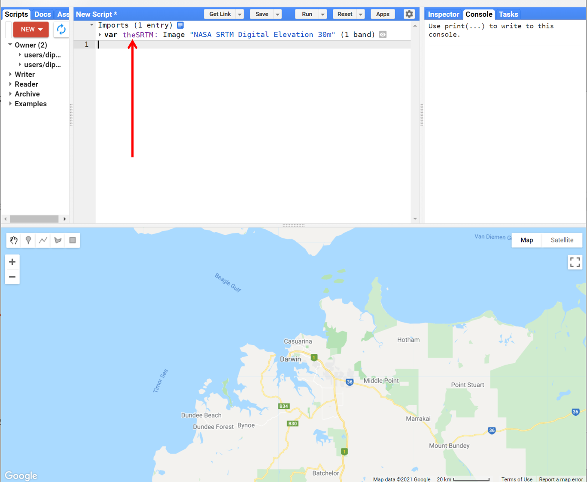
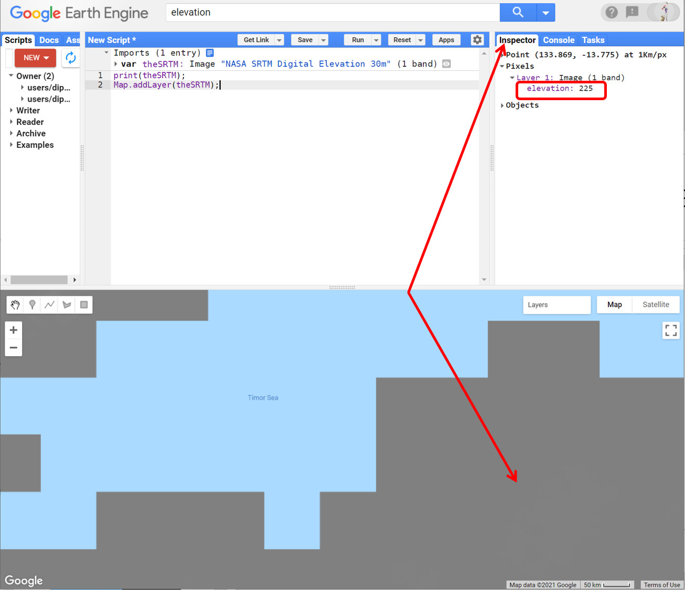

# Environmental Monitoring and Modelling (ENV306/506)
## Prac 1 - Introduction to Google Earth Engine, JavaScript, and working with single-band image (SRTM example)

### Acknowledgments 
- Google Earth Engine Team
- [Google Earth Engine guide](https://developers.google.com/earth-engine/guides)
- [GEARS Lab](https://www.gears-lab.com/emm_lab_2/)

### Prerequisites
- Completion of this Prac exercise requires the use of the Google Chrome browser and a Google Earth Engine account. If you have not yet signed up for Google Earth Engine account - please do so now in a new tab: [Earth Engine account registration](https://signup.earthengine.google.com/)

- Once registered you can access the Earth Engine environment at [https://code.earthengine.google.com](https://code.earthengine.google.com)

### Objective
The objective of this lab is to give you an introduction to the Earth Engine processing environment and basic JavaScript. You will also gain a basic feel of remote sensing image by working on a single-band elevation image (SRTM). From an environmental monitoring perspective, we will often be interested in how and where landscapes, and different components of that landscape, change over time. Understanding landscape context is very important, as ecological processes change with topographic position. By the end of this exercise, you will be able to will learn how to access, visualise and query digital elevation data for any study location.

---------------------------------------------------
## 1. Signup for the GEE account
1. If you have not done so already, sign up for Earth Engine account [here](https://code.earthengine.google.com/signup/)
2. Follow the signup and activation process.

## 2. Navigate through the GEE environment interface.
1. Open up the Google Earth Engine environment by going to this address in the Chrome browser: [https://code.earthengine.google.com](https://code.earthengine.google.com). You should see the GEE landing page as below.


2. Notice GEE environment is divided up into four panels: 
- The top-left panel has tabs for Scripts, Documentation and Assets  
- The editor (top-centre) panel is for writing and running JavaScript commands  
- The top-right panel has tabs for the console, inspector and tasks  
- The bottom panel is Map interface with geometry features and a google map like feel. 

3. Navigate through the four panels and try to understand what each panel does. I recommend you take the feature tour.

   

4. Check out different buttons and tabs available to you, try them and do a google search to understand their functionality. In this unit, you will frequently use following buttons and tabs: "Run", "Save", "Inspector", "Console", "Tasks", "Scripts", "Docs", and "Assets".

## 3. A basic introduction to JavaScript

1. Google Earth Engine uses the JavaScript programming language. We will cover the very basics of this language during this course. Time to write your first JavaScript for Earth Engine! In the editor panel, paste the below script and hit run. "Hello World!" will be printed on the console tab. 
 
```JavaScript
print("Hello World!");
```

2. The line above is a JavaScript statement. JavaScript statements end in a semicolon. Earth Engine programs are made up of a set of statements like this one. You can think of these statements as a set of tasks you want the earth engine to perform. Using the "print" command, you can print any text you want. Note that JavaScript and any other programming are quite restrictive in their syntax. The barebone structure "print(" ")" cannot be changed. Any text that is placed within the quotation gets printed.

**Question:** *Modify the above script to print your name in the console.*

3.When writing a rather long JavaScript program, it is a good practice to put lots of comments in your code- the comments are not executed but describes what you're trying to do. To comment, use "//" before the comment. for example: 

```JavaScript
// Printing hello world to the console
print("Hello World!");
```

4. In the above script, the content after "//" are ignored by the Earth Engine. These comments are for us to understand what's happening in the script. 

5. Using variables to store objects helps code readability. For example, a variable that stores a string object is defined by single ' or double " quotes but don't mix them. In the below script, first, we make a new string and store it in a variable called toPrint. Second, we print the variable toPrint which is 'Ahoy there!'. So, if you run the script, it will print 'Ahoy there!'

```JavaScript
// Use single (or double) quotes to make a string.
var toPrint = 'Ahoy there!';
// Use parentheses to pass arguments to functions.
print(toPrint);
```

6. You may have noticed that we used a keyword "var" at the beginning of the script. "var" is always used when defining a variable. The name "toPrint" that we gave to the variable can be anything we want - but be consistent throughout a JavaScript program. Try changing the name of the variable and run the script. Try modifying the script to print something else. 

7. Variables can also store numbers. We define the number variables using the same way as string variables -  we just don't need to put the numbers in quotes. 

```JavaScript
// Store a number in a variable.
var height = 165;
print('My height is:', height);
```
8. Notice how within the print command, the string is placed in quotation while the variable is not in the quotation. 

9. Try modifying the variable name "height" as well as the variable value to print your height.

**Question:** *Write a script that prints a person’s age. Use two variables to store the person name and age.* 

10. The best way to learn Scripting is to modify the script and make many mistakes - many many mistakes. If you are new to scripting and JavaScript, try to change and run the script and see what happens.
11. That’s all we have for the basic JavaScript. For a bit further details, read the introduction provided in the GEE developers forum [here](https://developers.google.com/earth-engine/tutorials/tutorial_js_01)

12. Alright, now lets start looking into some remote sensing images. Before that, clear your scripting area by clicking on "Clear script" under the "Reset" button.

## 4. Getting started with elevation data

1. Just above the Coding panel is the search bar. Search for ‘Darwin’ in this GEE search bar, and click the result to pan and zoom the map to Darwin (Figure 2). In this exercise, we will work on and around the Darwin region including Kakadu National Park. 


2. Search for "elevation" or "SRTM" and click on the "NASA SRTM Digital Elevation 30m" result to show the dataset description. In 2000, NASA flew an SRTM mission for 11-days to gather the 3D elevation data of the entire globe. The SRTM used radar interferometry to obtain the most detailed 3D elevation data.


3. Read the information on the dataset - look under "description" and "bands". Once done, click on "Import", which will import the dataset and places it under the Imports section at the top of your script.


**Question:** *How many bands do this data have and what is the spatial resolution?*

4. Rename the default variable name "image" to anything you like. I will rename it to "theSRTM".



5. Print the image object to the console by copying the script below into the code editor, and click "run" :

```JavaScript
print(theSRTM);
```

6. Browse through the information that is printed to the console window. Open the “bands” section to show the one band named “elevation”. Note that all this information is also available in the Imports section.


## 5. Visualising the single-band image

1. Use the Map.addLayer() method to add/display the image to the interactive map. We will start simple, without using any of the optional parameters. After adding the script, hit "run" again. Every time you make changes to your script, you will need to run the script again.

```JavaScript
Map.addLayer(theSRTM);
```


2. The displayed map will look pretty flat grey because the default visualization parameters maps the full 16­bit range (0 to 65,635) of the data onto the black–white range. However, the elevation range within a landscape is much smaller (e.g. between 0 and 400). We’ll fix it in a moment.


3. Select the Inspector tab and click on several points on the map to get a feel for the elevation range in this area.



4. Now that you know the approximate min and max elevation values for your scene, you can set some the appropriate visualization parameters by adjusting the code as follows (units of the min and max values are in meters above sea level):

```JavaScript
Map.addLayer(theSRTM, {min: 0, max: 300});
```


5. You will now be able to see the variation in the elevation range with min values in black and max points in white. The image added to the mapping layers has default names like "Layer 1", "Layer 2", etc. To improve the readability, we can give each layer a human­-readable name in the following code. Don't forget to click run.

```JavaScript
Map.addLayer(theSRTM, {min: 0, max: 300}, 'Elevation above sea level');
```


## 6. Commenting and saving your scripts

1. Now the code has started to look a little bit messy. Imagine you coming back to this code after a year. Would you still be able to tell which line is doing what task? Hence, it is a good idea to always put comments to your code reminding you of what you did and why. We add comments with two forward slashes // :

```Javascript
// Print data details to console
print(theSRTM);

// Add the SRTM data to the interactive map
Map.addLayer(theSRTM);

// Add the data again, but with restricted value ranges for better visualisation
Map.addLayer(theSRTM, {min: 0, max: 300});

// Add the data again, with value ranges, and a useful title for the Layer tab
Map.addLayer(theSRTM, {min: 0, max: 300}, 'Elevation above sea level');
```


2. Also remember to save the code by clicking "Save". It will be saved in your private repository, and will be accessible the next time you log in to Earth Engine.


3. If you would like to experiment with different colour combinations, you can play with colour palettes as per the example below: Experiment with the different colour combinations.

```Javascript
// Adding colour scale to the elevation data
Map.addLayer(theSRTM, {min: 0, max: 300, palette: ['blue', 'yellow', 'red']}, 'Elevation above sea level');
```


## 7. Applying computation on elevation image - example of hillshade and slope

1. Sometimes our application requires computation of the terrain hillshade and slope. Do a google search to find out what is terrain hillshade and what is terrain slope. Sometimes, the hillshade provides a better visualisation of the elevation data. Use below script to visualise the hillsahde of the landscape. 

```JavaScript
// Create hillshade and map it
var hillshade = ee.Terrain.hillshade(theSRTM);
Map.addLayer(hillshade, {min: 150, max:255}, 'Hillshade');
```


2. Remember you can use the Layer transparency options to create draped images for colourised hillsides.


3. Pan over to the Kakadu National Park region, where there are some nice elevation differences. Play with the transparency of hillshade and slopes. Flick around with hillshade and/or slope on top of the coloured palette for optimal display.


4. You can also similarly compute the slope of the terrain.

```javascript
// Create terrain slope and map it
var slope = ee.Terrain.slope(theSRTM);
Map.addLayer(slope, {min: 0, max: 20}, 'Slope');
```


5. Also check out the docs section where you can find other computations that are available to you under the Google Earth Engine. Docs section is your help section, if you are stuck with scripting, make sure to look into the docs tab as well as google search.

## 8. Applying thresholding to the images
1. Add a simple computation, for example, a threshold on elevation. This computation goes through every pixel to test if the elevation data on that pixel meets the defined threshold. In the below figure, the white pixel (True) is where the threshold is met and the dark pixel (False) is where the threshold is not meet.

```javascript
// computation: Terrain that has elevation over 200 m
var high = theSRTM.gt(200);
Map.addLayer(high, {}, 'Above 200m');
```


2. Pan over to the rapid creek river and play with the elevation threshold to see if you can approximately create the rapid creek flood extent (the flood plain maps of NT can be found [here](https://denr.nt.gov.au/water/water-resources/flooding-reports-maps/floodplain-maps)) 

3. We will learn more about masking in upcoming labs. But here let's just quickly look into how you can use the binary image created above called “high” to mask out your original DEM. Use the script below which will mask the areas in DEM that are below 200 m and display the above 200 m data for you in a coloured palette. Explore around Kakadu national park on this “DEM>200” layer

```JavaScript
// Masking out the terrains below 200m from the DEM
var DEMover200 = theSRTM.updateMask(high);
Map.addLayer(DEMover200, {min: 200, max: 300, palette: ['blue', 'yellow', 'red']}, 'DEM>200');
```


## 9. Applying a spatial reducer
Reducers are the way to aggregate data over time, space, bands, arrays and other data structures in Earth Engine. The spatial reducer aggregates the data over a certain space to give an output. E.g. mean elevation of a region. Recall how you used the inspector tool to extract data from one pixel, think of a spatial reducer as a way to extract data from a polygon rather than a single pixel. 


1. Select the polygon geometry tool and draw a rectangle (or more complex polygon) on the map. Rename the geometry polygon to roi (roi means the region of interest).


2. Apply spatial reducer and print the mean elevation value for the region

```JavaScript
// Apply spatial reducer to compute mean elevation over the roi
var meanElevation = theSRTM.reduceRegion({
        reducer: 'mean',
        geometry: roi,
        scale: 90
});
// print the mean elevation
print('Mean elevation', meanElevation.get('elevation'));
```


3. Try modifying the above script to extract min and max elevation instead of mean.

5. DO NOT forget to save your script. Click on Save button and follow the prompt to save the script. 

## 10. The complete script used in this Prac

```JavaScript
// Print data details to console
print(theSRTM);

// Add the SRTM data to the interactive map
Map.addLayer(theSRTM);

// Add the data again, but with restricted value ranges for better visualisation
Map.addLayer(theSRTM, {min: 0, max: 300});

// Add the data again, with value ranges, and a useful title for the Layer tab
Map.addLayer(theSRTM, {min: 0, max: 300}, 'Elevation above sea level');

// Adding colour scale to the elevation data
Map.addLayer(theSRTM, {min: 0, max: 300, palette: ['blue', 'yellow', 'red']}, 'Elevation above sea level');

// Create hillshade and map it
var hillshade = ee.Terrain.hillshade(theSRTM);
Map.addLayer(hillshade, {min: 150, max:255}, 'Hillshade');

// Create terrain slope and map it
var slope = ee.Terrain.slope(theSRTM);
Map.addLayer(slope, {min: 0, max: 20}, 'Slope');

// computation: Terrain that has elevation over 200 m
var high = theSRTM.gt(200);
Map.addLayer(high, {}, 'Above 200m');

// Masking out the terrains below 200m from the DEM
var DEMover200 = theSRTM.updateMask(high);
Map.addLayer(DEMover200, {min: 200, max: 300, palette: ['blue', 'yellow', 'red']}, 'DEM>200');

// Apply spatial reducer to compute mean elevation over the roi
var meanElevation = theSRTM.reduceRegion({
        reducer: 'mean',
        geometry: roi,
        scale: 90
});

// print the mean elevation
print('Mean elevation', meanElevation.get('elevation'));
```

-------
### Thank you

I hope you found this prac useful. A recorded video of this prac can be found on your learnline. Please get in touch if you have any questions.

#### Kind regards, Deepak Gautam
------
### The end

