# Environmental Monitoring and Modelling (ENV306/506)
## Prac 2 - Getting deeper into Earth Engine

### Acknowledgments 
- Google Earth Engine Team
- Geospatial Analysis Lab, University of San Francisco (especially Nicholas Clinton and David Saah)
- [GEARS Lab](https://www.gears-lab.com/emm_lab_2/)

### Objective
In Prac 1 we learnt how to search an archive for a single cloud-free image, display it in the map environment, and compute indices. From an environmental monitoring perspective, we will often be interested in how and where landscapes, and different components of that landscape, change over time. Understanding landscape context is very important, as ecological processes change with topographic position. In this Prac, we will learn how to access, visualise and query digital elevation data for any study location.
 
---------------------------------------------------
## 1. Getting started with elevation data
1. Navigate to the Darwin area - see prac 01 on how to. 

2. Search for "elevation" or "SRTM" and click on the "NASA SRTM Digital Elevation 30m" result to show the dataset description.

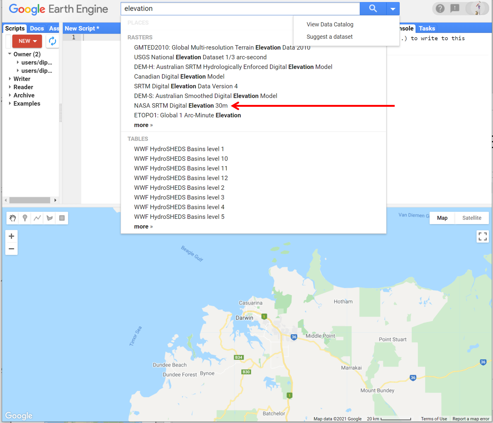

3. Read the information on the dataset - look under "description" and "bands". Once done, click on "Import", which will import the dataset and places it under the Imports section at the top of your script.

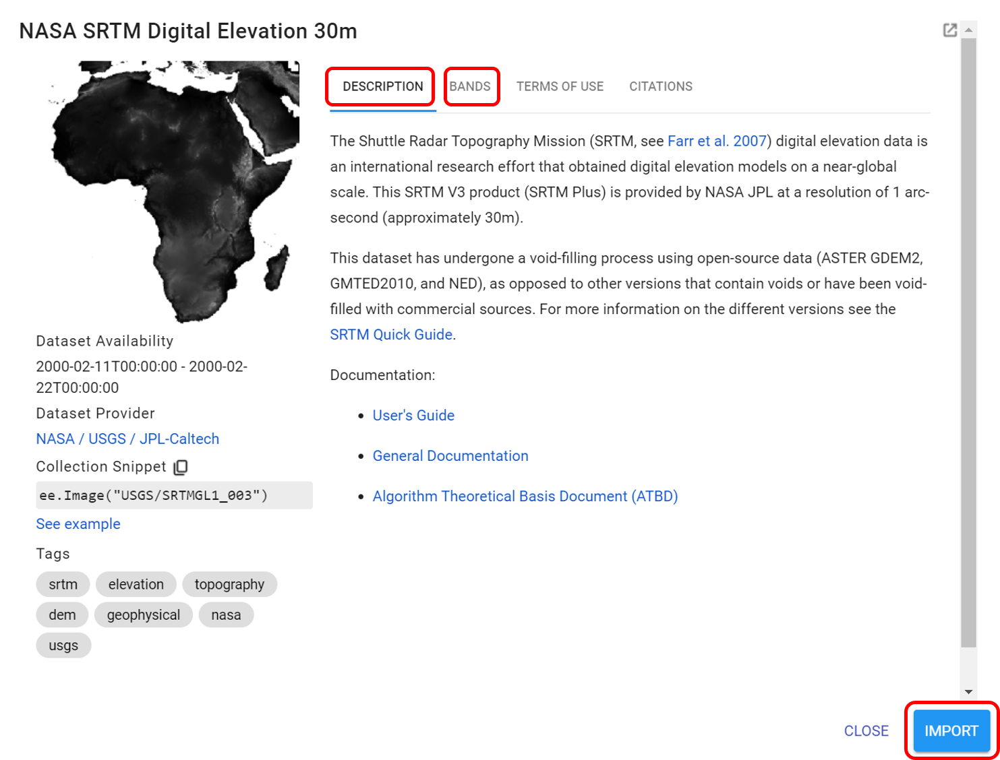

*Question:* How many bands do this data have and what is the spatial resolution?

4. Rename the default variable name "image" to anything you like. I will rename it to "theSRTM".

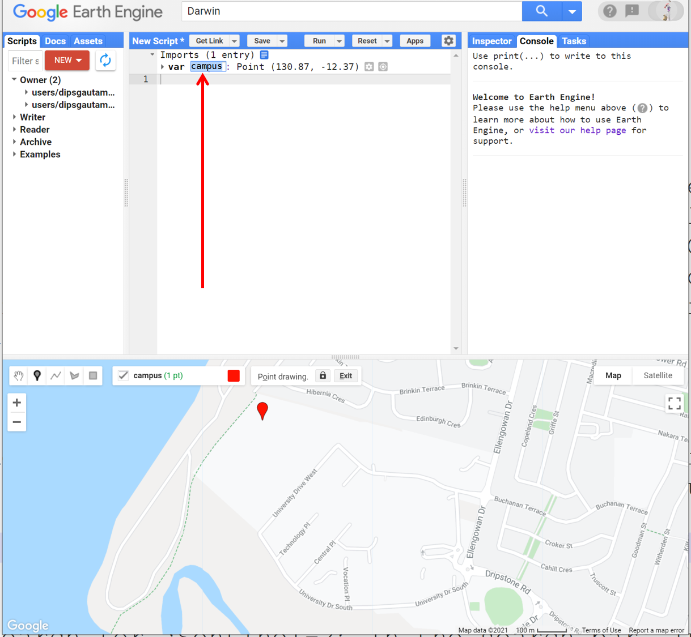

5. Print the image object to the console by copying the script below into the code editor, and click "run" :

```JavaScript
print(theSRTM);
```

6. Browse through the information that is printed to the console window. Open the “bands” section to show the one band named “elevation”. Note that all this information is also available in the Imports section.

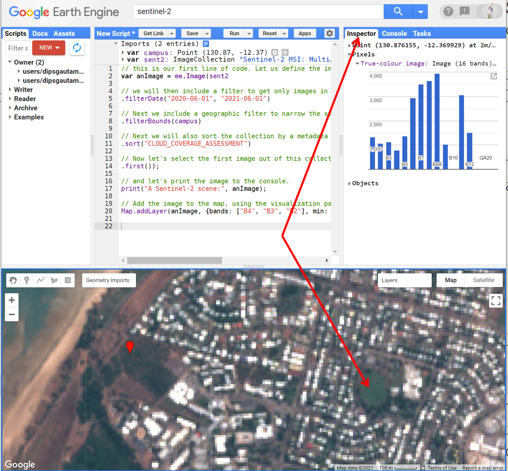

## 2. Adjusting visualisation parameters

1. Use the Map.addLayer() method to add/display the image to the interactive map. We will start simple, without using any of the optional parameters. After adding the script, hit "run" again. Every time you make changes to your script, you will need to run the script again.

```JavaScript
Map.addLayer(theSRTM);
```
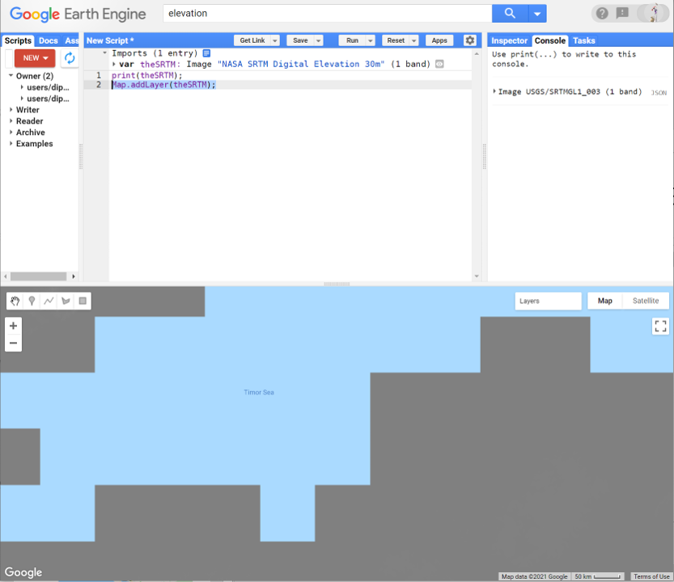

2. The displayed map will look pretty flat grey because the default visualization parameters maps the full 16­bit range (0 to 65,635) of the data onto the black–white range. However, the elevation range within a landscape is much smaller (e.g. between 0 and 400). We’ll fix it in a moment.


3. Select the Inspector tab and click on several points on the map to get a feel for the elevation range in this area.


4. Now that you know the approximate min and max elevation values for your scene, you can set some the appropriate visualization parameters by adjusting the code as follows (units of the min and max values are in meters above sea level):

```JavaScript
Map.addLayer(theSRTM, {min: 0, max: 300});
```
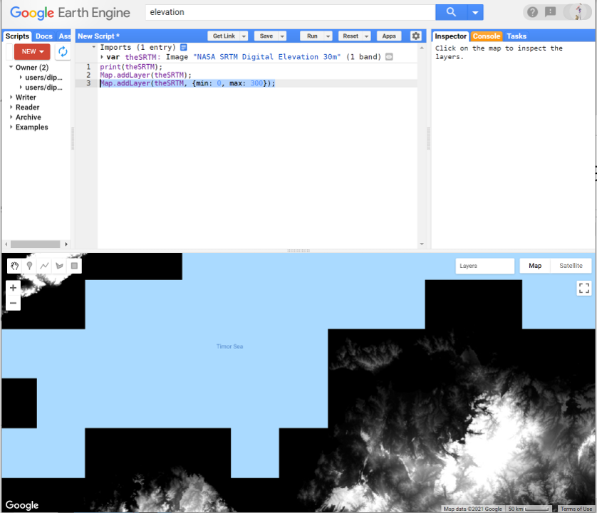

5. You will now be able to see the variation in the elevation range with min values in black and max points in white. The image added to the mapping layers has default names like "Layer 1", "Layer 2", etc. To improve the readability, we can give each layer a human­-readable name in the following code. Don't forget to click run.

```JavaScript
Map.addLayer(theSRTM, {min: 0, max: 300}, 'Elevation above sea level');
```
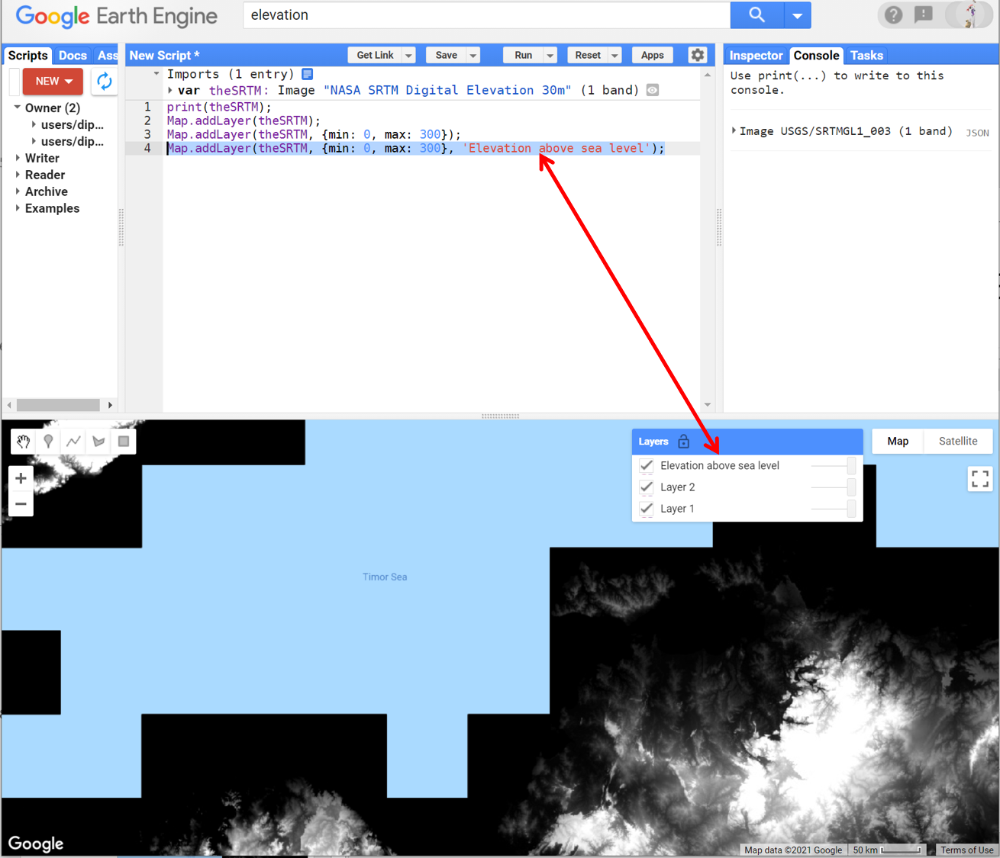

## 3. Commenting and saving your scripts

1. Now the code has started to look a little bit messy. Imagine you coming back to this code after a year. Would you still be able to tell which line is doing what task? Hence, it is a good idea to always put comments to your code reminding you of what you did and why. We add comments with two forward slashes // :

```Javascript
// Print data details to console
print(theSRTM);

// Add the SRTM data to the interactive map
Map.addLayer(theSRTM);

// Add the data again, but with restricted value ranges for better visualisation
Map.addLayer(theSRTM, {min: 0, max: 300});

// Add the data again, with value ranges, and a useful title for the Layer tab
Map.addLayer(theSRTM, {min: 0, max: 300}, 'Elevation above sea level');
```
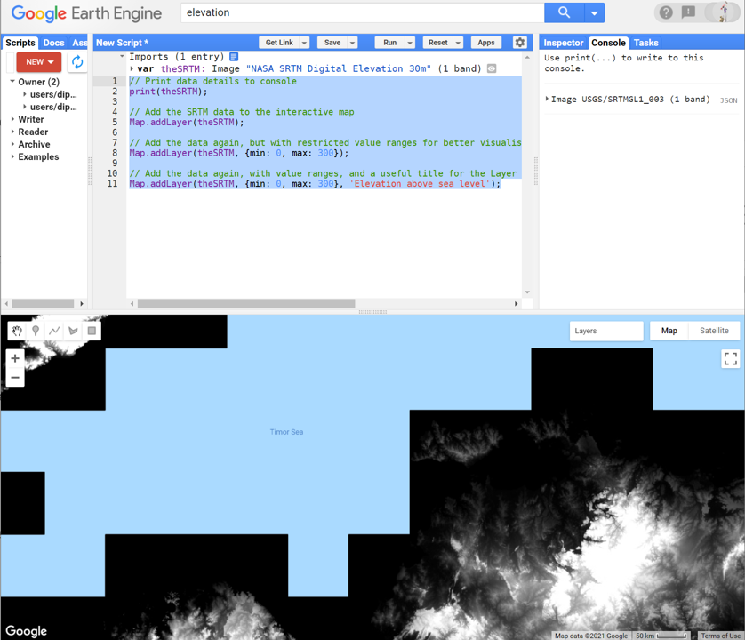

2. Also remember to save the code by clicking "Save". It will be saved in your private repository, and will be accessible the next time you log in to Earth Engine.


3. If you would like to experiment with different colour combinations, you can play with colour palettes as per the example below: Experiment with the different colour combinations.

```Javascript
// Adding colour scale to the elevation data
Map.addLayer(theSRTM, {min: 0, max: 300, palette: ['blue', 'yellow', 'red']}, 'Elevation above sea level');
```

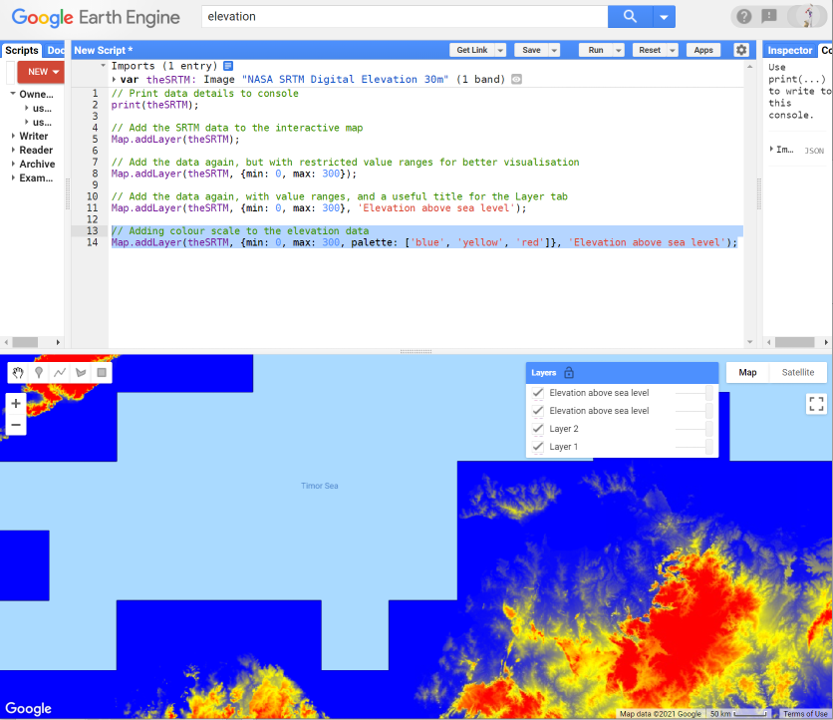

## 4. Hillshade and slope

1. For better visualisation we can create a hillshade view of the elevation data. 

```JavaScript
// Create hillshade and map it
var hillshade = ee.Terrain.hillshade(theSRTM);
Map.addLayer(hillshade, {min: 150, max:255}, 'Hillshade');
```

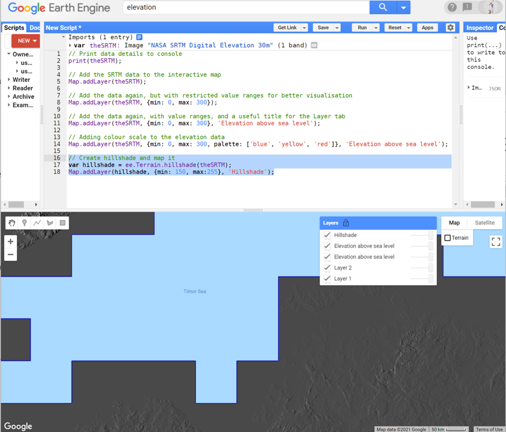

2. Remember you can use the Layer transparency options to create draped images for colourised hillsides.

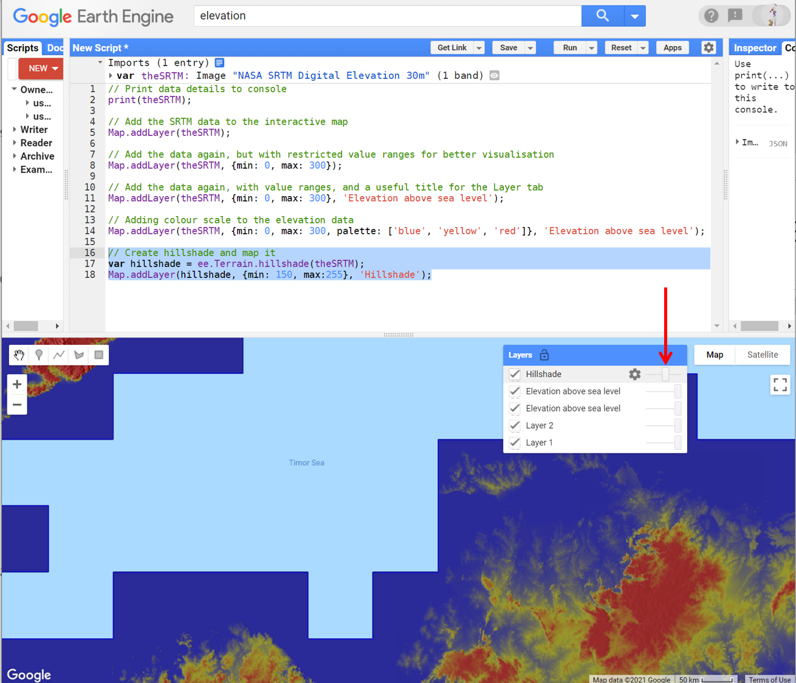

3. Pan over to the Kakadu National Park region, where there are some nice elevation differences. Play with the transparency of hillshade and slopes. Flick around with hillshade and/or slope on top of the coloured palette for optimal display.

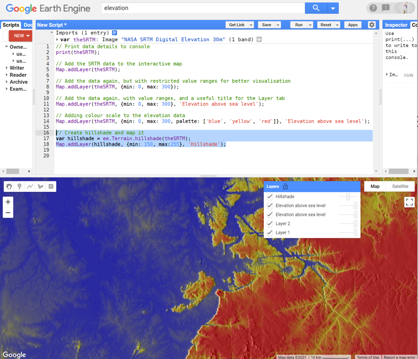

4. You can also similarly compute the slope of the terrain.

```javascript
// Create terrain slope and map it
var slope = ee.Terrain.slope(theSRTM);
Map.addLayer(slope, {min: 0, max: 20}, 'Slope');
```

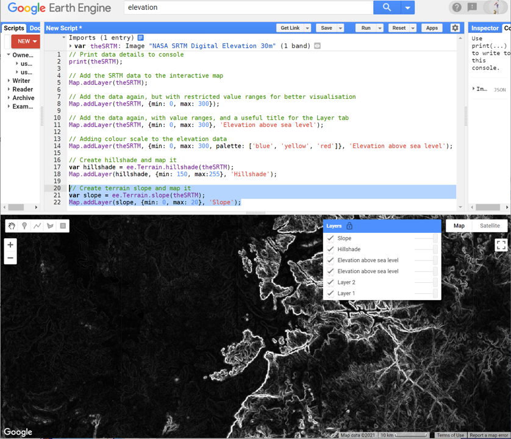

5. Also check out the docs section where you can find other computations that are available to you under the Google Earth Engine. Docs section is your help section, if you are stuck with scripting, make sure to look into the docs tab as well as google search.

## 5. Applying a computation to an image
1. Add a simple computation, for example, a threshold on elevation. This computation goes through every pixel to test if the elevation data on that pixel meets the defined threshold. In the below figure, the white pixel (True) is where the threshold is met and the dark pixel (False) is where the threshold is not meet.

```javascript
// computation: Terrain that has elevation over 200 m
var high = theSRTM.gt(200);
Map.addLayer(high, {}, 'Above 200m');
```
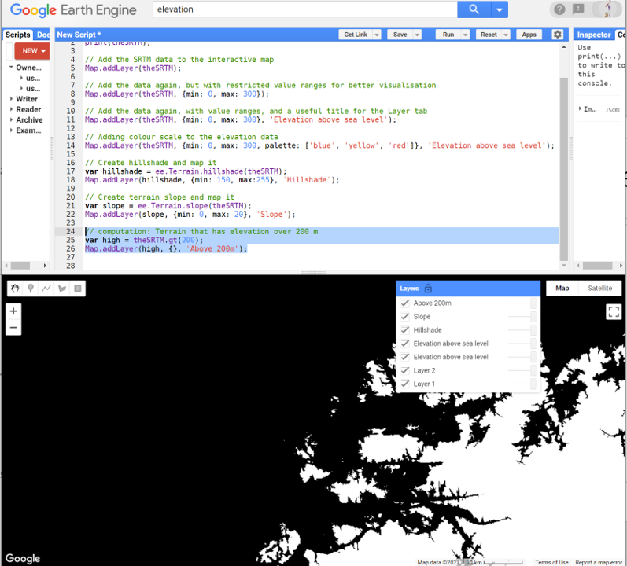

2. Pan over to the rapid creek river and play with the elevation threshold to see if you can approximately create the rapid creek flood extent (the flood plain maps of NT can be found [here](https://denr.nt.gov.au/water/water-resources/flooding-reports-maps/floodplain-maps)) 

3. We will learn more about masking in upcoming labs. But here let's just quickly look into how you can use the binary image created above called “high” to mask out your original DEM. Use the script below which will mask the areas in DEM that are below 200 m and display the above 200 m data for you in a coloured palette. Explore around Kakadu national park on this “DEM>200” layer

```JavaScript
// Masking out the terrains below 200m from the DEM
var DEMover200 = theSRTM.updateMask(high);
Map.addLayer(DEMover200, {min: 200, max: 300, palette: ['blue', 'yellow', 'red']}, 'DEM>200');
```

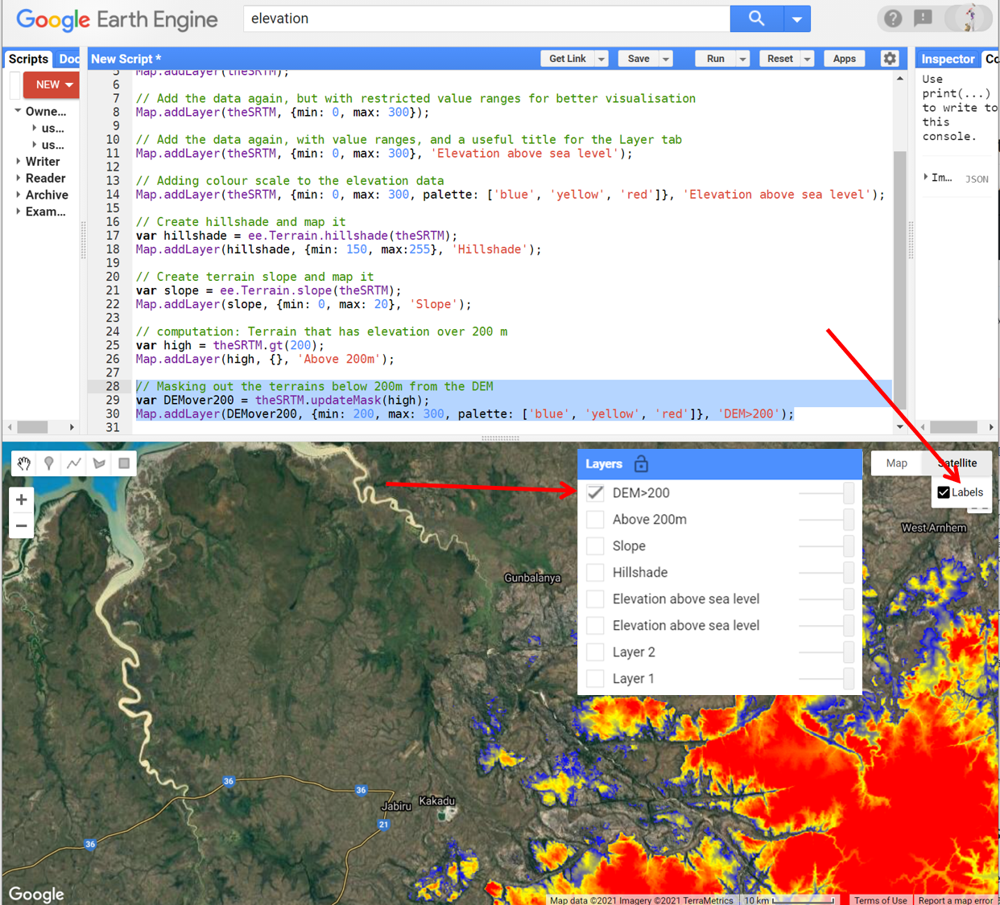

## 6. Applying a spatial reducer
Reducers are the way to aggregate data over time, space, bands, arrays and other data structures in Earth Engine. The spatial reducer aggregates the data over a certain space to give an output. E.g. mean elevation of a region. Recall how you used the inspector tool to extract data from one pixel, think of a spatial reducer as a way to extract data from a polygon rather than a single pixel. 

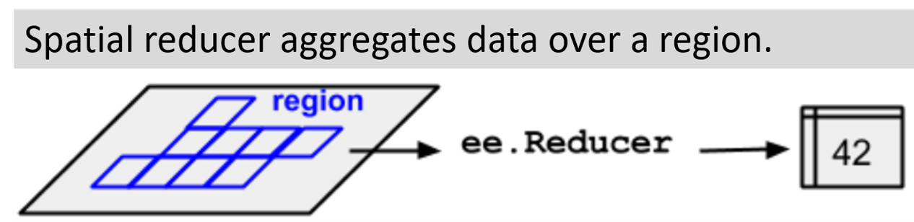

1. Select the polygon geometry tool and draw a rectangle (or more complex polygon) on the map. Rename the geometry polygon to roi (roi means the region of interest).

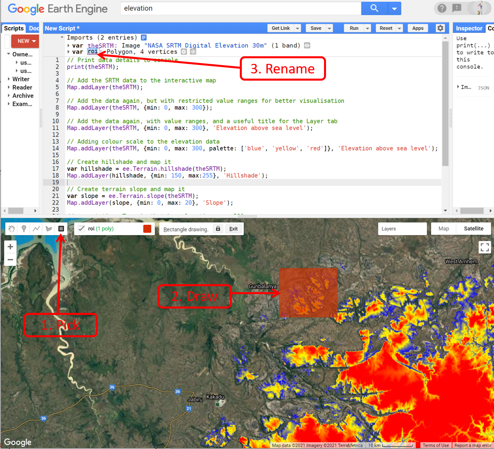

2. Apply spatial reducer and print the mean elevation value for the region

```JavaScript
// Apply spatial reducer to compute mean elevation over the roi
var meanElevation = theSRTM.reduceRegion({
        reducer: 'mean',
        geometry: roi,
        scale: 90
});
// print the mean elevation
print('Mean elevation', meanElevation.get('elevation'));
```
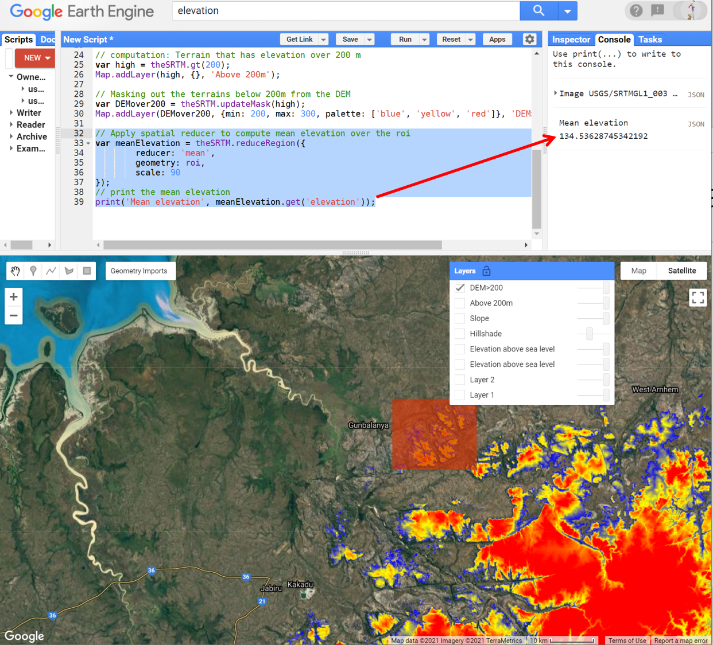

3. Try modifying the above script to extract min and max elevation instead of mean.

4. DO NOT forget to save your script. Click on the Save button and follow the prompt to save the script.

*Note:* There are other digital elevation data available to you on the google earth engine. Try searching for them. One useful data for Australian application is called “Australian 5M DEM”. This data covers Australia's populated coastal zone; floodplain surveys within the Murray Darling Basin, and individual surveys of major and minor population centres. 

## 7. Exercise
Prac01 taught you how to visualise Sentinel-2 data and compute indices. Prac02 taught you how to visualise elevation data, apply computation, and reducer.  

- Locate a cloud-free Sentinel image over Greater Darwin region from before and after Cyclone Marcus (17 March 2018). 
- Using the cloud-free Sentinel image, derive NDVI layers for before and after the Cyclone Marcus and visually compare the effects of the cyclone.
- Overlay the elevation data, apply spatial reducer and compute mean elevation of the areas which had a severe, moderate, and minimal effect by the Cyclone. 

## The complete script

```JavaScript
// Print data details to console
print(theSRTM);

// Add the SRTM data to the interactive map
Map.addLayer(theSRTM);

// Add the data again, but with restricted value ranges for better visualisation
Map.addLayer(theSRTM, {min: 0, max: 300});

// Add the data again, with value ranges, and a useful title for the Layer tab
Map.addLayer(theSRTM, {min: 0, max: 300}, 'Elevation above sea level');

// Adding colour scale to the elevation data
Map.addLayer(theSRTM, {min: 0, max: 300, palette: ['blue', 'yellow', 'red']}, 'Elevation above sea level');

// Create hillshade and map it
var hillshade = ee.Terrain.hillshade(theSRTM);
Map.addLayer(hillshade, {min: 150, max:255}, 'Hillshade');

// Create terrain slope and map it
var slope = ee.Terrain.slope(theSRTM);
Map.addLayer(slope, {min: 0, max: 20}, 'Slope');

// computation: Terrain that has elevation over 200 m
var high = theSRTM.gt(200);
Map.addLayer(high, {}, 'Above 200m');

// Masking out the terrains below 200m from the DEM
var DEMover200 = theSRTM.updateMask(high);
Map.addLayer(DEMover200, {min: 200, max: 300, palette: ['blue', 'yellow', 'red']}, 'DEM>200');

// Apply spatial reducer to compute mean elevation over the roi
var meanElevation = theSRTM.reduceRegion({
        reducer: 'mean',
        geometry: roi,
        scale: 90
});

// print the mean elevation
print('Mean elevation', meanElevation.get('elevation'));
```

-------
### Thank you

I hope you found this prac useful. A recorded video of this prac can be found on your learnline.

#### Kind regards, Deepak Gautam
------
### The end
