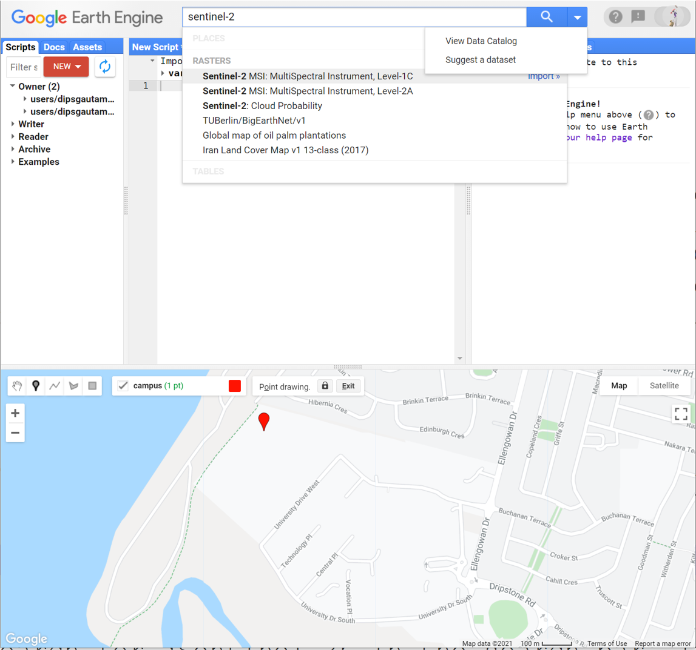
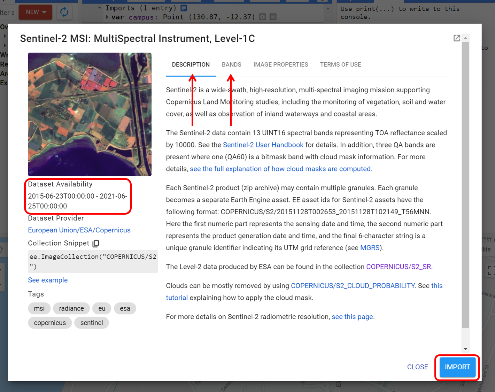
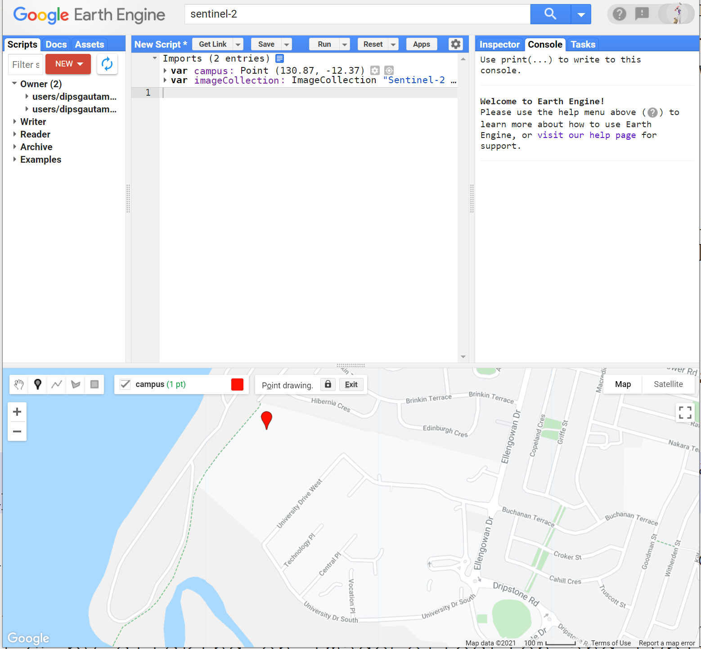
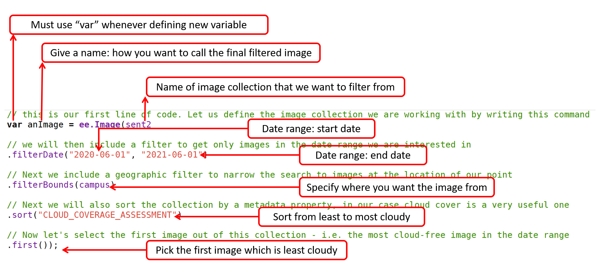
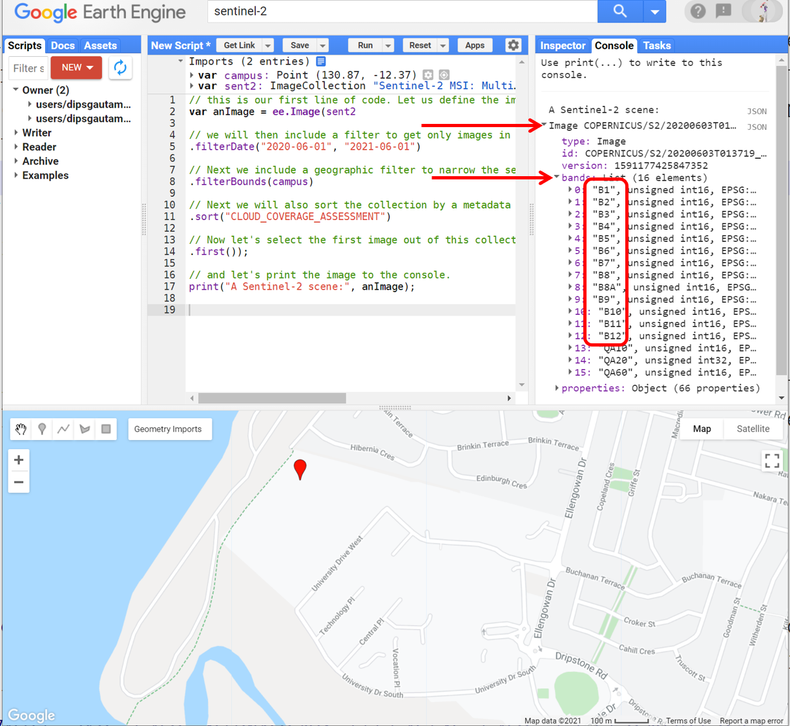
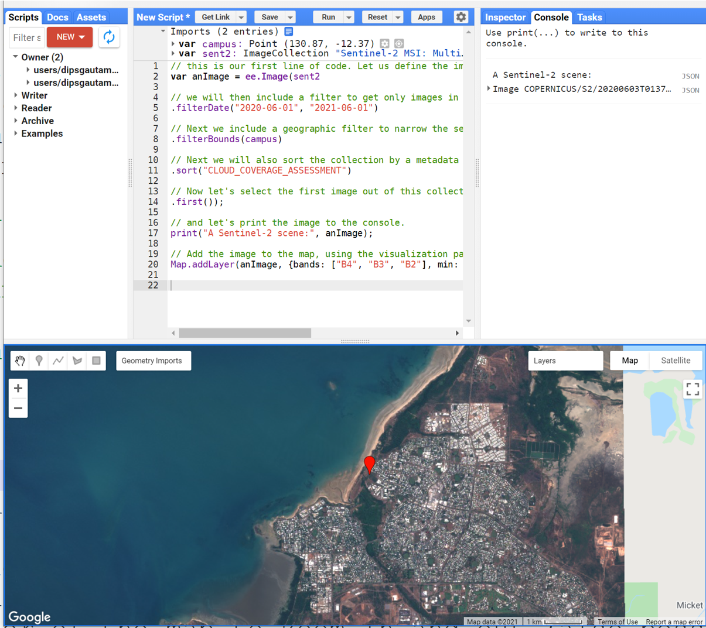
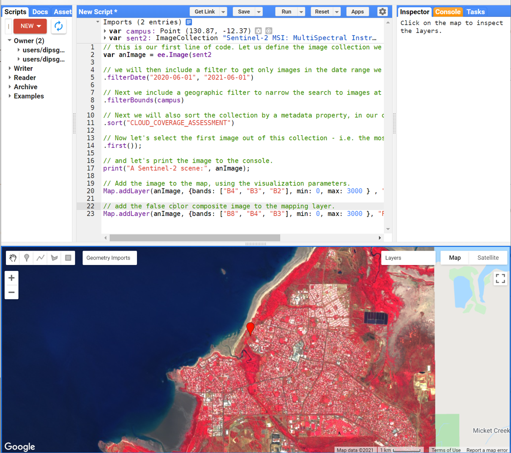
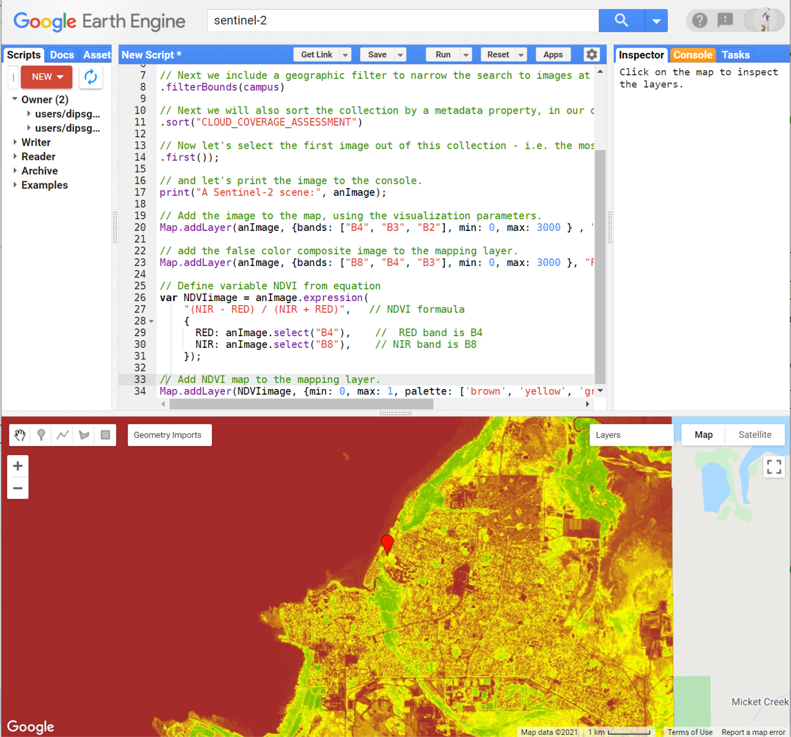
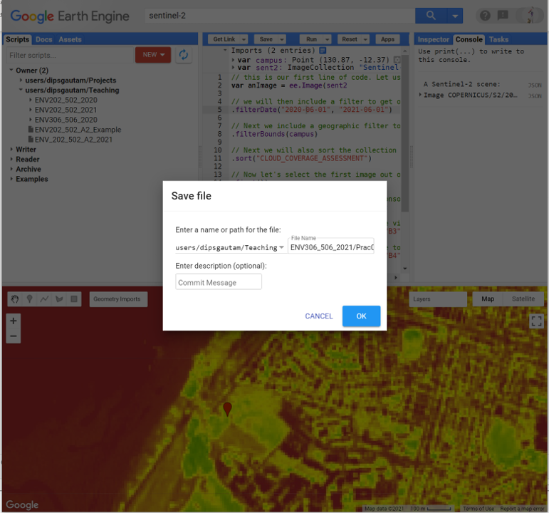

# Environmental Monitoring and Modelling (ENV306/506)
## Prac 2 - Working with multi-band image (Sentinel-2 example)

### Acknowledgments 
- Google Earth Engine Team
- [GEARS Lab](https://www.gears-lab.com/emm_lab_1/)

### Objective
In Prac 1 we had a brief overview of the GEE, JavaScript and learnt how to work with single-band elevation data. In this prac, we will work with multi-band image taking Sentinel-2 as an example. We will learn to display imagery as true colour and false colour composites, as well as to calculate indices (e.g. NDVI) from multi-spectral imagery. By the end of this exercise you will be able to search, find and visualize a broad range of remotely sensed datasets.
---------------------------------------------------
## 4. Searching and importing remote sensing images 

Now you are ready to get started with images and remote sensing. In this exercise, we will work with Sentinel-2 satellite data. 

About Sentinel-2: Sentinel-2 is a wide-swath, high-resolution, multi-spectral imaging mission supporting Copernicus Land Monitoring studies, including the monitoring of vegetation, soil and water cover, as well as observation of inland waterways and coastal areas. Sentinel-2 was developed and operated by the European Space Agency and has been sending data back to Earth since 23 June 2015. The Sentinel-2 data contain 13 spectral bands representing TOA reflectance scaled by 10000.

Let us load a Sentinel-2 scene over Darwin, Australia, into Google Earth Engine to see what it looks like. Follow the commands below step-by-step - if you get stuck or can’t follow these instructions alone, then watch the accompanying video.


1. Just above the Coding panel is the search bar. Search for ‘Darwin’ in this GEE search bar, and click the result to pan and zoom the map to Darwin (Figure 2). In this exercise, we will work on and around the Darwin region. 


2. Use the geometry tools to make a point on the Casuarina campus of Charles Darwin University (located in the suburb of Brinkin, north of Rapid Creek). Once you create the geometry point, you will see it added to your Coding panel as a variable (var) under the Imports heading.


3. Rename the resulting point to ‘campus’ by clicking the import name (which is called ‘geometry’ by default).


4. Now that we have decided the region where we want our remote sensing data from, Search for ‘Sentinel-2’ in the search bar. In the results section you will see ‘Sentinel-2: Multi-spectral Instrument (MSI), Level-1C’ - click on it o show the dataset description.



5. Briefly read the information of Sentinel-2 within the description tab and about bands in the bands tab.



Self-assessment question: How many bands do this data have and whats the spatial resolution?

6. Click on the “Import” button to import the data to our computing environment. Sentinel-2 will be added to our Imports in the Coding panel as a variable with the default name "imageCollection".



7. Let's rename this to “sent2” by clicking on imageCollection and typing "sent2".


## 6. Filtering through the image collection for a cloud-free image
It is important to understand that we have now added access to the full Sentinel-2 image collection (i.e. every image that has been collected to date) to our script. For this exercise we don't want to load all these images - we want a single cloud-free image over Charles Darwin University. As such, we can now filter the image collection with a few criteria, such as time of acquisition, spatial location and cloud cover.

1. Copy or type the below code to the GEE and hit the run button. This piece of code will search the Sentinel-2 archive within defined dates, find images that are located over Darwin, sort them according to percentage cloud cover, and then return the most cloud-free image for us. 

```JavaScript
// this is our first line of code. Let us define the image collection we are working with by writing this command
var anImage = ee.Image(sent2

// we will then include a filter to get only images in the date range we are interested in
.filterDate("2020-06-01", "2021-06-01")

// Next we include a geographic filter to narrow the search to images at the location of our point
.filterBounds(campus)

// Next we will also sort the collection by a metadata property, in our case cloud cover is a very useful one
.sort("CLOUD_COVERAGE_ASSESSMENT")

// Now let's select the first image out of this collection - i.e. the most cloud-free image in the date range
.first());

```

**Take a moment** to play with and understand the above filtering script see figure below as a guide


2. At this point the image filtering has happened in the GEE memory, we can print the information about the the filtered image to the console using "print" command as below. 

```JavaScript
// and let's print the image to the console.
print("A Sentinel-2 scene:", anImage);
```

3. Explore the printed information to find out the name of the scene, the date it was collected, and the band names. 




**Self-assessment questions:** Have a think about the following questions. Try to answer them yourself and discuss them with classmates. 
- *What do the numbers within the filterDate() represent?* 
- *Think about what would happen if you removed or commented out the filterDate command?*
- *Modify the above script to get an image from last - month.*
- *What does filterBounds represent?*
- *What will happen if you remove or comment out the filterBounds() command.*
- *Where did we get the keyword "CLOUD_COVERAGE_ASSESSMENT" to sort the images.*
- *What will happen if you remove the ".first()" command?*

## 7. Adding images to the map view
1. So far, we have filtered the image, and printed the information, but we don't know what the image looks like. To display the image, we need to use the "Map.addLayer" command. Append the below script to display the image to the mapping layer. 

```JavaScript
// Add the image to the map, using the visualization parameters.
Map.addLayer(anImage, {bands: ["B4", "B3", "B2"], min: 0, max: 3000 } , "True-colour image");
```



**Take a moment** to play with and understand the above Map.addLayer script. Use figure below as a guide


2. After the image appears on the map, zoom in and explore Darwin. We can see great detail in the Sentinel-2 image, which is at 10m resolution for the selected bands. Use the (+) and (-) symbols in the upper left corner of the map to zoom in and out (also possible with the mouse scroll wheel/trackpad). Use left click+drag to pan around the image. 

3. Move your mouse over the "Layers" button in the top right-hand corner of the mapping panel - this panel shows you the available image layers and lets you enable/disable the layer and adjust the opacity.


4. Now click on the inspector tab and click any location in the image. The band values at that point will be displayed in the Inspector window. Below is a screen capture of band values from sports field. 


5. Now try click over different landcover such as "sports field", "beach", "ocean", "mangroves". Do you notice differences in the band values from the aforementioned landcover? 

## 8. Exploring the band combination 

1. In the above display of the image, we have utilised 3 bands "red", "green", and "blue" to create a true-colour composite. However, sentinel-2 has 13 bands. We can utilise the different combination of the band to create a composite. Different band combination can be used to create a unique composite that could better highlight different features in the landscape.  

2. Run the script below to display a false-colour infrared composite. The band combination for the false-colour composite is NIR, Red, and Green. Paste the following lines below the ones you’ve already added, and click "Run".You will also see that "false-colour composite" has been added to the Layers tab in the map view.

```JavaScript
// add the false color composite image to the mapping layer.
Map.addLayer(anImage, {bands: ["B8", "B4", "B3"], min: 0, max: 3000 }, "False-colour composite");

```


3. False-colour composites plugs in the near infra-red band to the red channel of the computer screen, red band to the green channel, and green band to the blue channel. Chlorophyll content in green leaves has a strong response in the near-infrared band. Hence, the vegetation that appears dark green in true colour, appears bright red in the false-colour composite. Note the variations in red that can be seen in the vegetation bordering Rapid Creek. 

4. Other band combinations for you to play with. Try them all so you learn how to modify the script.
- Natural colour: 4 3 2
- False-colour infrared: 8 4 3
- False-colour urban: 12 11 4
- Agriculture: 11 8 2
- Atmospheric penetration: 12 11 8A
- Healthy vegetation: 8 11 2
- Land/Water: 8 11 4
- Natural colours with atmospheric removal: 12 8 3
- Shortwave infrared: 12 8 4
- Vegetation analysis: 11 8 4

## 9. Computing spectral/vegetation indices
A spectral index is a mathematical equation that is applied to the various spectral bands of an image per pixel. The vegetation index uses two or more bands designed to enhance the contribution of vegetation properties and allow reliable mapping of photosynthetic activity and canopy structural variations.

NDVI is calculated from the visible and near-infrared light reflected by vegetation using the formula NDVI = (NIR — VIS)/(NIR + VIS). Healthy vegetation absorbs most of the visible light and reflects a large portion of the near-infrared light = larger NDVI value. Unhealthy or sparse vegetation reflects more visible light and less near-infrared light = lower NDVI value.

1. Let's calculate the normalised-difference vegetation index (NDVI) for this image. NDVI is an index calculated from the RED and NIR bands, according to this equation:
NDVI = (NIR - RED)/(NIR + RED)

2. Append the following lines to your script to compute the NDVI. 

```JavaScript
// Define variable NDVI from equation
var NDVIimage = anImage.expression(
    "(NIR - RED) / (NIR + RED)",   // NDVI formaula
    {
      RED: anImage.select("B4"),    //  RED band is B4
      NIR: anImage.select("B8"),    // NIR band is B8
    });
```
3. When you hit run, the NDVI is computed, however, nothing is displayed or printed for us - thats because we have not asked to print/display the NDVI yet. To visualise the NDVI map, we need to use Map.addLayer command as before. Add the below lines and run your script. 

```JavaScript
// Add NDVI map to the mapping layer.
Map.addLayer(NDVIimage, {min: 0, max: 1, palette: ['brown', 'yellow', 'green']}, "NDVI");
```



4. Adapting the above script, you can modify the equation and compute 100s of indices from the Sentinel-2 images. Have a look at the indices that can be computed using the sentinel-2 satellite data here: (https://custom-scripts.sentinel-hub.com/custom-scripts/sentinel-2/indexdb/). You don’t need to know them, but a useful place to search for other indices that might be of interest.

5. DO NOT forget to save your script. Click on Save button and follow the prompt to save the script. 



4. DO NOT forget to save your script. Click on the Save button and follow the prompt to save the script.

*Note:* There are other digital elevation data available to you on the google earth engine. Try searching for them. One useful data for Australian application is called “Australian 5M DEM”. This data covers Australia's populated coastal zone; floodplain surveys within the Murray Darling Basin, and individual surveys of major and minor population centres. 

## 7. Exercise
Prac02 taught you how to visualise Sentinel-2 data and compute indices. Prac02 taught you how to visualise elevation data, apply computation, and reducer.  

- Locate a cloud-free Sentinel image over Greater Darwin region from before and after Cyclone Marcus (17 March 2018). 
- Using the cloud-free Sentinel image, derive NDVI layers for before and after the Cyclone Marcus and visually compare the effects of the cyclone.
- Overlay the elevation data, apply spatial reducer and compute mean elevation of the areas which had a severe, moderate, and minimal effect by the Cyclone. 

## The complete script

```JavaScript
// this is our first line of code. Let us define the image collection we are working with by writing this command
var anImage = ee.Image(sent2

// we will then include a filter to get only images in the date range we are interested in
.filterDate("2020-06-01", "2021-06-01")

// Next we include a geographic filter to narrow the search to images at the location of our point
.filterBounds(campus)

// Next we will also sort the collection by a metadata property, in our case cloud cover is a very useful one
.sort("CLOUD_COVERAGE_ASSESSMENT")

// Now let's select the first image out of this collection - i.e. the most cloud-free image in the date range
.first());

// and let's print the image to the console.
print("A Sentinel-2 scene:", anImage);

// Add the image to the map, using the visualization parameters.
Map.addLayer(anImage, {bands: ["B4", "B3", "B2"], min: 0, max: 3000 } , "True-colour image");

// add the false color composite image to the mapping layer.
Map.addLayer(anImage, {bands: ["B8", "B4", "B3"], min: 0, max: 3000 }, "False-colour composite");

// Define variable NDVI from equation
var NDVIimage = anImage.expression(
    "(NIR - RED) / (NIR + RED)",   // NDVI formaula
    {
      RED: anImage.select("B4"),    //  RED band is B4
      NIR: anImage.select("B8"),    // NIR band is B8
    });
    
// Add NDVI map to the mapping layer.
Map.addLayer(NDVIimage, {min: 0, max: 1, palette: ['brown', 'yellow', 'green']}, "NDVI");
```

-------
### Thank you

I hope you found this prac useful. A recorded video of this prac can be found on your learnline.

#### Kind regards, Deepak Gautam
------
### The end
