# Environmental Monitoring and Modelling (ENV306/506)

## Prac03 - Reducing and applying functions to images collection

### Acknowledgments 

- Google Earth Engine Team
- [GEARS Lab](https://www.gears-lab.com/emm_lab_3/)

### Objective

In Prac01 and Prac02 we learnt how to search for images (multispectral and elevation) and display them in the map environment, and we ran some basic computations. Now we will go a step further and learn how to apply the computations over a full collection of images. 

---------------------------------------------------
## 1. Load and filter and visualise Landsat image collection.
In this prac, we will work with the Landsat 8 image collection over Mitchell pateau, which is a area in north western Australia. This area is challenging because there is often a lot of cloud in this area. So, quite tricky to get a cloud-free mosaic from this region.
1. Open up the Google Earth Engine environment by going to [https://code.earthengine.google.com] in the Chrome browser.
1. In the search bar, search for Mitchell plateau and navigate to the area. 
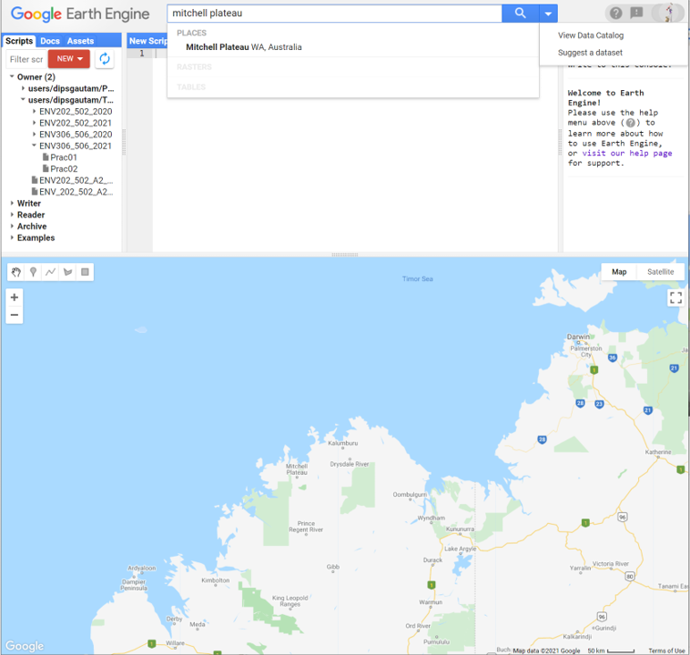

2. Now search for “Landsat 8 TOA” satellite data. From the list of results, open the “USGS Landsat 8 Collection 1 Tier 1 TOA Reflectance”.
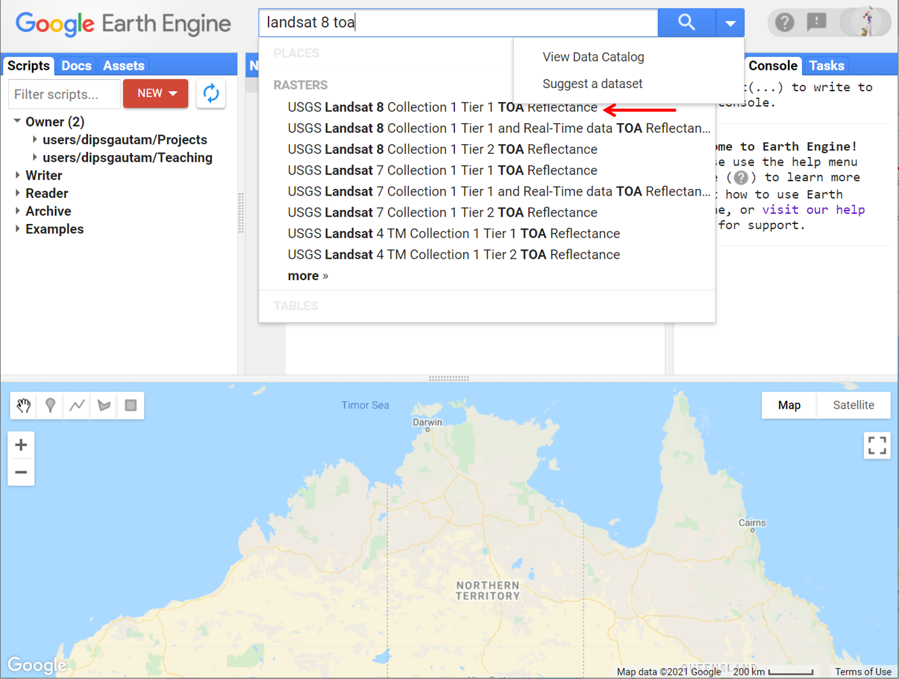
3. Have a read about the dataset description and band information and then click “Import” to import the dataset to your scripting pane. Once imported, rename the imageCollection to "l8".
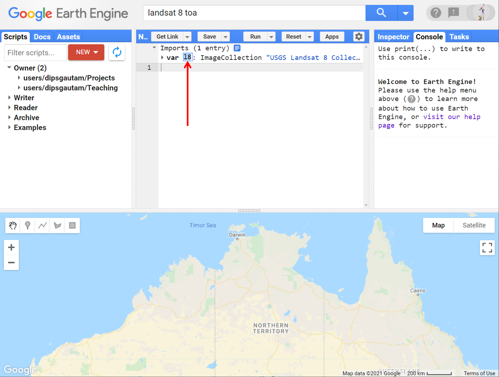

4. Use the rectangle geometry tool to draw a polygon over the Northern Australia. Rename the default geometry import to “roi” and untick the “roi” from Geometry Imports
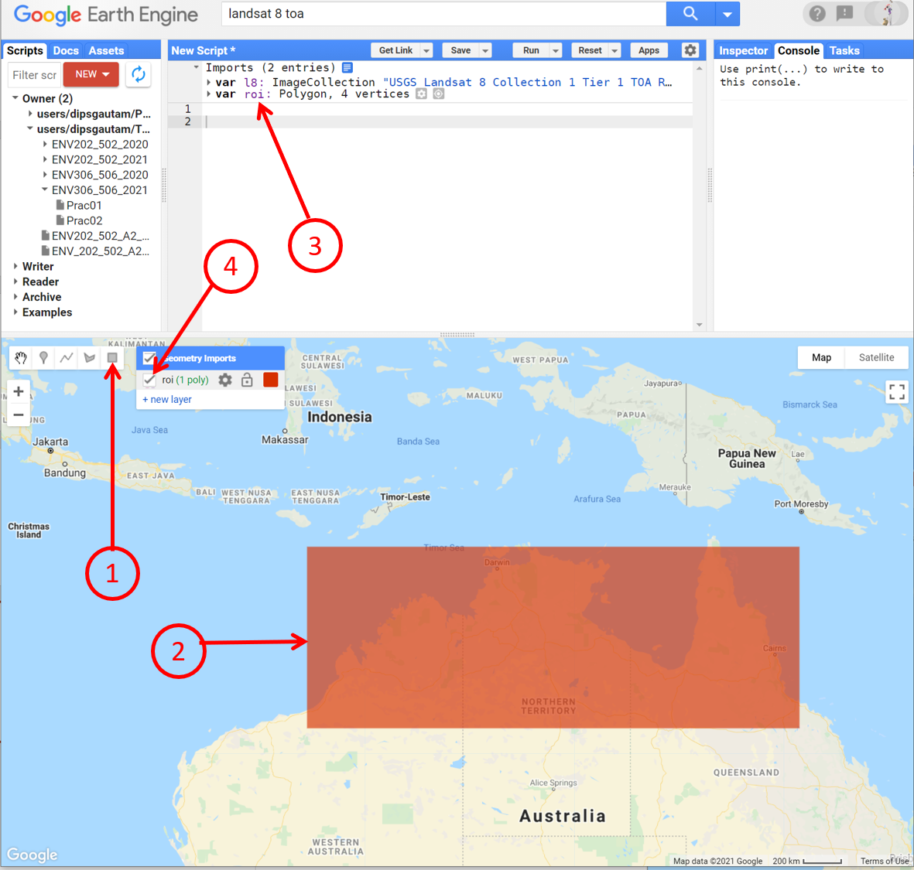

5. In Prac01, we learnt an extensive method of filtering image collection. Here we will just use the date range and the roi to return a collection of images, unlike a single image in Prac01. 
```JavaScript
// filter the data collection to from 2021 up to now.
var filtered = l8.filterDate('2021-01-01', Date.now()).filterBounds(roi);
```

6. Now print the filtered image collection to the console. 
```JavaScript
// print the image collection to the console
print(filtered);
```
7. Explore the printed information in the console. 
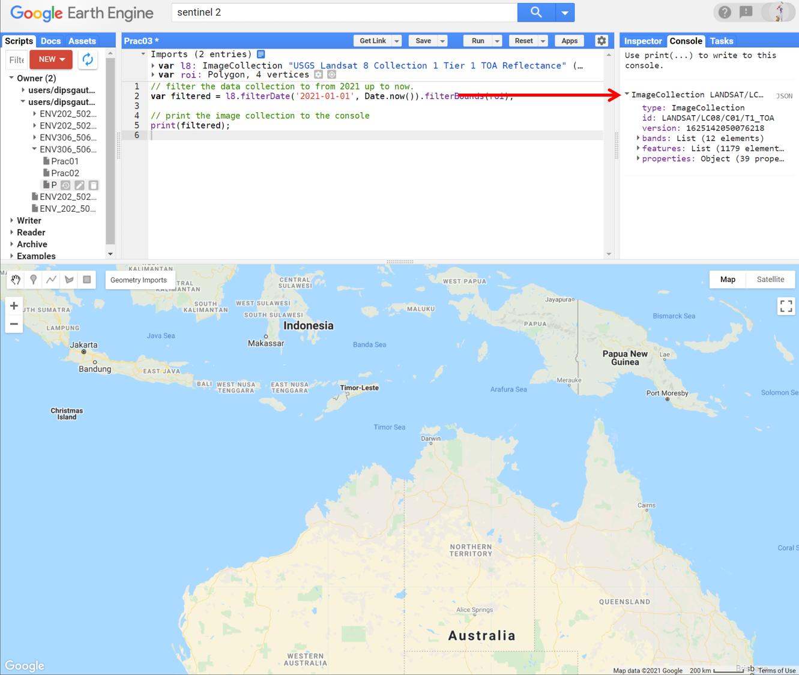

*Question:* How many Landsat-8 images were collected from the Northern Australia since the start of this year?

8. Now lets put all the images (I had 1179 images) into the mapping layer using Map.addLayer command. Notice the image tiles have hard boundaries and does not provide a synergetic view. 

```JavaScript
// display the filtered image collection into mapping layer
Map.addLayer(filtered,{min: 0, max: 0.3, bands:['B4', 'B3', 'B2']}, 'filtered');
```

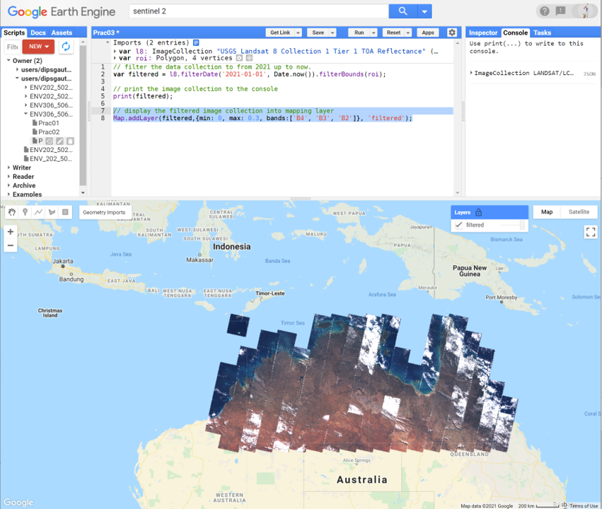

9. Notice subtle differences in the visualisation parameters between the Sentinel-2 and Landsat-8. In Sentinel-2 we had min-max set to 0-3000 whereas in Landsat 8  the appropriate min-max is 0-0.3.


## 2. Reducing image collections (temporal reducer)
1. Temporal reducers aggregates data over time. Imaging same Landsat scene being caputred approximately twice a month for 12 months. That means, on a given year, a particlular Landsat-8 image tile, will have about 24 images sitting right underneath captured at different t ime. Temporal reducers aggregates those images together to produce a composite. A temporal reducer drills down' temporally' thorugh each pixel and return the aggregated data for us.

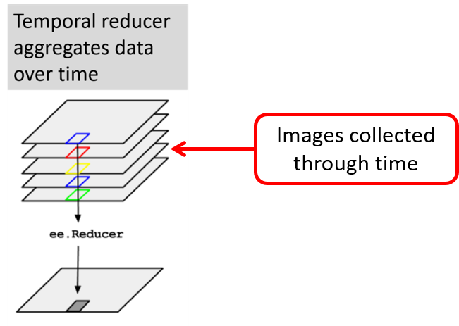


2. Lets apply the median() temporal reducer, which drills down temporally through each pixel and return the median value over time.

```JavaScript
// add the median image to the mapping layer
Map.addLayer(filtered.median(), {min: 0, max: 0.3, bands:['B4', 'B3', 'B2']}, 'median RGB');
```
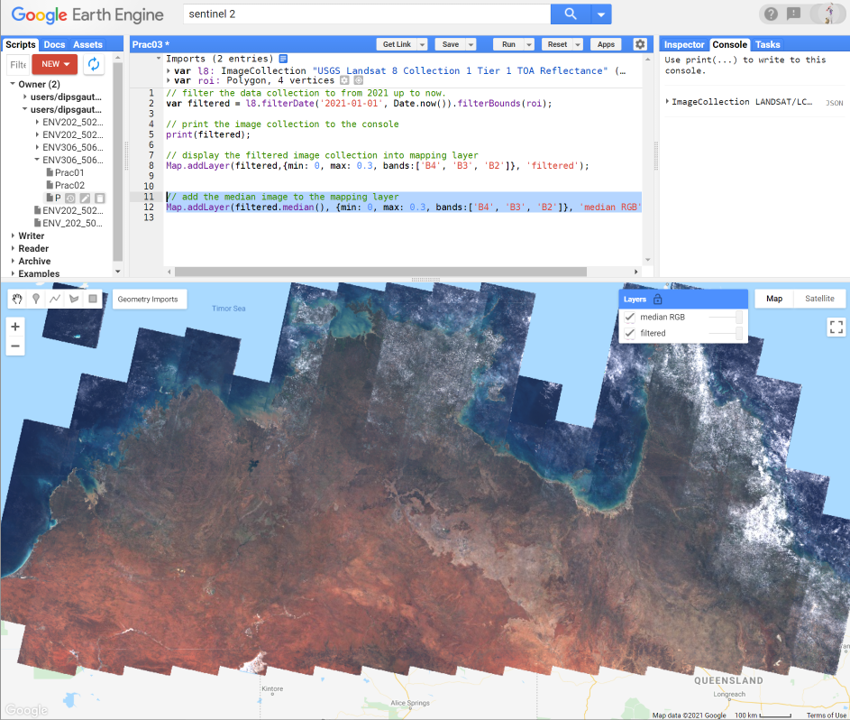

3. Explore the displayed mapping layer. Most of the clouds is removed and the hard boundaries between the image tiles are minimal the scene looks more blended. Try other reducers here e.g. mean(), min(), max(). Which reducer worked best for you?

4. Similarly, we can map median false color composite. Remember false color composite highlights the photosynthetically active vegetation in bright red. 

```JavaScript
// add the median false color composite to the mapping layer
Map.addLayer(filtered.median(), {min: 0, max: 0.3, bands:['B5', 'B4', 'B3']}, 'median false color');
```

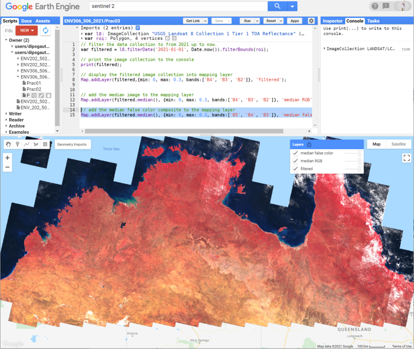

## 3. Writing functions e.g. to compute NDVI 

1. Functions are "self contained" modules of code that accomplish a specific task. Functions usually "take in" data, process it, and "return" a result. Once a function is written, it can be used over and over and over again. Here we will write a function to compute NDVI on an image. We will then use the function over and over and over and over to compute the NDVI on all the 1179 images. 

2. Before writing codes into function, it is a good practice to develop the code outside the function. Lets do that. In Lab01, we used image.expression() to compute NDVI. Here, let us use ee.Image.normalizedDifference() method to compute the NDVI. Have a read about this method in the docs tab. 

```JavaScript
// Isolate a single cloud free image to test the NDVI computation
var cloudFreeImage = filtered.sort("CLOUD_COVER").first();

// Compute the  NDVI on the cloud free image 
var ndviCloudFree = cloudFreeImage.normalizedDifference(['B5', 'B4']);

// Display the NDVI to the mapping layer
Map.addLayer(ndviCloudFree, {min: 0, max: 1, palette:['brown','yellow','green']}, 'NDVI image');
```

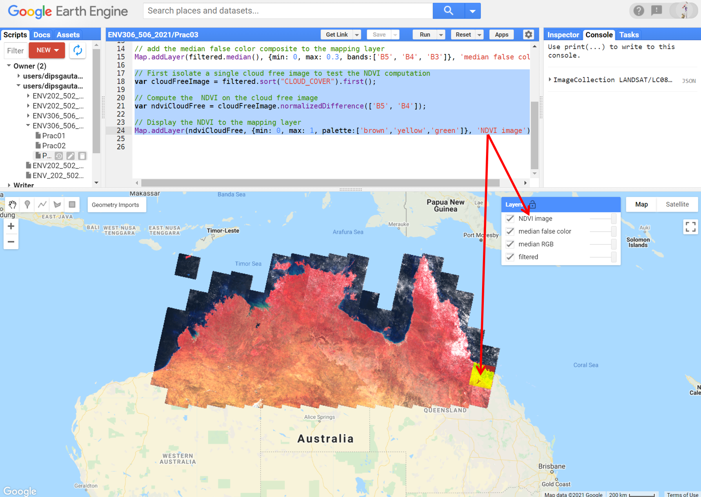

3. Couple of things that you need to note here in the above script
- In the first line, we sorted the 1179 images based on cloud cover and then picked the least cloudy image. Note the keyword "CLOUD_COVER" is different to the keyword we used in Prac01 "CLOUD_COVERAGE_ASSESSMENT". Why do you think that is? How do we know which keyword to use? Hint: Read under the "Image Properties" tab of the dataset description. 
- Second line computed NDVI using slightly different approach than that used in Prac01. Look under docs tab and search for the command "normalizedDifference" and have a read at it. Basically, in scripting there usually are more than one way of doing certain things. In this particular command, the input B5 and B4 are plugged into the formula (B5-B4)/(B5+B4). Now since B5 is NIR band and the B4 is Red band, the result is a NDVI.


2. Great, now that our NDVI script is working, we are ready to create our function. In following script, we create a function that does two things: First, compute NDVI from the input image and second add an extra band to the input image - the extra band is called NDVI which contains the NDVI image. 

```JavaScript
// Function to add a new band called "NDVI" to the input image. 
function addNDVIband(anImage) {
   // Compute NDVI using same approach as above
  var ndviTemp = anImage.normalizedDifference(['B5', 'B4']);
  // Return the input image after appending a new band called "NDVI"
  return anImage.addBands(ndviTemp.rename('NDVI'));}
```
4. Hit run, however, nothing new will happen. This is because we have created the function, but not used the function. Lets test the functionality of the function on the cloudFreeImage that we isolated earlier.  

```JavaScript
// test the function on a the cloudFreeImage isolated earlier
print ('Before calling the function', cloudFreeImage);
var ndviAdded = addNDVIband(cloudFreeImage);
print ('After calling the function', ndviAdded);
```

5. Now explore the printed information. Before looking at the below image, can you guess what you would expect to be printed before and after?

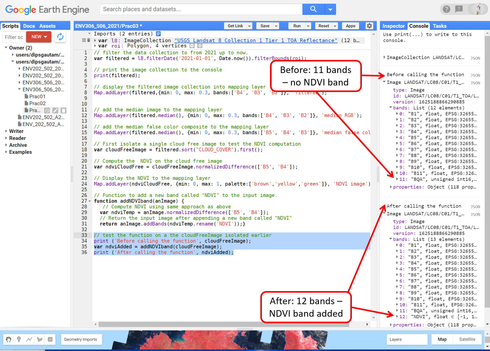

6. As programmed, the function has added a new band called "NDVI" to the input image (cloudFreeImage). This concludes the testing of the function. 


## 4. Map the function over the Landsat image collection

1. In the context of environmental monitoring, ability to monitor the landscape conditions and changes through both space and time is quite crucial. Now that we have a working function that has been tested on a single image, we will 'map' the function across the Landsat 8 collection called “filtered” which contains 1179 images. 

```JavaScript
// map the function to the image collection
var ndviMapped = filtered.map(addNDVIband);

// print the 1179 images after the mapping of function
print ('After mapping NDVI', ndviMapped);
```

2. From the printed information on the console, expand and check on several images if the NDVI band has been added as expected. The new variable "ndviMapped" should contain the collection of Landsat-8 images with an extra band called NDVI. Please verify yourself.

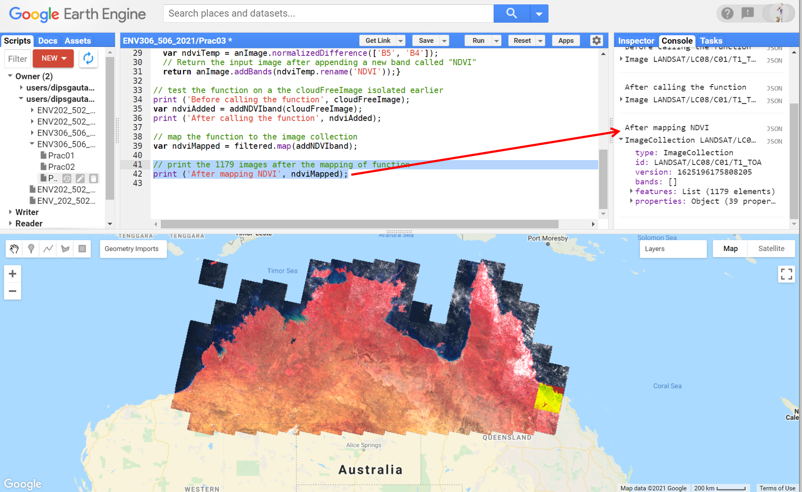

3. Now you can now treat this extra band (NDVI) as you would a regular band for visualisation. We will apply the median() temporal reducer to the NDVI band to map the NDVI for the entire Northern Australia. Zoom and explore the ndvi map of Northern Australia. The greener pixels represents the higher concentration of photosynthetically active vegetation.

```JavaScript
// apply temporal reducer to the NDVI band that has been added to the image collection. 
Map.addLayer(ndviMapped.median(), {bands: 'NDVI', min: 0, max: 1, palette:['brown','yellow','green','darkgreen']}, 'median ndvi');
```

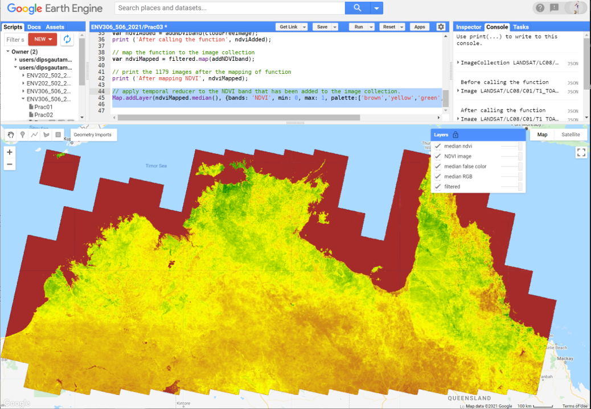

## 5. Charting NDVI over time
1. First lets create a polygon to define the area we want to generate chart from. Under Geometry Imports click on "new layer", select the rectangle drawing tool, draw a polygon around Darwin region and rename the polygon to "chartingPolygon".  

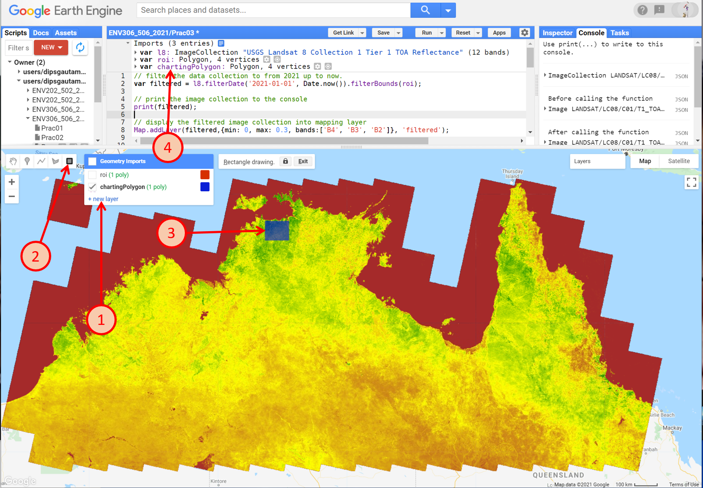

2. Add the following line of script to make a chart of NDVI over time for your area of interest.


```JavaScript
// First we create the chart on the GEE memory
var ndviChart = ui.Chart.image.series({
	imageCollection:ndviMapped.select("NDVI"), // define which band to chart
	region:chartingPolygon,                    // define which area to chart from
  reducer:ee.Reducer.median(),              // define the reducer to use
  scale:90,                                 // define the scale for reducer - higher than the  spatial resolution of the data 
  xProperty:'system:time_start'});

// now print the chart in the colsole
print(ndviChart);
```

2. Explore the chart. You can start to see the trends in the NDVI over time. In above chart I can see NDVI droping to almost zero during February - that could be attributed to cloud cover and not actual vegetation condition. 

3. Try moving the polygon "chartingPolygon" to a new area. To move the polygon, left click on the polygon and then left click drag to a different area. Try charting NDVI over Cairns region. Do you see differences in vegetation condition through NDVI?

4. Go back to the Try out the interactivity of the chart by hovering; expand it to full screen, and testing out the SVG/PNG/CSV download buttons.

## 6. Exporting image
The source data that you work with can have many different characteristics (single band, multispectral, bit depth, etc.), and the visualization tools in Earth Engine allow you to display the data in a variety of ways. You can also export the data in a variety of ways, such as a multi¬band image. This section will demonstrate how to export a 3¬band (RGB) 8-bit image that can be easily displayed in other tools outside of Earth Engine. In this exercise, we will export the cloud-free image extracted from the collection

1. Export the image to your Google Drive account. 

```JavaScript
// export the cloud-free image to your google drive account
Export.image.toDrive({
	image:cloudFreeImage.visualize(rgb_vis), // RGB visualisation parameter
	description:"Export", // Name of the task
	folder:"EarthEngine", // folder name on your google drive
	fileNamePrefix:"ENV306506_Lab03_cloudFreeImage", // file name
	region:roi, // export from this region
	scale:30}); // at this spatial resolution
```

2. After you run the script, you need to go to the task tab in the right panel and click run to export.

3. Go to your appropriate folder in the google drive to see the exported image

## The complete script

```JavaScript
// Print data details to console
print(theSRTM);

// Add the SRTM data to the interactive map
Map.addLayer(theSRTM);

// Add the data again, but with restricted value ranges for better visualisation
Map.addLayer(theSRTM, {min: 0, max: 300});

// Add the data again, with value ranges, and a useful title for the Layer tab
Map.addLayer(theSRTM, {min: 0, max: 300}, 'Elevation above sea level');

// Adding colour scale to the elevation data
Map.addLayer(theSRTM, {min: 0, max: 300, palette: ['blue', 'yellow', 'red']}, 'Elevation above sea level');

// Create hillshade and map it
var hillshade = ee.Terrain.hillshade(theSRTM);
Map.addLayer(hillshade, {min: 150, max:255}, 'Hillshade');

// Create terrain slope and map it
var slope = ee.Terrain.slope(theSRTM);
Map.addLayer(slope, {min: 0, max: 20}, 'Slope');

// computation: Terrain that has elevation over 200 m
var high = theSRTM.gt(200);
Map.addLayer(high, {}, 'Above 200m');

// Masking out the terrains below 200m from the DEM
var DEMover200 = theSRTM.updateMask(high);
Map.addLayer(DEMover200, {min: 200, max: 300, palette: ['blue', 'yellow', 'red']}, 'DEM>200');

// Apply spatial reducer to compute mean elevation over the roi
var meanElevation = theSRTM.reduceRegion({
        reducer: 'mean',
        geometry: roi,
        scale: 90
});

// print the mean elevation
print('Mean elevation', meanElevation.get('elevation'));
```

-------
### Thank you

I hope you found this prac useful. A recorded video of this prac can be found on your learnline.

#### Kind regards, Deepak Gautam
------
### The end
