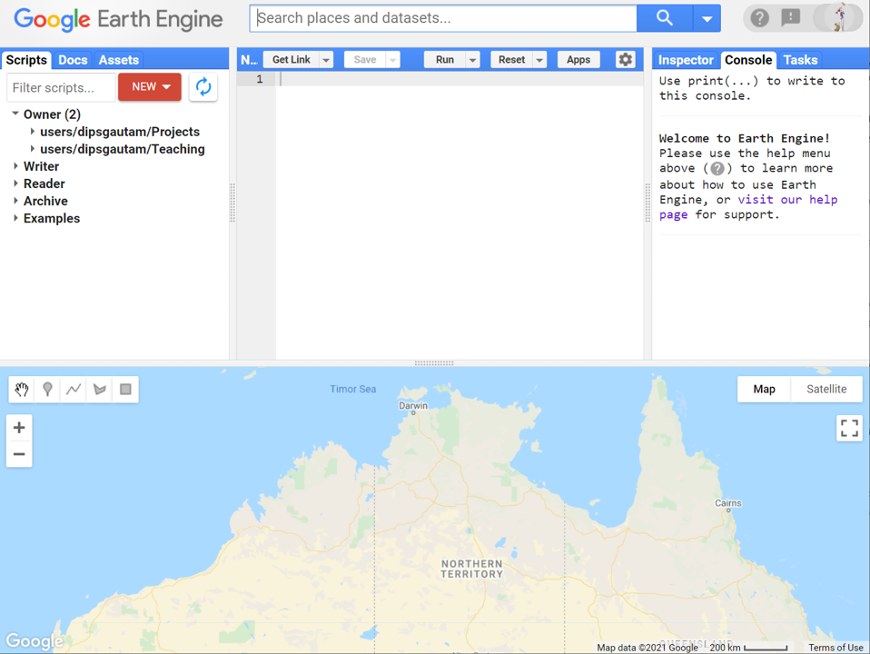
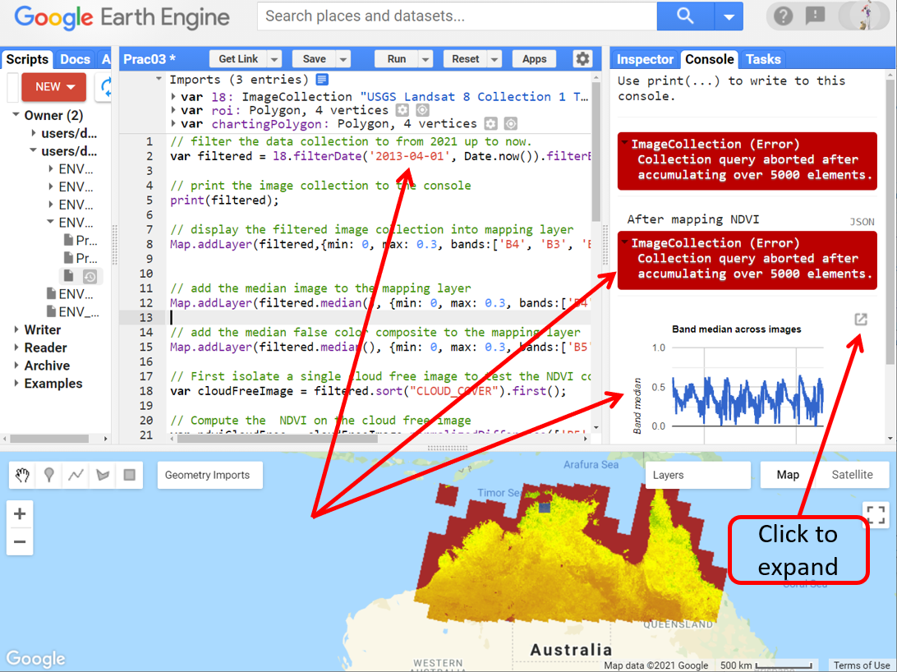
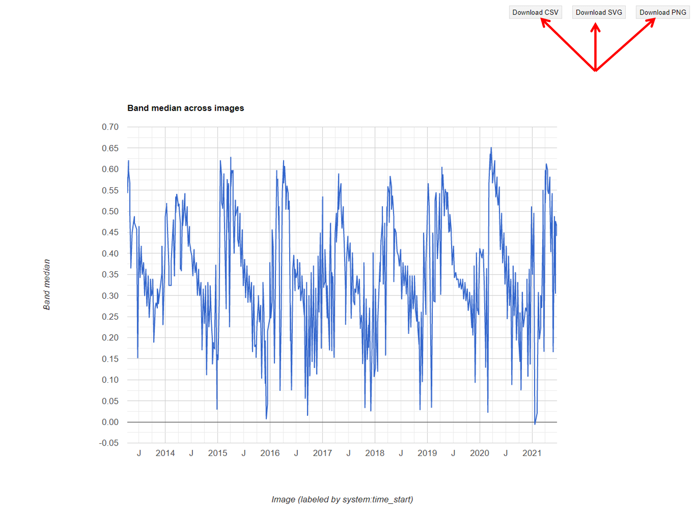
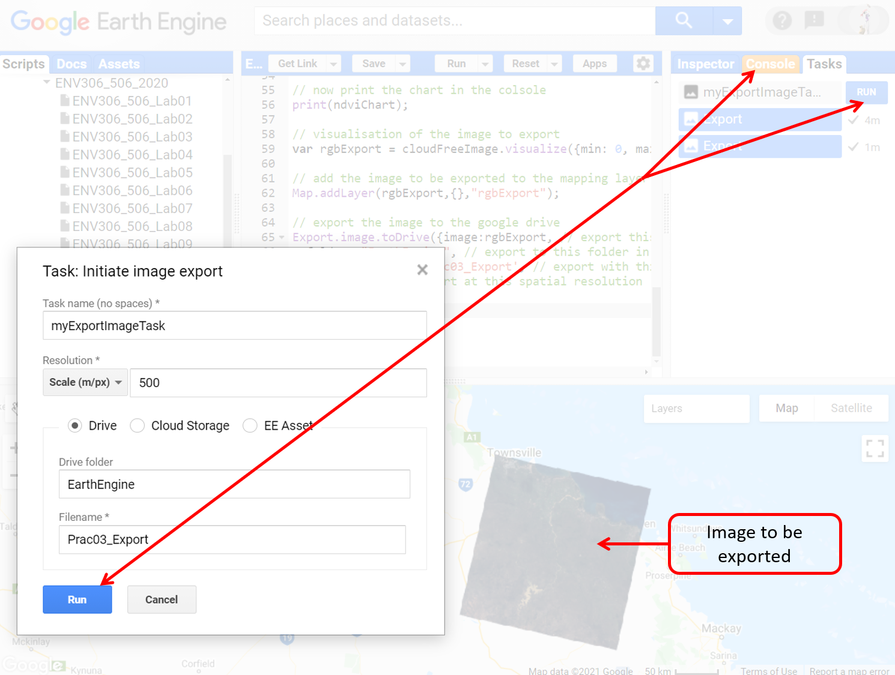
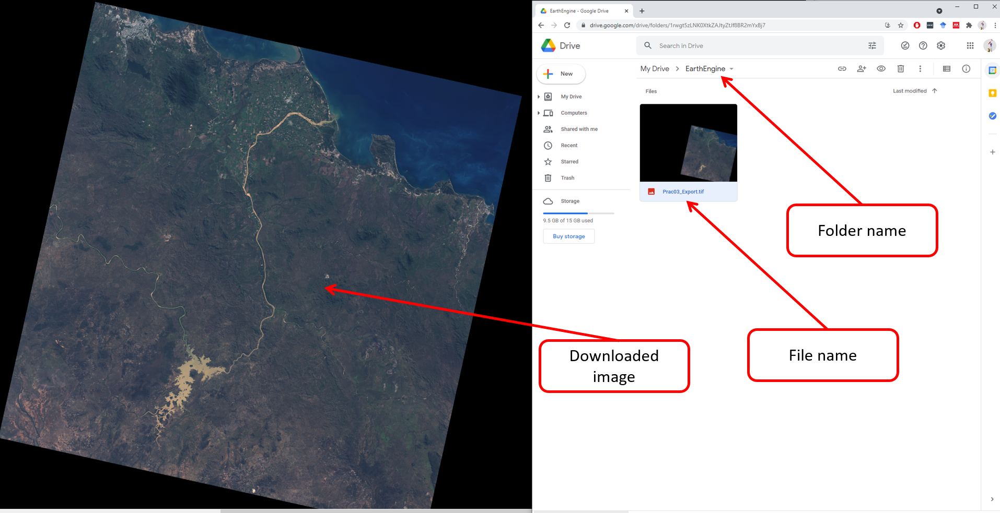

# Environmental Monitoring and Modelling (ENV306/506)

## Prac03 - Reducing and applying functions to images collection

### Acknowledgments 

- Google Earth Engine Team
- [GEARS Lab](https://www.gears-lab.com/emm_lab_3/)

### Objective

In Prac01 and Prac02 we learnt how to search for images (multispectral and elevation) and display them in the map environment, and we ran some basic computations. Now we will go a step further and learn how to apply the computations over a full collection of images. 

---------------------------------------------------
## 1. Load and filter and visualise Landsat image collection.
1. Open up the Google Earth Engine environment by going to [https://code.earthengine.google.com] in the Chrome browser.
1. In this prac, we will work with the Landsat 8 image collection over Northern Australia. Navigate to Northern Australia.


2. Now search for “Landsat 8 TOA” satellite data. From the list of results, open the “USGS Landsat 8 Collection 1 Tier 1 TOA Reflectance”.

3. Have a read about the dataset description and band information and then click “Import” to import the dataset to your scripting pane. Once imported, rename the imageCollection to "l8".


4. Use the rectangle geometry tool to draw a polygon over Northern Australia. Rename the default geometry import to “roi” and untick the “roi” from Geometry Imports


5. In Prac01, we learnt an extensive method of filtering image collection. Here we will just use the date range and the roi to return a collection of images, unlike a single image in Prac01. 
```JavaScript
// filter the data collection to from 2021 up to now.
var filtered = l8.filterDate('2021-01-01', Date.now()).filterBounds(roi);
```

6. Now print the filtered image collection to the console. 
```JavaScript
// print the image collection to the console
print(filtered);
```
7. Explore the printed information in the console. 


*Question:* How many Landsat-8 images were collected from Northern Australia since the start of this year?

8. Now let's put all the images (I had 1179 images) into the mapping layer using Map.addLayer command. Notice the image tiles have hard boundaries and do not provide a blended view. 

```JavaScript
// display the filtered image collection into mapping layer
Map.addLayer(filtered,{min: 0, max: 0.3, bands:['B4', 'B3', 'B2']}, 'filtered');
```


9. Notice subtle differences in the visualisation parameters between the Sentinel-2 and Landsat-8. In Sentinel-2 we had min-max set to 0-3000 whereas in Landsat 8  the appropriate min-max is 0-0.3.


## 2. Reducing image collections (temporal reducer)
1. Temporal reducer aggregates data over time. Imagine the same Landsat scene being captured approximately twice a month for 12 months. That means, on a given year, a particular Landsat-8 image tile, will have about 24 images sitting right underneath captured at different times. The temporal reducer aggregates those images together to produce a composite. A temporal reducer drills down' temporally' through each pixel and return the aggregated data for us.


2. Let's apply the median() temporal reducer, which drills down temporally through each pixel and return the median value over time.

```JavaScript
// add the median image to the mapping layer
Map.addLayer(filtered.median(), {min: 0, max: 0.3, bands:['B4', 'B3', 'B2']}, 'median RGB');
```


3. Explore the displayed mapping layer. Most of the clouds are removed and the hard boundaries between the image tiles are minimal the scene looks more blended. Try other reducers here e.g. mean(), min(), max(). Which reducer worked best for you?

4. Similarly, we can map the median false-colour composite. Remember false-colour composite highlights the photosynthetically active vegetation in bright red. 

```JavaScript
// add the median false color composite to the mapping layer
Map.addLayer(filtered.median(), {min: 0, max: 0.3, bands:['B5', 'B4', 'B3']}, 'median false color');
```


## 3. Writing functions e.g. to compute NDVI 

1. Functions are "self-contained" modules of code that accomplish a specific task. Functions usually "take in" data, process it, and "return" a result. Once a function is written, it can be used over and over and over again. Here we will write a function to compute NDVI on an image. We will then use the function over and over and over and over to compute the NDVI on all the 1179 images. 

2. Before writing codes into function, it is a good practice to develop the code outside the function. Let's do that. In Lab01, we used image.expression() to compute NDVI. Here, let us use ee.Image.normalizedDifference() method to compute the NDVI. Have a read about this method in the docs tab. 

```JavaScript
// Isolate a single cloud free image to test the NDVI computation
var cloudFreeImage = filtered.sort("CLOUD_COVER").first();

// Compute the  NDVI on the cloud free image 
var ndviCloudFree = cloudFreeImage.normalizedDifference(['B5', 'B4']);

// Display the NDVI to the mapping layer
Map.addLayer(ndviCloudFree, {min: 0, max: 1, palette:['brown','yellow','green']}, 'NDVI image');
```


3. Couple of things that you need to note here in the above script
- In the first line, we sorted the 1179 images based on cloud cover and then picked the least cloudy image. Note the keyword "CLOUD_COVER" is different to the keyword we used in Prac01 "CLOUD_COVERAGE_ASSESSMENT". Why do you think that is? How do we know which keyword to use? Hint: Read under the "Image Properties" tab of the dataset description. 
- Second-line computed NDVI using a slightly different approach than that used in Prac01. Look under the docs tab and search for the command "normalizedDifference" and have a read at it. Basically, in scripting there usually is more than one way of doing certain things. In this particular command, the input B5 and B4 are plugged into the formula (B5-B4)/(B5+B4). Now since B5 is the NIR band and the B4 is the Red band, the result is an NDVI.


2. Great, now that our NDVI script is working, we are ready to create our function. In the following script, we create a function that does two things: First, compute NDVI from the input image and second add an extra band to the input image - the extra band is called NDVI which contains the NDVI image. 

```JavaScript
// Function to add a new band called "NDVI" to the input image. 
function addNDVIband(anImage) {
   // Compute NDVI using same approach as above
  var ndviTemp = anImage.normalizedDifference(['B5', 'B4']);
  // Return the input image after appending a new band called "NDVI"
  return anImage.addBands(ndviTemp.rename('NDVI'));}
```
4. Hit run, however, nothing new will happen. This is because we have created the function, but not used the function. Let's test the functionality of the function on the cloudFreeImage that we isolated earlier.  

```JavaScript
// test the function on a the cloudFreeImage isolated earlier
print ('Before calling the function', cloudFreeImage);
var ndviAdded = addNDVIband(cloudFreeImage);
print ('After calling the function', ndviAdded);
```

5. Now explore the printed information. Before looking at the below image, can you guess what you would expect to be printed before and after?


6. As programmed, the function has added a new band called "NDVI" to the input image (cloudFreeImage). This concludes the testing of the function. 


## 4. Map the function over the Landsat image collection

1. In the context of environmental monitoring, the ability to monitor the landscape conditions and changes through both space and time is quite crucial. Now that we have a working function that has been tested on a single image, we will 'map' the function across the Landsat 8 collection called “filtered” which contains 1179 images. 

```JavaScript
// map the function to the image collection
var ndviMapped = filtered.map(addNDVIband);

// print the 1179 images after the mapping of function
print ('After mapping NDVI', ndviMapped);
```

2. From the printed information on the console, expand and check on several images if the NDVI band has been added as expected. The new variable "ndviMapped" should contain the collection of Landsat-8 images with an extra band called NDVI. Please verify yourself.


3. Now you can now treat this extra band (NDVI) as you would a regular band for visualisation. We will apply the median() temporal reducer to the NDVI band to map the NDVI for entire Northern Australia. Zoom and explore the ndvi map of Northern Australia. The greener pixels represents the higher concentration of photosynthetically active vegetation.

```JavaScript
// apply temporal reducer to the NDVI band that has been added to the image collection. 
Map.addLayer(ndviMapped.median(), {bands: 'NDVI', min: 0, max: 1, palette:['brown','yellow','green','darkgreen']}, 'median ndvi');
```


## 5. Charting NDVI over time
1. First let's create a polygon to define the area we want to generate a chart from. Under Geometry Imports click on "new layer", select the rectangle drawing tool, draw a polygon around the Darwin region and rename the polygon to "chartingPolygon".  


2. Add the following line of script to make a chart of NDVI over time for your area of interest.


```JavaScript
// First we create the chart on the GEE memory
var ndviChart = ui.Chart.image.series({
	imageCollection:ndviMapped.select("NDVI"), // define which band to chart
	region:chartingPolygon,                    // define which area to chart from
  reducer:ee.Reducer.median(),              // define the reducer to use
  scale:90,                                 // define the scale for reducer - higher than the  spatial resolution of the data 
  xProperty:'system:time_start'});

// now print the chart in the console
print(ndviChart);
```


2. Explore the chart. You can start to see the trends in the NDVI over time. In the above chart, I can see NDVI dropping to almost zero during February - that could be attributed to cloud cover and not actual vegetation condition. 

3. Try moving the polygon "chartingPolygon" to a new area. To move the polygon, left-click on the polygon and then left click-drag to a different area. Try charting NDVI over the Cairns region. Do you see differences in vegetation conditions through NDVI?

4. Go back to the top of the script and try changing the filterDate range to incorporate all the data i.e. from the start of the Landsat-8 mission up to now. With this change in the date range, the number of images the code has to deal with increases significantly - resulting a significantly more processing time. Also, you will notice some errors associated with the 
print function, however, that will not affect the overall processing.




3. You can expand the figure by clicking on the expand button (see above). This will open the chart in a new Chrome window. Here, you have the option to download the chart in an SVG/PNG/CSV format.



## 6. Exporting image
For most of the reporting activities, you will find that screenshot of the generated map is sufficient. However, there will be times when you want to export the image data such that you can further your analysis in other software e.g. ArcGIS, QGIS. Similar to visualisation, you can export the image data in a variety of ways, such as a multi¬band image. Below, we export a 3¬band (RGB) 8-bit image that can be easily displayed in other tools outside of Earth Engine. In this exercise, we will export the cloudFreeImage isolated earlier.

1. Export the image to your Google Drive account. 

```JavaScript
// visualisation of the image to export
var rgbExport = cloudFreeImage.visualize({min: 0, max: 0.3, bands:['B4', 'B3', 'B2']});

// add the image to be exported to the mapping layer
Map.addLayer(rgbExport,{},"rgbExport");

// export the image to the google drive
Export.image.toDrive({image:rgbExport, // export this visualisation
  folder: "EarthEngine", // export to this folder in your google drive
  fileNamePrefix: 'Prac03_Export', // export with this filename
  scale:100}); // export at this spatial resolution

```

2. After you run the script, you need to go to the task tab in the right panel and click run to export.



3. Once the export is complete in the task tab of the GEE, go to your appropriate folder in google drive to see the exported image. At this point, you can view or download the file to your local drive.



## The complete script

```JavaScript
// filter the data collection to from 2021 up to now.
var filtered = l8.filterDate('2021-01-01', Date.now()).filterBounds(roi);

// print the image collection to the console
print(filtered);

// display the filtered image collection into mapping layer
Map.addLayer(filtered,{min: 0, max: 0.3, bands:['B4', 'B3', 'B2']}, 'filtered');


// add the median image to the mapping layer
Map.addLayer(filtered.median(), {min: 0, max: 0.3, bands:['B4', 'B3', 'B2']}, 'median RGB');

// add the median false color composite to the mapping layer
Map.addLayer(filtered.median(), {min: 0, max: 0.3, bands:['B5', 'B4', 'B3']}, 'median false color');

// First isolate a single cloud free image to test the NDVI computation
var cloudFreeImage = filtered.sort("CLOUD_COVER").first();

// Compute the  NDVI on the cloud free image 
var ndviCloudFree = cloudFreeImage.normalizedDifference(['B5', 'B4']);

// Display the NDVI to the mapping layer
Map.addLayer(ndviCloudFree, {min: 0, max: 1, palette:['brown','yellow','green']}, 'NDVI image');

// Function to add a new band called "NDVI" to the input image. 
function addNDVIband(anImage) {
   // Compute NDVI using same approach as above
  var ndviTemp = anImage.normalizedDifference(['B5', 'B4']);
  // Return the input image after appending a new band called "NDVI"
  return anImage.addBands(ndviTemp.rename('NDVI'));}

// test the function on a the cloudFreeImage isolated earlier
print ('Before calling the function', cloudFreeImage);
var ndviAdded = addNDVIband(cloudFreeImage);
print ('After calling the function', ndviAdded);

// map the function to the image collection
var ndviMapped = filtered.map(addNDVIband);

// print the 1179 images after the mapping of function
print ('After mapping NDVI', ndviMapped);

// apply temporal reducer to the NDVI band that has been added to the image collection. 
Map.addLayer(ndviMapped.median(), {bands: 'NDVI', min: 0, max: 1, palette:['brown','yellow','green','darkgreen']}, 'median ndvi');

// First we create the chart on the GEE memory
var ndviChart = ui.Chart.image.series({
	imageCollection:ndviMapped.select("NDVI"), // define which band to chart
	region:chartingPolygon,                    // define which area to chart from
  reducer:ee.Reducer.median(),              // define the reducer to use
  scale:90,                                 // define the scale for reducer - higher than the  spatial resolution of the data 
  xProperty:'system:time_start'});

// now print the chart in the console
print(ndviChart);

// visualisation of the image to export
var rgbExport = cloudFreeImage.visualize({min: 0, max: 0.3, bands:['B4', 'B3', 'B2']});

// add the image to be exported to the mapping layer
Map.addLayer(rgbExport,{},"rgbExport");

// export the image to the google drive
Export.image.toDrive({image:rgbExport, // export this visualisation
  folder: "EarthEngine", // export to this folder in your google drive
  fileNamePrefix: 'Prac03_Export', // export with this filename
  scale:100}); // export at this spatial resolution
  
```

-------
### Thank you

I hope you found this prac useful. A recorded video of this prac can be found on your learnline.

#### Kind regards, Deepak Gautam
------
### The end
