# Environmental Monitoring and Modelling (ENV306/506)

## Prac04 - Mapping and monitoring surface water availability

### Acknowledgments 

- Google Earth Engine Team
- USAID, SERVER Mekong, NASA, Winrock International, adpc
- [GEARS Lab](https://www.gears-lab.com/emm_lab_8/)

### Objective

In Prac03, we worked with the Landsat-8 image collection. We learnt how to work with the image collection, filtering, and apply computation to the entire image collection. Here we will work further with the Landsat-8 image collection in the context of land water management. Managing water resources requires spatially explicit knowledge of where water is located in landscapes, and how it varies over time. The objective of this prac is to map the presence of surface water from space and calculate the inundation frequency of different water bodies. 

---------------------------------------------------
## 1. Working with Landsat-8 image collection.

1. Open up the Google Earth Engine environment by going to [https://code.earthengine.google.com] in the Chrome browser.

2. In this prac, we will make use of the Landsat 8 TOA Tier 1 collection (LANDSAT/LC08/C01/T1_TOA). You have already used this image collection in Prac03. Import the image collection and rename the image collection to "l8". You can use two methods to import the image collection. a) using the techniques learnt in Prac03, b) by simply running the below script. Both the method will do exactly the same thing - provide you with access to the Landsat 8 TOA Tier 1 collection.

```JavaScript
// import the Landsat- 8 image collection
var l8 = ee.ImageCollection('LANDSAT/LC08/C01/T1_TOA');
```

3. We will use the vicinity of Menindee Lakes for this example, located between Broken Hill and Ivanhoe in NSW, Australia. The Menindee Lakes supplies water for domestic use, livestock and irrigation to Broken Hill, the lower Darling and the water users along the Murray River in NSW, VIC, and SA. Seven of the lakes are incorporated in an artificially regulated overflow system providing both for flood mitigation and as storage (you can read detail at [NSW DPI website](https://www.industry.nsw.gov.au/__data/assets/pdf_file/0008/145394/Murray-and-Lower-Darling.pdf)). 

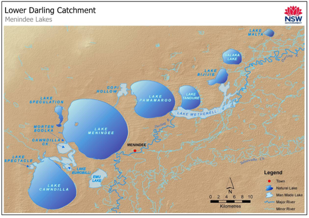

4. Navigate to the Menindee Lakes and define a region of interest using the geometry rectangle tool. Rename the geometry to  "roi". 

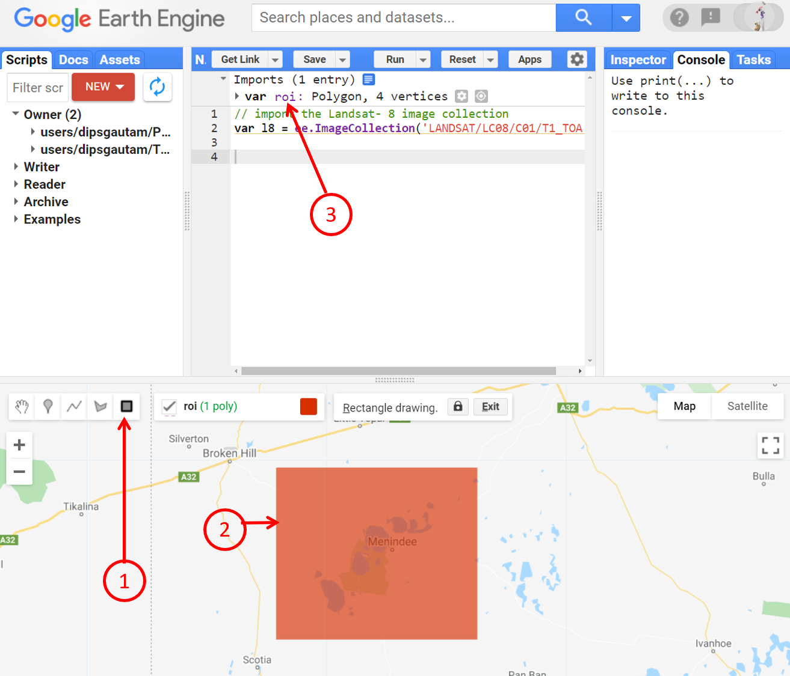

5. Now, filter the Landsat 8 collection within the roi, between April 2013 and now. Refer to Prac03 for more detail on filtering. In the below example, we set the start and end date upfront and use the variable name within the filtering. 

```JavaScript
// Define the desired start and end dates upfront
var startDate = ee.Date('2013-05-01');
var endDate = ee.Date(Date.now());

// Select Landsat 8 images within the specified time and spatial range
var l8Images = l8.filterDate(startDate, endDate).filterBounds(roi);
```

*Question:* If you compare the above filtering and the filtering you did in Prac03, you can see some subtle differences. Specifically, here, we did not use the "sort" and ".first()". Can you think why that is and what would the filtered result be here?

6. I want you to print the filtered image collection and explore the printed information in the console - we have already learnt how to do it. How many images did you have in your collection? I had 684

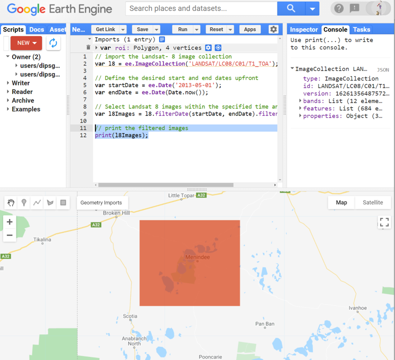

7. It is important to note here that although we did filtering, we are not after a single image but the series of images collected through time. Also, we haven't excluded the potential cloudy images. The disadvantage of completely removing the cloudy images is that we may end up with much fewer images than that we ideally want to monitor the water bodies through time. So, instead of completely removing the cloudy images, we will just mask out the cloudy section of images. 

8. Something for you to try yourself - refer to Prac03 and add a median image to the mapping layer. 

## 2. Masking out the clouds

1. Our approach to dealing with clouds so far has been: a) sorting the image by cloud cover and selecting the least cloudy image, and b) using temporal reducers to average out the cloud. This next piece of code shows an alternative way of dealing with clouds by physically masking them out.

```JavaScript
// define a threshold value to mask out the cloud. 0 = no clouds, 100 = completly cloudy
var cloudThreshold = 20;

// Write a function to mask out the cloud 
function cloudMask (anImage){
  // Next line of script  goes through each pixel of the input image
  // and gives a simple cloud score for each pixels. 
  // The algorithm uses brightness, temperature, and NDSI (normalise difference snow index)
	var cloudScore = ee.Algorithms.Landsat.simpleCloudScore(anImage);
	// next line of script uses the threshold we set earlier to identify the cloudy pixels
	var cloudy = cloudScore.select('cloud').gt(cloudThreshold);
	// next line of script applies the mask and returns the masked image
	return anImage.updateMask(cloudy.not());}
```

2. Please take some time to unpack what happened in the above script – use the image below as a guide. 

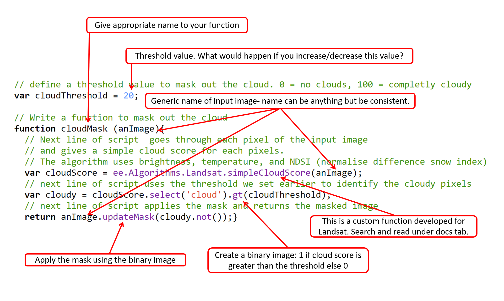


*Question:* I purposefully put ".gt" in the above script. Now that you have fathomed the above script, can you make the script produce the same result using ".lt" instead of ".gt"? What else would you need to modify in the script?

3. Now we can map the cloudMask function over our filtered image collection. 
```JavaScript
// apply cloudMask function to the image collection l8Images
var l8CloudMasked = l8Images.map(cloudMask);
```
4. Nothing happens when you run the script. All the processing is done in the GEE memory. We are not sure if the masking has worked or not. Let's display one image from the masked collection to see if masking has occurred.

```JavaScript
// display an image to test the masking
Map.addLayer(l8CloudMasked.first(), {min: 0, max: 0.5, bands: ['B5', 'B4', 'B3']}, 'Testing the cloudMask');
```

5. The displayed image shows some white portion within the images. These pixels have been masked out - suspected of being the cloud. This clearly shows the masking has occurred. Note this is just one image out of my 684 image collections. can you see any masked pixels in your image? 

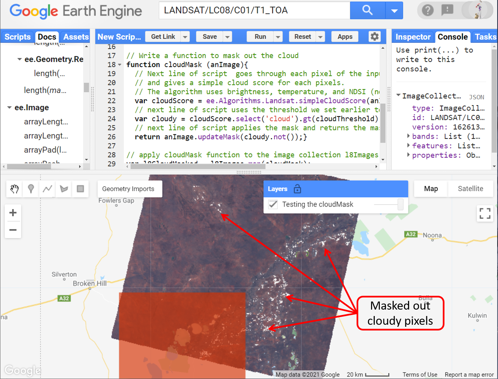

6. Now that we have verified the clouds have been masked, let us apply a temporal reducer to map the median true colour composite. 

```JavaScript
//map the temporally reduced median of the image collection
Map.addLayer(l8CloudMasked.median(), {min: 0, max: 0.5, bands: ['B4', 'B3', 'B2']}, 'Median true-color');
```

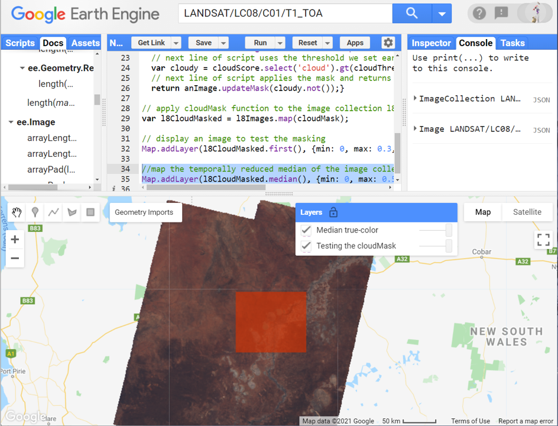

7. Great, we have a cloud-free composite from our roi mapped from 2013 to the present. We can go a step further and clip the image median image within our roi boundary. Replace the above "Median true-color" display script with the below script to map just within our roi. Also, make sure you untick the roi for better visualisation. 

```JavaScript
//map the temporally reduced median of the image collection
Map.addLayer(l8CloudMasked.median().clip(roi), {min: 0, max: 0.5, bands: ['B4', 'B3', 'B2']}, 'Median, clipped true-color');
```

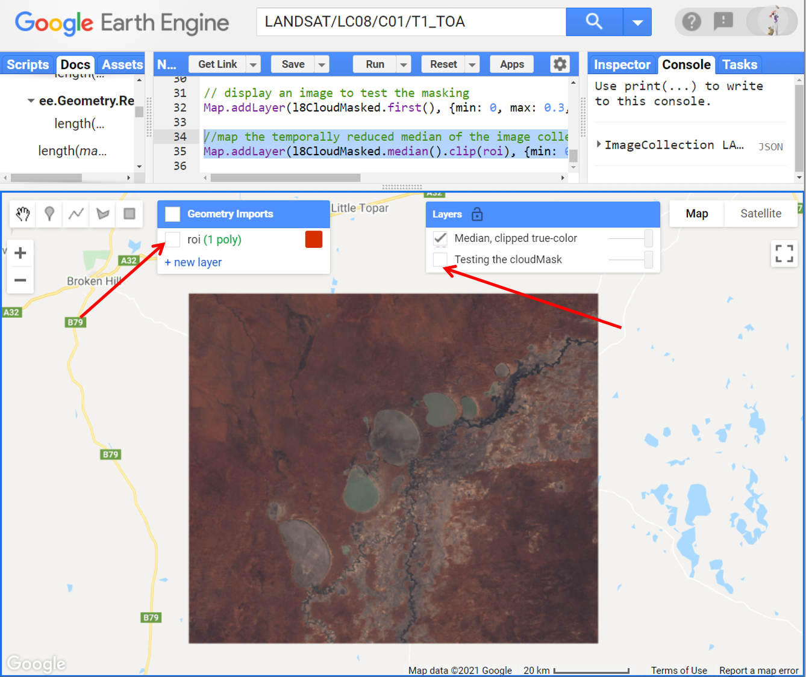

## 3. The normalised difference water index (NDWI)
1. In Prac 03, we worked with NDVI. The NDVI is used to map the photosynthetically active vegetation. The index that we will work on today is called NDWI (Normalised Difference Water Index). The NDWI is used to map the water bodies in the landscape. The formula for the computation of NDWI is (Green - NIR)/(Green + NIR). Let us write a function that creates an NDWI band imageCollection. Remember we did a similar routine in Prac03 when adding an NDVI band. When working with image collection, it is a common practice to create a function and then maps the function to the image collection.

```JavaScript
// Function to compute compute and return NDWI for an input Landsat image
function computeNdwiImage(anImage) {
   // Input the bands in the correct order to match the NDWI formula and rename the band name to NDWI
  var ndwiTemp = anImage.normalizedDifference(['B3', 'B5']).rename('NDWI');
  // Clip the NDWI to roi and return the clipped NDWI whilst retaining the timestamp from input image
  return ndwiTemp.clip(roi).copyProperties(anImage, ['system:time_start']);}
```

2. Now that the function to compute NDWI is ready, map the computeNdwiImage function over the image collection.

```JavaScript
// Apply the computeNdwiImage function to our masked image collection 
var l8Ndwi = l8CloudMasked.map(computeNdwiImage);
```

3. When you hit run, nothing new happens in the GEE. That's because all the computation we have added has happened in the GEE memory. Using the above NDWI collection, let's map the NDWI spatially to show the maximum spatial extent of water bodies over our date range.

```JavaScript
// Map the maximum extent of the water bodies since 2013
Map.addLayer(l8Ndwi.max().mask(l8Ndwi.max()),{min: 0, max:1, palette: ['blue','darkblue']}, 'Max extent of water');
```

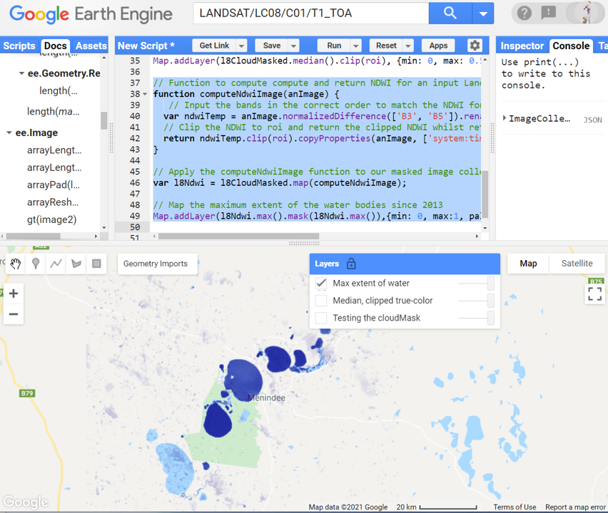

*Question:* Can you guess whats the purpose of ".mask(l8Ndwi.max()" in the above script? What would happen if you removed that bit from the above script?

4. What you see in the mapping pane is the maximum water extent in each pixel since 2013. It is not accumulative water extent but the maximum in our image collection. The dark blue pixel represents the deeper water bodies while the light blue pixel represents the shallow water bodies. 

5. What if we are interested in one particular year and not the entire duration since 2013? You can use the below script to filter the NDWI collection and display it in the mapping layer. 

```JavaScript
// The year I am interested to map the NDWI
var year = 2019;

// filter the NDWI for the year
var ndwi2019 = l8Ndwi.filterDate(ee.Date.fromYMD(year, 1, 1), ee.Date.fromYMD(year, 12, 31));

// Add the maximum water body extent for that 1 year
Map.addLayer(ndwi2019.max().mask(ndwi2019.max()), {min:0,max:1,palette:['darkblue']}, 'Max extent 2019');

```

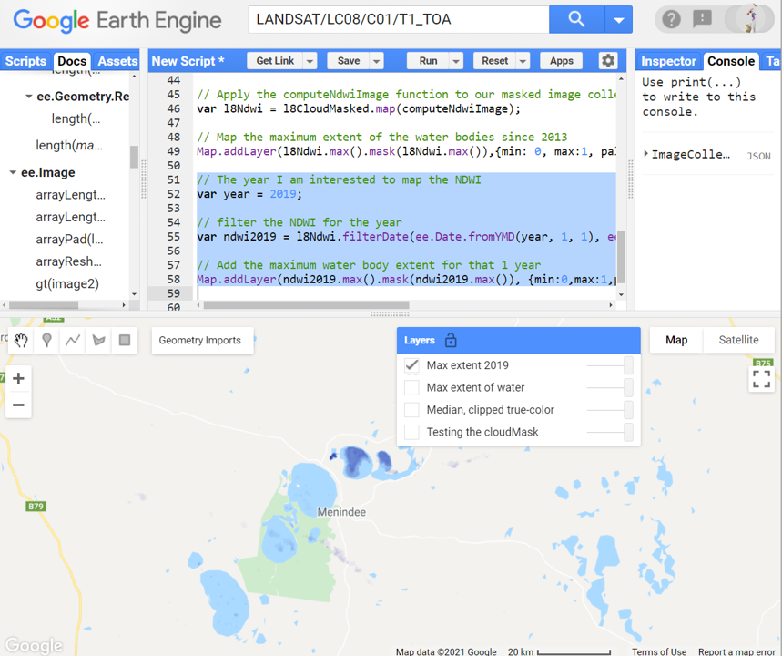

6. Take a moment to compare the maximum extent of water bodies since 2013 and in 2019. You can see a stark difference in the maximum water bodies in the landscape. Clearly, 2019 looks much much drier - could it be the effect of drought and reduced rain. Think about what the implication could be if the water in Menindee lake were about to run out. 

## 4. Inundation frequency
1. Finally, what we really want to see in this Prac is to map the inundation frequency of the water bodies. The higher frequency means the consistent presence of water bodies in a pixel, the lower frequency means the consistent absence of water bodies in that pixel. First, we will create a function that will return the status of water in each pixel: 0 = not water, 1 = water

```JavaScript
//Function to return the binary water status: 0 = not water, 1= water 
function waterBinary(anImage) {
	return anImage.gt(0);}
```

2. Now we will use the waterBinary function to get the inundation status for the entire image collection. If a pixel had water binary as 1, that will mean the pixel is inundated. Otherwise, the pixel is not inundated

```JavaScript
// Map the waterBinary function over the l8ndwi collection. 
var innundationStatus = l8Ndwi.map(waterBinary);
```

3. Next let's compute the frequency of the inundation which is the sum of inundation status divided by the count of inundation status.

```JavaScript
// computing frequency of inundation = Sum of innundation/ Count of innundation
var frequency = innundationStatus.sum().divide(innundationStatus.count());

// quickly map the frequency of inundation
Map.addLayer(frequency)
```
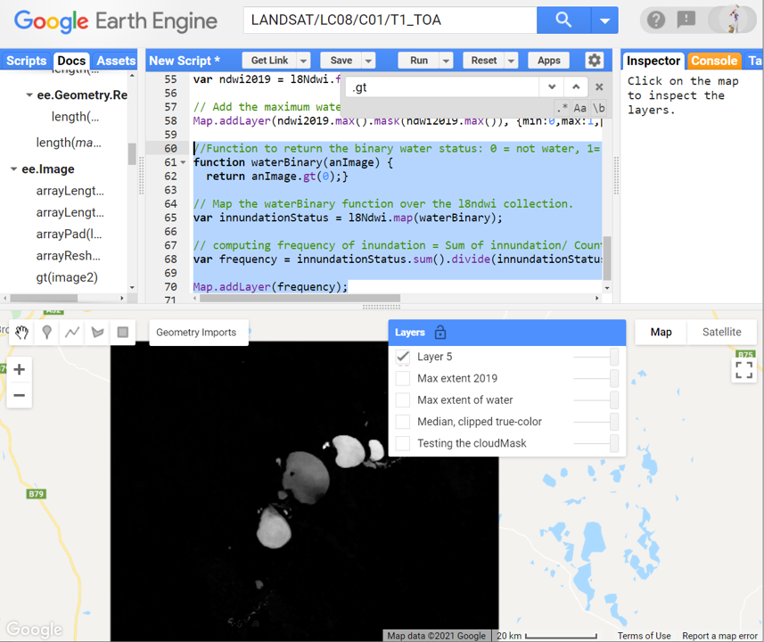

4. In the above map, the bright pixels are the ones that consistently had water = more frequent inundation. The dark pixels are the one which had low or no water = less frequent inundation. We can go a step forward and map the inundation status properly - using a colour palette and masking. Replace the above "Map.addLayer(frequency)" script with the below script.

```JavaScript
//Add the frequency of inundation image to the mapping layer
Map.addLayer(frequency.mask(frequency),
{palette: ['white', 'magenta', 'blue','darkblue']}, 'Water inundation frequency');
``` 
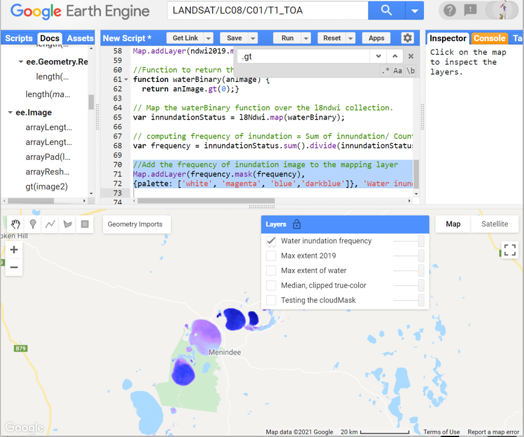

5. Inspect carefully to comprehend the image in the display. The darkblue pixel represents the lake that has not dried out. The blue pixels represent the area of the lake that has sometimes dried out. The magenta pixel represents the region of the lake that has frequently dried out. The transparent (non-coloured) pixel represents the lake/landscape that has stayed mostly dry during the 2013-present time.

6. Don't forget to save the script before you exit. 

## 5. Ungraded exercise

1. Move your region of interest (roi) around different parts of Australia and explore how current drought conditions are affecting dam levels in different parts of the country. Can you query the water dam from your region? Generate the max innundation for each year since 2013.

2. Map the water availability and innundation frequency over the same region using Sentinel-2 images. Landsat-8 and Sentinel-2 differ in spatial resolution, temporal resolution, and band position. Do you see similar/different results when using Landsat vs Sentinel? Think about how you might go about expanding the time series and going further back in time to look at longer-term inundation trends e.g. since the start of this century.

## The complete script

```JavaScript
// import the Landsat- 8 image collection
var l8 = ee.ImageCollection('LANDSAT/LC08/C01/T1_TOA');

// Define the desired start and end dates upfront
var startDate = ee.Date('2013-05-01');
var endDate = ee.Date(Date.now());

// Select Landsat 8 images within the specified time and spatial range
var l8Images = l8.filterDate(startDate, endDate).filterBounds(roi);

// print the filtered images
print(l8Images);

// define a threshold value to mask out the cloud. 0 = no clouds, 100 = completly cloudy
var cloudThreshold = 20;

// Write a function to mask out the cloud 
function cloudMask (anImage){
  // Next line of script  goes through each pixel of the input image
  // and gives a simple cloud score for each pixels. 
  // The algorithm uses brightness, temperature, and NDSI (normalise difference snow index)
	var cloudScore = ee.Algorithms.Landsat.simpleCloudScore(anImage);
	// next line of script uses the threshold we set earlier to identify the cloudy pixels
	var cloudy = cloudScore.select('cloud').gt(cloudThreshold);
	// next line of script applies the mask and returns the masked image
	return anImage.updateMask(cloudy.not());}

// apply cloudMask function to the image collection l8Images
var l8CloudMasked = l8Images.map(cloudMask);

// display an image to test the masking
Map.addLayer(l8CloudMasked.first(), {min: 0, max: 0.3, bands: ['B4', 'B3', 'B2']}, 'Testing the cloudMask');

//map the temporally reduced median of the image collection
Map.addLayer(l8CloudMasked.median().clip(roi), {min: 0, max: 0.5, bands: ['B4', 'B3', 'B2']}, 'Median, clipped true-color');

// Function to compute compute and return NDWI for an input Landsat image
function computeNdwiImage(anImage) {
   // Input the bands in the correct order to match the NDWI formula and rename the band name to NDWI
  var ndwiTemp = anImage.normalizedDifference(['B3', 'B5']).rename('NDWI');
  // Clip the NDWI to roi and return the clipped NDWI whilst retaining the timestamp from input image
  return ndwiTemp.clip(roi).copyProperties(anImage, ['system:time_start']);
}

// Apply the computeNdwiImage function to our masked image collection 
var l8Ndwi = l8CloudMasked.map(computeNdwiImage);

// Map the maximum extent of the water bodies since 2013
Map.addLayer(l8Ndwi.max().mask(l8Ndwi.max()),{min: 0, max:1, palette: ['blue','darkblue']}, 'Max extent of water');

// The year I am interested to map the NDWI
var year = 2019;

// filter the NDWI for the year
var ndwi2019 = l8Ndwi.filterDate(ee.Date.fromYMD(year, 1, 1), ee.Date.fromYMD(year, 12, 31));

// Add the maximum water body extent for that 1 year
Map.addLayer(ndwi2019.max().mask(ndwi2019.max()), {min:0,max:1,palette:['darkblue']}, 'Max extent 2019');

//Function to return the binary water status: 0 = not water, 1= water 
function waterBinary(anImage) {
	return anImage.gt(0);}

// Map the waterBinary function over the l8ndwi collection. 
var innundationStatus = l8Ndwi.map(waterBinary);

// computing frequency of inundation = Sum of innundation/ Count of innundation
var frequency = innundationStatus.sum().divide(innundationStatus.count());

//Add the frequency of inundation image to the mapping layer
Map.addLayer(frequency.mask(frequency),
{palette: ['white', 'magenta', 'blue','darkblue']}, 'Water inundation frequency');
  
```

-------
### Thank you

I hope you found this prac useful. A recorded video of this prac can be found on your learnline.

#### Kind regards, Deepak Gautam
------
### The end
