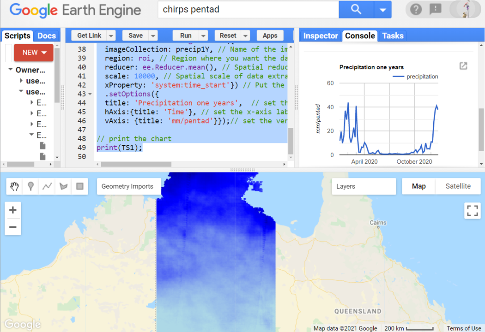

# Environmental Monitoring and Modelling (ENV306/506)

## Prac05 - Exploring rainfall trends over time

### Acknowledgments 

- Google Earth Engine Team
- [GEARS Lab](https://www.gears-lab.com/emm_lab_5/)

### Objective

The objective of this lab is to broaden our horizons and explore different types of data in the Google Earth Engine Environment. Thus far we have worked with optical satellite data, and have explored vegetation trends over time and space. However merely tracking changes in vegetation properties is not enough to understand what is driving them - we need to be able to link these dynamics with other environmental data. 

---------------------------------------------------
## 1. Load and study the CHIRPS rainfall dataset.
1. Open the Google Earth Engine environment by going to [https://code.earthengine.google.com] in the Chrome browser.

2. Today we will use the Climate Hazards Group InfraRed Precipitation with Station (CHIRPS) dataset.  The CHIRPS data is a 30+ year quasi-global rainfall dataset, since 1981. CHIRPS incorporates 0.05° resolution satellite imagery (from MODIS) with in-situ rainfall weather station data to create gridded rainfall time series for trend analysis and seasonal drought monitoring. Load precipitation data from the CHIRPS data archive 

```JavaScript
// Load the rainfall dataset 
var CHIRPS= ee.ImageCollection('UCSB-CHG/CHIRPS/PENTAD');
```

3. Before you start to work on a dataset, it is always a good idea to have a read about the dataset and understand the details. Such as whats the date range of availability of this dataset? What area does this dataset cover? How many bands does it contain? What is the name of the bands? What is stored in each band and their unit? What's the spatial resolution of the bands? , etc. Take your time to find out all the information of this particular CHIRPS dataset. 
  
4. Also, always take some time to explore the dataset by printing the dataset onto your console and quickly adding it to your mapping layer. 

```JavaScript
// print the dataset to console
print(CHIRPS);

// add the dataset to your mapping layer.
Map.addLayer(CHIRPS.first());
```

5. What do you see? How many images did your collection have? I had 2916 images collected since 1981. Can you visually judge if Australia seems to have more or less rainfall compared to the rest of the world? 
 
6. Now that we have read the description of the dataset, played a bit with the dataset, we are ready to work further. Let's filter the rainfall dataset within a range of dates. I will use 2015-2029 (5 years) for this exercise, you can use any range.

```JavaScript
//filter the dataset with a date range of interest
var precip5Y = CHIRPS.filterDate('2015-01-01','2019-12-31');
```

## 2. Map the rainfall pattern spatially
1. Let's first define our region of interest. In this exercise, I will define the region of interest covering the entire Northern Territory. Use the rectangular geometry tool to draw a region of interest, rename the default variable "geometry" to "roi".


2. Using sacthe mean reducer, map the 5-year spatial pattern of the rainfall in NT. Adjust the min and max values yourself by using the inspector tool.

```JavaScript
// adding mean precipitation of five-year time series to the mapping panel 
Map.addLayer(precip5Y.mean().clip(roi), {min: 3, max: 25, palette:['lightblue','blue','darkblue']}, '5-year precip');
```


*Question:* Do you remember whats the function of ".mean()" and ".clip(roi)" in the above line of script? 

3. Looking at the above line of script and the resulting map, interpret the map. What does lightblue, blue, and darkblue colour represent?

*Question*: In the above map, the darkest blue colour represents approximately how much rainfall? Why? [15 mm/pentad, 20 mm/pentad, 25 mm/pentad, 30 mm/pentad] - discuss in the discussion board.

4. Now use the mean reducer again but map the 1-year spatial pattern of the rainfall in NT. Adjust the min and max values accordingly.

```JavaScript
//filter the dataset with a date range of interest
var precip1Y=CHIRPS.filterDate('2020-01-01','2020-12-31');
// adding precipitation of 1 year to the mapping panel. 
Map.addLayer(precip1Y.mean().clip(roi), {min: 3, max: 25,palette:['lightblue','blue','darkblue']}, '1-year precip');
```


5. Note that to make a visual comparison between the 5 years mean and the recent mean, you need to have the same min and max values on both the display. What differences do you notice between those two mean precipitation? Do you notice an overall improvement in rainfall recently? Are there areas that saw a significant increase/decrease in rainfall?


## 3. Chart the rainfall trend temporally

1. Create the 5-year temporal trend of precipitation for the roi.

```JavaScript
// Create the five year precipitation chart 
var TS5 = ui.Chart.image.series({
	imageCollection: precip5Y, // Name of the image collection that you want to extract data from
	region: roi, // Region where you want the data to come from
	reducer: ee.Reducer.mean(), // Spatial reducer that you want to use
	scale: 10000, // Spatial scale of data extraction
	xProperty: 'system:time_start'}) // Put the image acquisiton time as x-axis label
	.setOptions({ 
	title: 'Precipitation five years',  // set the title of the chart
	hAxis:{title: 'Time'}, // set the x-axis label
	vAxis: {title: 'mm/pentad'}});// set the vertical axis label
```

2. If you run the script, nothing new happens, you cant see the chart - why is that? Every time you generate a chart, you need to print it for visualisation in the console. Use the print command to print the chart to the console.
 
```JavaScript
// print the chart
print(TS5);
```


3. You can expand the chart for better visualisation. After expanding, you will have the option to download the chart as an image or download the data in CSV. 


4. Similarly let us create and print the 1-year rainfall chart. 

```JavaScript
// Create the one year precipitation chart 
var TS1 = ui.Chart.image.series({
	imageCollection: precip1Y, // Name of the image collection that you want to extract data from
	region: roi, // Region where you want the data to come from
	reducer: ee.Reducer.mean(), // Spatial reducer that you want to use
	scale: 10000, // Spatial scale of data extraction
	xProperty: 'system:time_start'}) // Put the image acquisiton time as x-axis label
	.setOptions({ 
	title: 'Precipitation one years',  // set the title of the chart
	hAxis:{title: 'Time'}, // set the x-axis label
	vAxis: {title: 'mm/pentad'}});// set the vertical axis label
	
// print the chart
print(TS1);
```



5. Similarly, you can modify the script to generate the 40-year rainfall trend. Try yourself. 


6. Don't forget to save the script before you exit. 

## 5. Ungraded exercise

In today's prac we worked with 5-year rainfall data and looked into the techniques of mapping the spatial pattern and charting the temporal trend. We used a 5-year window and a 1-year window to look into the rainfall pattern and trend. The 5-year window is a short period in the context of ecological changes. Compare the rainfall pattern of the recent 5 years using pre-2000 as a baseline over the greater Broken Hill region of NSW. Plot the rainfall trend for the past 40 years. Does the rainfall trend reveal drought in the Broken Hill region?


## The complete script

```JavaScript
// Load the rainfall dataset 
var CHIRPS= ee.ImageCollection('UCSB-CHG/CHIRPS/PENTAD');

// print the dataset to console
print(CHIRPS);

// add the dataset to your mapping layer.
Map.addLayer(CHIRPS.first());

//filter the dataset with a date range of interest
var precip5Y = CHIRPS.filterDate('2015-01-01','2019-12-31');

// adding mean precipitation of five-year time series to the mapping panel 
Map.addLayer(precip5Y.mean().clip(roi), {min: 3, max: 25, palette:['lightblue','blue','darkblue']}, '5-year precip');

//filter the dataset with a date range of interest
var precip1Y=CHIRPS.filterDate('2020-01-01','2020-12-31');
// adding precipitation of 1 year to the mapping panel. 
Map.addLayer(precip1Y.mean().clip(roi), {min: 3, max: 25,palette:['lightblue','blue','darkblue']}, '1-year precip');

// Create the five year precipitation chart 
var TS5 = ui.Chart.image.series({
	imageCollection: precip5Y, // Name of the image collection that you want to extract data from
	region: roi, // Region where you want the data to come from
	reducer: ee.Reducer.mean(), // Spatial reducer that you want to use
	scale: 10000, // Spatial scale of data extraction
	xProperty: 'system:time_start'}) // Put the image acquisiton time as x-axis label
	.setOptions({ 
	title: 'Precipitation five years',  // set the title of the chart
	hAxis:{title: 'Time'}, // set the x-axis label
	vAxis: {title: 'mm/pentad'}});// set the vertical axis label

// print the chart
print(TS5);

// Create the one year precipitation chart 
var TS1 = ui.Chart.image.series({
	imageCollection: precip1Y, // Name of the image collection that you want to extract data from
	region: roi, // Region where you want the data to come from
	reducer: ee.Reducer.mean(), // Spatial reducer that you want to use
	scale: 10000, // Spatial scale of data extraction
	xProperty: 'system:time_start'}) // Put the image acquisiton time as x-axis label
	.setOptions({ 
	title: 'Precipitation one years',  // set the title of the chart
	hAxis:{title: 'Time'}, // set the x-axis label
	vAxis: {title: 'mm/pentad'}});// set the vertical axis label
	
// print the chart
print(TS1);

  
```

-------
### Thank you

I hope you found this prac useful. A recorded video of this prac can be found on your learnline.

#### Kind regards, Deepak Gautam
------
### The end
