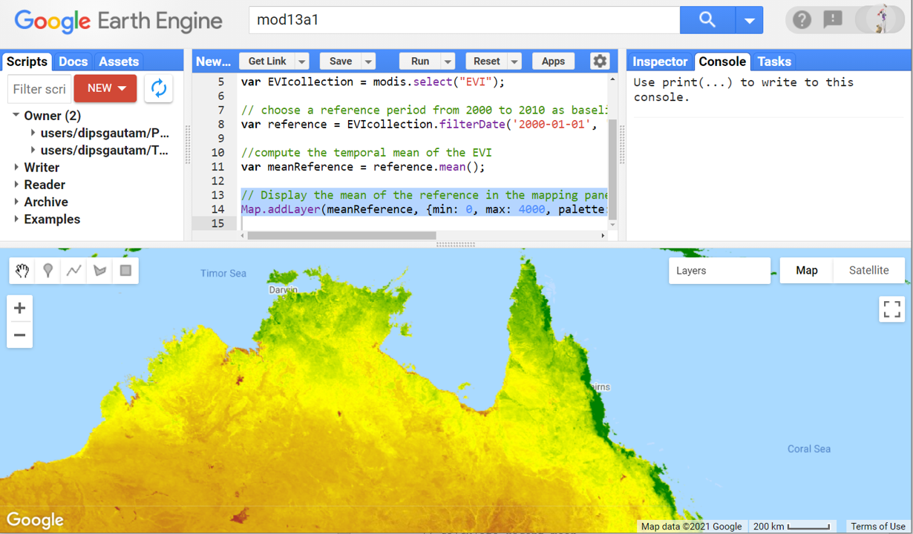
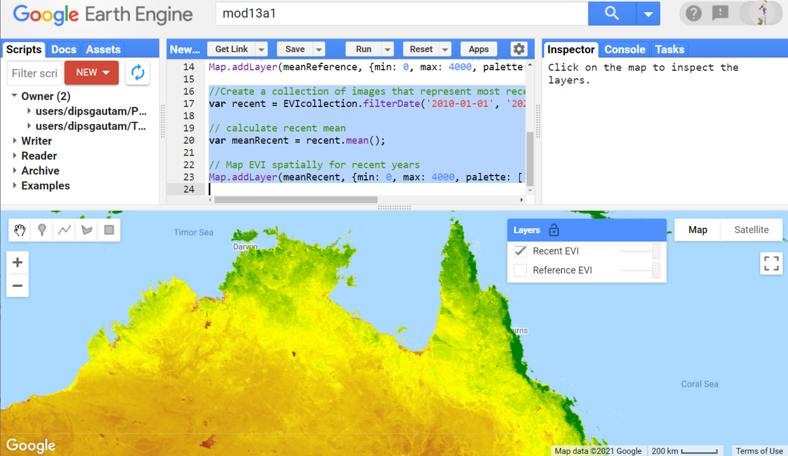
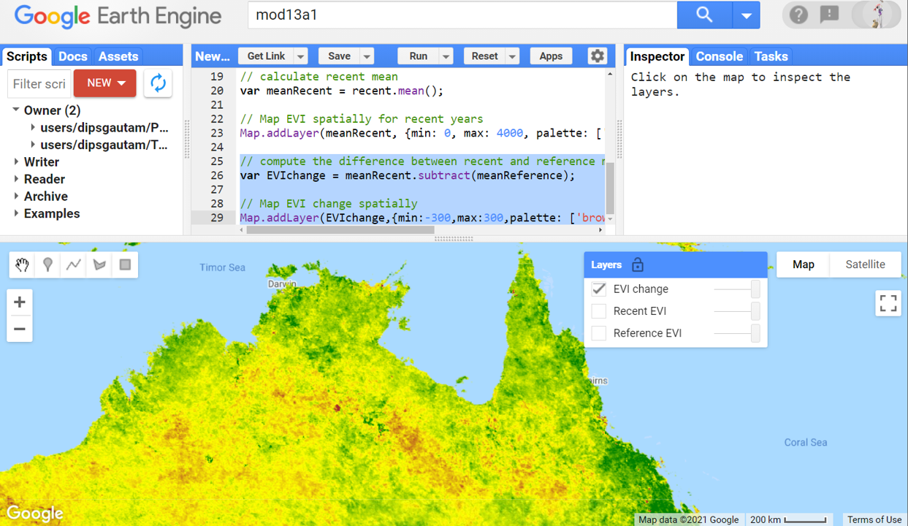
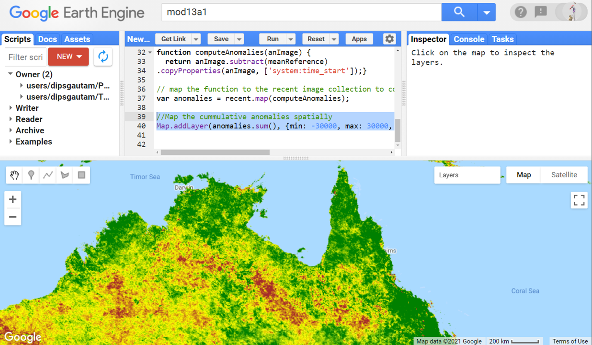

# Environmental Monitoring and Modelling (ENV306/506)

## Prac06 - Monitoring vegetation condition in Google Earth Engine

### Acknowledgments 

- Google Earth Engine Team
- [GEARS Lab](https://www.gears-lab.com/emm_lab_6/)

### Objective

The objective of this tutorial is to develop the skills for assessing change in vegetation condition over time. How do we know if an ecosystem is stressed or has been disturbed? Quantifying changes and attributing causality can be challenging - particularly in ecosystems that have large degrees of intra-annual variability. One approach we have at our disposal is to compare attributes from recent years to those from a baseline period. In this Prac, we will explore anomalies in vegetation condition (measured in terms of EVI) to determine if the vegetation stress is increasing or decreasing over time. Using this technique, you can explore anomalies in any other variables such as rainfall, temperature, vegetation health, and etc. 

---------------------------------------------------
## 1. Getting to know MODIS and EVI.
1. Open the Google Earth Engine environment by going to [https://code.earthengine.google.com] in the Chrome browser.

2. Search for and import the MOD13A1.006 V6 or load the image collection using the script below. 
```JavaScript
//Import the MODIS image collection MOD13A1 V6
var modis = ee.ImageCollection('MODIS/006/MOD13A1');
```

3. Always when you load image collection, make sure you read the band information. In this Prac, we will be working with the EVI band. EVI is an acronym for "Enhanced Vegetation Index". The enhanced vegetation index (EVI) is an 'optimized' vegetation index designed to enhance the vegetation signal with improved sensitivity in high biomass regions and improved vegetation monitoring through a de-coupling of the canopy background signal and a reduction in atmosphere influences. EVI is very similar to NDVI (we worked with NDVI in Prac02 and Prac03) but EVI is more reliable in tropical ecosystems as it does not saturate as early as NDVI. Select the EVI band for further processing. For details about the MODIS vegetation index, refer to [this user guide](https://lpdaac.usgs.gov/documents/103/MOD13_User_Guide_V6.pdf). 

```JavaScript
// Select the EVI band of the MODIS MOD13A1
var EVIcollection = modis.select("EVI");
```

4. To detect the ecosystem stress/disturbance, we will use the comparison with the baseline approach. Create a reference baseline dataset by filtering for the dates from 2000 – 2010.

```JavaScript
// choose a reference period from 2000 to 2010 as baseline
var reference = EVIcollection.filterDate('2000-01-01', '2010-01-01').sort('system:time_start');
```

5. Compute the mean of our reference baseline period

```JavaScript
//compute the temporal mean of the EVI 
var meanReference = reference.mean();
```

6. You can display the mean of the baseline in the mapping layer. Navigate to the Northern Australia, and use the script below to display the baseline mean EVI. Adjust the min and max values for visualisation purpose.

```JavaScript
// Display the mean of the reference in the mapping panel
Map.addLayer(meanReference, {min: 0, max: 4000, palette: ['brown','yellow','green']}, 'Reference EVI');
```



*Question - do your research:* What does it mean to have low or high EVI value?

## 2. Exploring spatial change/anomalies pattern against baseline

1. Create a new image collection for the period of 2010-2020. This new collection will be used to compare with the baseline reference collection. 

```JavaScript
//Create a collection of images that represent most recent conditions
var recent = EVIcollection.filterDate('2010-01-01', '2020-01-01').sort('system:time_start');
```
2. Similar to the baseline, calculate the mean of the recent EVI time series and display in the mapping layer.

```JavaScript
// calculate recent mean
var meanRecent = recent.mean();
// Map EVI spatially for recent years
Map.addLayer(meanRecent, {min: 0, max: 4000, palette: ['brown','yellow','green']}, 'Recent EVI');
```



3. Subtract the recent mean with the reference mean to see the spatial pattern of EVI change in recent decade as compared to the baseline. The following map highlights the improved EVIs in green, reduced EVIs in red and yellow color representing similar EVI. This technique highlights the areas where there has been EVI gain/loss highlight the vegetation condition and potential ecosystem stress.

```JavaScript
// compute the difference between recent and reference mean EVI (recent - reference)
var EVIchange = meanRecent.subtract(meanReference);

// Map EVI change spatially
Map.addLayer(EVIchange,{min:-300,max:300,palette: ['brown','yellow','green']},'EVI change');
```



4. The above figure is simply the difference between the recent and reference vegetation condition. What we really want is some measure of the anomaly through time. Lets create a function that calculate and define anomalies (departure from the long-term average) by subtracting the reference mean from *each of the more recent images*.

```JavaScript
// Function to subtract the meanReference each of the more recent images. 
function computeAnomalies(anImage) {
  return anImage.subtract(meanReference)
.copyProperties(anImage, ['system:time_start']);}
```

5. Map the computeAnomalies function to the entire recent (includes 2010-2020) EVI image collection
```JavaScript
// map the function to the recent image collection to compute anomalies 
var anomalies = recent.map(computeAnomalies);
```

6. Often in the context of ecosystem, it is the cummulative anamoly, rather than mean of 10 years that we are interested in. Display the cumulative anomalies spatially using the code below.

```JavaScript
//Map the cummulative anomalies spatially
Map.addLayer(anomalies.sum(), {min: -30000, max: 30000, palette: ['brown','yellow','green']}, 'Cumulative anomaly');
```



7. Using the anomalies map above, explore the regions in the northern australia where there has been cummulation of eocsystem stress.

## 4. Temporally explore anomalies trends against the baseline 
1. Next, we will chart the change of EVI through time, using the EVI anomalies. We will first create an image collection using the anomalies by using the iterate function. Then we will graph the cumulative anomaly (vertical axis) over time. *Caution: you may find the subsequent script not so intuitive - do not stress*: First we will get the timestamp from the earliest image in the recent collection.

```JavaScript
//Get timestamp of first image in the recent collection
var time0 = recent.first().get('system:time_start');
```

2. Create a list that contains a single image of zeros, with the time of time0 (i.e. first image in recent). Rename the list to 'EVI' to match the band name of recent EVI image collection.
```JavaScript
// initialise a list (containing an empty image) to provide a structure into which the EVI anomalies can be mapped
var first = ee.List([ ee.Image(0).set('system:time_start', time0).rename('EVI')]);
```

3. Paste the following code into the code editor. This code is a function that iterates through the subsequent images in recent EVI collection and accumulate the anomalies temporally.

```JavaScript
// Write a function to iterate through time and accumulate the anomalies
function accumulate (anImage, aList) { // this function takes two inputs - image and list
  var previous = ee.List(aList).get(-1); // get the last anamolies in the list
  var cumSum = anImage.add(previous).set('system:time_start',anImage.get('system:time_start')); // add current anomalies with the previous one
  return ee.List(aList).add(cumSum);} // return the list with one extra item which is a cummulative sum
```

4. Paste the code below in the code editor to iterate through the above function.

```JavaScript
//Apply the above created function to the anomalies (the image collection)
var cumulative = ee.ImageCollection(ee.List(anomalies.iterate(accumulate, first)));
print (cumulative);

```
reveals the ecosystem stress Display the cumulative anomalies spatially using the code below.
## 3. Calculating temporal change/trend against baseline
1. 
3. Calculate and define the anomalies spatially (departure from the long-term average) by subtracting the reference mean from each of the more recent images.
## 3. Exploring temporal trend against baseline


9. Don't forget to save the script before you exit. 

## 5. Ungraded exercise

1. Think about how you can adapt this approach to other types of data, such as Land Surface Temperature or rainfall for example.


## The complete script

```JavaScript
// Import the MODIS MOD11A2 V6 image collection
var modis = ee.ImageCollection('MODIS/006/MOD11A2');

// A start date is defined and the end date is determined by advancing 1 year from the start date.
var startDate = ee.Date('2015-01-01');
var numberOfYears = 1;
var dateRange = ee.DateRange(startDate, startDate.advance(numberOfYears, 'year'));

// Filter the LST collection to include only images from time frame and select day time temperature band
var modLSTDay = modis.filterDate(dateRange).select('LST_Day_1km');

// Function to convert MODIS LST band from degree Kelvin to degree Celsius.
function mod2C(anImage) {
  var kelvin = anImage.multiply(0.02); // Scale back to degree Kelvin
  var celsius = kelvin.subtract(273.15); // Convert degree Kelvin to degree Celsius
  return celsius.copyProperties(anImage, ['system:time_start']);} // retain the image properties.
  
// map the function to image collection
var modC = modLSTDay.map(mod2C);

//Visualise the temperature 
//Map.addLayer(modC.mean(), {min: 10, max: 30, palette: ['blue', 'limegreen', 'yellow', 'darkorange', 'red']}, 'Temperature');

//Visualise the temperature - clipped
Map.addLayer(modC.mean().clip(roi), {min: 10, max: 30, palette: ['blue', 'limegreen', 'yellow', 'darkorange', 'red']}, 'Temperature ACT');

// generate the temperature  time-series
var tempTrend = ui.Chart.image.series({
  imageCollection: modC,    // Name of the image collection that you want to extract data from
  region: roi,              // Region where you want the data to come from
  reducer: ee.Reducer.median(), // Spatial reducer that you want to use
  scale: 1000,                  // Spatial scale of data extraction 
  xProperty: 'system:time_start'}) // Put the image acquisiton time as x-axis label
  .setOptions({
    lineWidth: 1,                 // width of the chart line
    pointSize: 3,                 // size of the point data
    trendlines: {0: {             // include a trend line
        color: 'CC0000'}},        // trendline is red in color
    title: 'LST  Time Series',   // se the title of the chart
    vAxis: {title: 'Celsius'}}); // set the vertical axis label

// Print the temperature trend chart
print(tempTrend);
  
```

-------
### Thank you

I hope you found this prac useful. A recorded video of this prac can be found on your learnline.

#### Kind regards, Deepak Gautam
------
### The end
