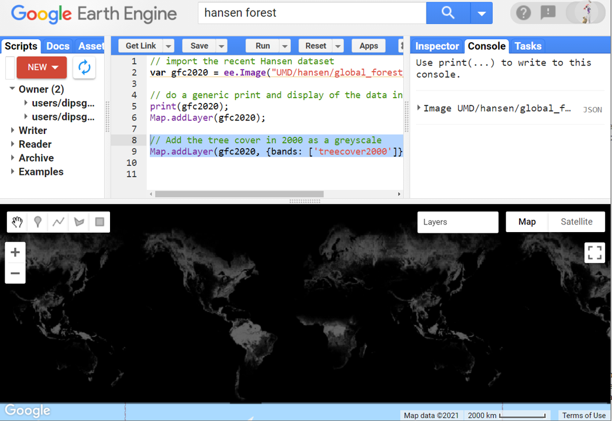
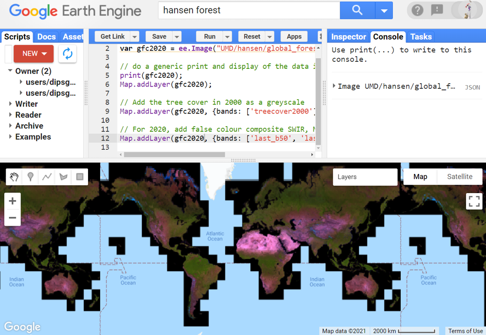
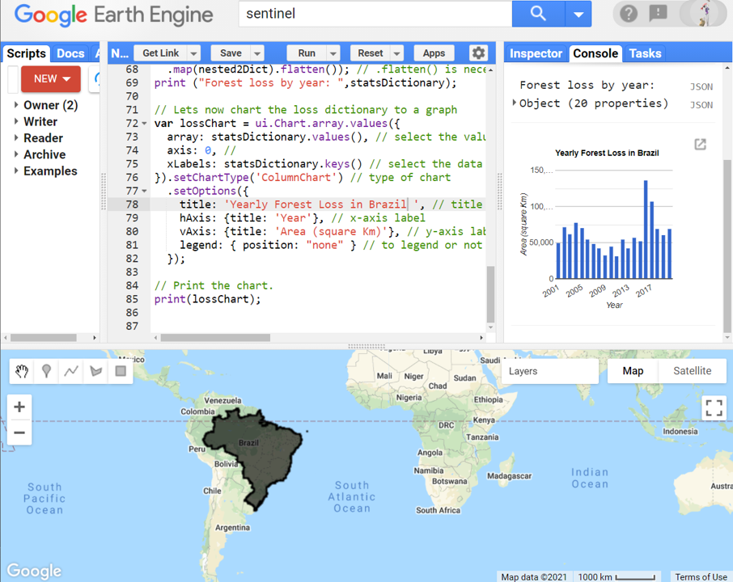

# Environmental Monitoring and Modelling (ENV306/506)

## Prac06 - Understanding patterns of historical deforestation

### Acknowledgments 

- Google Earth Engine Team
- [Hansen dataset](https://science.sciencemag.org/content/342/6160/850)
- [GEARS Lab](https://www.gears-lab.com/emm_lab_7/)

### Objective

The objective of this tutorial is to develop an important skill of environmental management, which is around understanding and managing the forest status specifically deforestation. In this tutorial, you will learn to look into the historical forest data and chart the yearly forest loss over any given spatial location.  

---------------------------------------------------
## 1. Getting to know the Hansen dataset.

1. Open the Google Earth Engine environment by going to [https://code.earthengine.google.com] in the Chrome browser.

2. Search for and import the "Hansen Forest" dataset and rename the image to "gfc2020" or copy the following script to the code editor. The script will import the Hansen dataset. Hansen et al. (2013) published the Global Forest Change dataset in Earth Engine providing forest change, at 30 meters resolution, globally, between 2000 and 2014. Since then, the product is updated annually. 

```JavaScript
// import the recent Hansen dataset
var gfc2020 = ee.Image("UMD/hansen/global_forest_change_2020_v1_8");
```

3. As always, I recommend you read through the description of the dataset, do a generic print and Map.addLayer to get a feeling for the dataset. Explore the printed information and explore the map. 

```JavaScript
// do a generic print and display of the data in the mapping panel
print(gfc2020);
Map.addLayer(gfc2020);
```


*Question:* Why do you think the map is overwhelmingly red (ignoring the black)?. 

4. It is important to note that when a multi-band image is added to a map, by default the first three bands of the image are chosen as red, green, and blue, respectively, and stretched according to the data type of each band (e.g. floats are stretched in [0,1], 16-bit data are stretched to the full range of possible values). The first three bands, in this case, happen to be treecover2000, loss, and gain. Your image looks red because the first band (treecover2000) is expressed in range 0-100 while the next two bands (loss and gain) are expressed in range 0-1. Refer back to the data description under the "bands" tab.


5. To display the forest cover in the year 2000 as a grayscale image, you can use the first band "treecover2000" as below. 
```JavaScript
// Add the tree cover in 2000 as a greyscale
Map.addLayer(gfc2020, {bands: ['treecover2000']}, 'Tree cover 2000');
```


6. The forest cover of the latest year (2020 in this case) is not available. As a workaround, we can use a false colour composite (SWIR, NIR, R) i.e. bands 5, 4 and 3 which highlights forest cover in 2000 in green pixel.

```JavaScript
// For 2020, add false colour composite SWIR, NIR, R
Map.addLayer(gfc2020, {bands: ['last_b50', 'last_b40', 'last_b30']}, 'Tree cover 2020');
```


7. Navigate between the two layers "Tree cover 2000" and "Tree cover 2020" do you notice much difference. Is the difference clearly visible?

8. One nice visualization of the Global Forest Change dataset could be by showing forest extent in 2000 as green, forest loss as red, and forest gain as blue. Let us, make “loss” the first band (red), treecover2000 the second band (green), and gain the third band (blue). Note the range of values (min, max) for loss gain and trecover2000 are not the same. Hence, we need to control the min/max values separately for each band.

```JavaScript
// scale the loss and gain for a balanced display
Map.addLayer(gfc2020, {bands: ['loss', 'treecover2000', 'gain'], min: [0, 0, 0], max: [1, 100, 1]}, 'Forest cover, loss, gain');
```


*Question* The result we are expecting is an image that is green where there is forest, red where there is forest loss, blue where there is forest gain. However, upon closer inspection, we can see the forest loss is represented in shades of yellow (see image below). Why? 


9. The yellow colour in the area of forest loss is actually due to the mix of green and red colours. The bright red pixels (forest loss) mix with the underlying green pixels (forest cover in 2000) producing yellow pixels. Similarly, you can see pink colour where there was both “loss” and “gain” during 2000-2020. How do we display the image we want: forest in green, loss in red and gain in blue? Think about it. 

## 2. Palette and masking

1. Let us try to use masking to get to our desired display. All of the images shown so far have had big black areas where the data is zero. For example, there are no trees in the ocean. To make these areas transparent, you can mask their values. Every pixel in Earth Engine has both a value and a mask. The image is rendered with transparency set by the mask, with zero being completely transparent and one being completely opaque. Let's isolate the treecover2000 band, mask it, and then add it to the mapping layer in green colour.

```JavaScript
// Isolate the tree cover and add it as green band and masked
var treeCover = gfc2020.select(["treecover2000"]);
var maskedTreeCover = treeCover.mask(treeCover);
Map.addLayer(maskedTreeCover, {bands: ["treecover2000"], palette: ["lightgreen", "darkgreen"], max: 100}, "tree cover");
```


2. Now isolate the loss band, apply the mask, and then add to the mapping layer with a red palette. 

```JavaScript
// Isolate the tree loss and add it as red band and masked
var lossImage = gfc2020.select(["loss"]);
var maskedLossImage = lossImage.mask(lossImage);
Map.addLayer(maskedLossImage, {bands: ["loss"], palette: ["red"], max: 1}, "LossImage");
```

3. Similarly isolate the gain band, apply the mask, and then add to mapping layer with a blue palette.

```JavaScript
// Isolate the tree gain and add it as blue band and masked
var GainImage = gfc2020.select(["gain"]);
var maskedGainImage = GainImage.mask(GainImage);
Map.addLayer(maskedGainImage, {bands :["gain"], palette: ["blue"], max: 1}, "GainImage");
```


4. The display now looks similar to what we imagined. We have green pixel representing the tree cover in 2000, red pixel representing forest loss and blue the forest gain. 

*Question:* Imagine you are looking at an area/pixel representing a commercial pine plantation. The plants are planted, grown, and then harvested every 15-20 years. The area/pixel had lush pine forest back in 2000. The stock was harvested in 2010 and planted with a new batch in 2012 resulting in again lush pine forest last year. Have a careful think about what that pixel/area would look like in the above image? Why? 

## 3. Charting the yearly forest loss
An important thing about the Hansen dataset is that for each loss pixel, the dataset also records when the loss has happened. This means, although this dataset is not an “imageCollection”, we can chart the yearly loss particularly due to the record of loss year. Each pixel in the “lossyear” band contains values from 1 to 20 indicating the year in which the loss has occurred: 1=2001, 20=2020. How would you know this? - read the description under the bands.  
 
1. To chart the yearly forest loss, let us first start by defining our region of interest (roi). So far, we have used a point or a polygon tool to draw simpler rois. Here we will use roi from the existing country dataset LSIB (large-scale international boundary polygons, simplified). Created in 2017, the LSIB dataset stores the simplified boundary of all the countries in the world. Search for and import the "LSIB 2017: Large Scale International Boundary Polygons, Simplified" and rename the default "table" to "countries". Alternatively, use the script below to import the dataset. 

```JavaScript
// Load country boundaries from LSIB.
var countries = ee.FeatureCollection('USDOS/LSIB_SIMPLE/2017');
```

2. Have a read the description of the dataset. From the "table scheme" tab you will note that every country is coded using "Two-letter FIPS country code" - a complete list of codes found [here](https://en.wikipedia.org/wiki/List_of_FIPS_country_codes). What is the code used to represent Australia? Use the code to filter and extract the boundary of Australia - or any other country.

```JavaScript
// Get a feature collection with just the Australia feature. Country codes here: https://en.wikipedia.org/wiki/List_of_FIPS_country_codes
var roi = countries.filter(ee.Filter.eq('country_co', 'AS'));
```

3. Great. You have obtained the simplified boundary roi representing the whole of Australia. You can simply view the roi by using Map.addLayer command. 

```JavaScript
// View the roi in the mapping pane
Map.addLayer(roi,{palette:[]},'the roi');
```


4. Now, before calculating the yearly forest loss, let's do some computation. Currently, Hansen “loss” band contains the pixels (0 and 1) representing the loss. However, from an application point of view, we want to know the loss area. In the below script, we create a new image that contains two bands: the lossArea and the lossYear. These two bands will suffice our computation of yearly loss. 

```JavaScript
// Compute lossArea as a single band image
var lossArea = lossImage.multiply(ee.Image.pixelArea()).divide(1000000.0); // converting to KM squared
// create new image containing two bands lossArea and lossyear
var newImage = lossArea.addBands(gfc2020.select(['lossyear']));
// once created new image, you can also rename the band names as you like.
newImage = newImage.select(
	['loss', 'lossyear'], // Old band names
	['lossArea', 'lossYear']); // New band names
```

5. Note that we used reduceRegion in Prac01 to calculate the mean, median, max, or total elevation. We could have used a similar method here to compute the mean, median, max, or total forest loss. However, the issue is that the computation will be an aggregate of 20 years. However, we are interested in yearly forest loss. Which is the reason for the extra bit of work we did in the previous step. Now we can use a grouped reducer to get the “lossArea” summed and grouped according to the value in the “lossYear” band.

```JavaScript
// Apply grouped reducer in the new image.
var lossByYear = newImage.reduceRegion({
  reducer: ee.Reducer.sum().group({groupField: 1, groupName: 'Year'}),// we use groupField as 1 to represent the second band. The band index starts at 0
  geometry: roi, // region which you want to extract the data from
  scale: 3000
});

// print the computed yearly loss
print("loss by Year (unformatted):", lossByYear);
```


6. From the printed information in the console, you will see the yearly forest loss area is printed out in a nested list called groups. Years are represented by values 1 to 20, 1 representing 2001 and 20 representing the year 2020. You can copy the data across to excel/CSV and start charting the yearly forest loss in excel if you prefer that way. You can also do the charting in GEE. However, GEE likes input in a dictionary format. Our yearly loss is in nested loop format. Let's write a function that converts nested loop to the dictionary. 

```JavaScript
// Function to convert the nested loop to dictionary. 
function nested2Dict (nList) { // takes the nested list as input
    var data = ee.Dictionary(nList); // extracts the data from the nested loop
    var dict = [ee.Number(data.get('Year')).format("20%02d"), ee.Number(data.get('sum') )]; // creates a dictornary with Year as key
    return dict;} // returns the converted dictornary
```

7. Now let's map our nested loop to the above function to convert to a dictionary. 

```JavaScript
// now lets map the nested loop to the function to get the dictionary. 
var statsDictionary = ee.Dictionary(ee.List(lossByYear.get('groups'))
  .map(nested2Dict).flatten()); // .flatten() is necessary to make 1 dictionary from the resulting 20 dictionaries.
print ("Forest loss by year: ",statsDictionary);
```


8. What we have above is a clear way of showing the yearly forest loss and it's easy to comprehend. With the dictionary ready, we can create a chart. We will use the ui.Chart.array.values() method. This method takes an array (or list) of input values and an array (or list) of labels for the X-axis.

```JavaScript
// Lets now chart the loss dictionary to a graph
var lossChart = ui.Chart.array.values({
  array: statsDictionary.values(), // select the values to plot on y-axis
  axis: 0, // 
  xLabels: statsDictionary.keys() // select the data to use in x-axis
}).setChartType('ColumnChart') // type of chart
  .setOptions({
    title: 'Yearly Forest Loss in Australia ', // title of the chart
    hAxis: {title: 'Year'}, // x-axis label
    vAxis: {title: 'Area (square Km)'}, // y-axis label
    legend: { position: "none" } // to legend or not to legend :)
  });
```

9. Always, after you create a chart, you will need to print it to the console to visualise the chart. 

```JavaScript
// Print the chart.
print(lossChart);
```


10. Explore the chart and the associated maps. The maps showed where the loss/gain has occurred. The chart showed when the loss has occurred. It seems there has been a disproportionate amount of forest loss (almost 6 times the average) in the last two years. Can you speculate why that could be? Have we been chopping down more forest recently? 


11. Now that we have a working function, it is very simple to inspect the yearly forest loss in any other region. For example, you can check the forest loss happening in Brazil by changing the country code to "BR" and modifying the chart title from "Australia" to "Brazil". How does the forest loss in the two countries compare?



12. Explore any other parts of the world. Don't forget to save the script before you exit. 

## 4. Ungraded exercise
During the southern hemisphere summer of 2015–16, one of the worst mangrove dieback events ever recorded impacted approximately 7400 hectares of mangrove forests along the Gulf of Carpentaria coastline. The dieback spanned 100s of Kms and affecting parts of NT and QLD. The affected region is very remote and there is no feasible way of monitoring the sites in person. During a site visit, researchers from CDU  and JCU setup several monitoring sites (based on the severity of dieback) to look into the potential cause of dieback and monitor the recovery process using remote sensing. Below are four sites 2 from QLD and 2 from NT. 
- Site-Limmen: 135.78877, -15.14622
- site-Mule: 136.43415, -15.64737
- Site-Karumba: 140.85358, -17.42256
- Site-Mitchell: 141.66542, -15.02732
Please look into the historical temperature data (Prac07) and investigate the land surface temperature of the monitoring sites for the years leading up to the dieback. You can also look into the historical rainfall data (Prac05) to investigate the rainfall pattern for the years leading up to the dieback. 

## The complete script

```JavaScript
// import the recent Hansen dataset
var gfc2020 = ee.Image("UMD/hansen/global_forest_change_2020_v1_8");

// do a generic print and display of the data in the mapping panel
print(gfc2020);
Map.addLayer(gfc2020);

// Add the tree cover in 2000 as a greyscale
Map.addLayer(gfc2020, {bands: ['treecover2000']}, 'Tree cover in 2000');

// For 2020, add false colour composite SWIR, NIR, R
Map.addLayer(gfc2020, {bands: ['last_b50', 'last_b40', 'last_b30']}, 'False colour');

// scale the loss and gain for a balanced display
Map.addLayer(gfc2020, {bands: ['loss', 'treecover2000', 'gain'], min: [0, 0, 0], max: [1, 100, 1]}, 'Forest cover, loss, gain');

// Isolate the tree cover and add it as green band and masked
var treeCover = gfc2020.select(["treecover2000"]);
var maskedTreeCover = treeCover.mask(treeCover);
Map.addLayer(maskedTreeCover, {bands: ["treecover2000"], palette: ["lightgreen", "darkgreen"], max: 100}, "tree cover");

// Isolate the tree loss and add it as red band and masked
var lossImage = gfc2020.select(["loss"]);
var maskedLossImage = lossImage.mask(lossImage);
Map.addLayer(maskedLossImage, {bands: ["loss"], palette: ["red"], max:1}, "LossImage");

// Isolate the tree gain and add it as blue band and masked
var GainImage = gfc2020.select(["gain"]);
var maskedGainImage = GainImage.mask(GainImage);
Map.addLayer(maskedGainImage, {bands: ["gain"], palette: ["blue"], max:1}, "GainImage");

// Load country boundaries from LSIB.
var countries = ee.FeatureCollection('USDOS/LSIB_SIMPLE/2017');

// Get a feature collection with just the Australia feature. Country codes here: https://en.wikipedia.org/wiki/List_of_FIPS_country_codes
var roi = countries.filter(ee.Filter.eq('country_co', 'AS'));

// View the roi in the mapping pane
Map.addLayer(roi,{palette:[]},'the roi');

// Compute lossArea as a single band image
var lossArea = lossImage.multiply(ee.Image.pixelArea()).divide(1000000.0); // converting to KM squared
// create new image containing two bands lossArea and lossyear
var newImage = lossArea.addBands(gfc2020.select(['lossyear']));
// once created new image, you can also rename the band names as you like.
newImage = newImage.select(
	['loss', 'lossyear'], // Old band names
	['lossArea', 'lossYear']); // New band names

// Apply grouped reducer in the new image.
var lossByYear = newImage.reduceRegion({
  reducer: ee.Reducer.sum().group({groupField: 1, groupName: 'Year'}),// we use groupField as 1 to represent the second band. The band index starts at 0
  geometry: roi, // region which you want to extract the data from
  scale: 3000
});

// print the computed yearly loss
print("loss by Year (unformatted):", lossByYear);

// Function to convert the nested loop to dictionary. 
function nested2Dict (nList) { // takes the nested list as input
    var data = ee.Dictionary(nList); // extracts the data from the nested loop
    var dict = [ee.Number(data.get('Year')).format("20%02d"), ee.Number(data.get('sum') )]; // creates a dictornary with Year as key
    return dict;} // returns the converted dictornary

// now lets map the nested loop to the function to get the dictionary. 
var statsDictionary = ee.Dictionary(ee.List(lossByYear.get('groups'))
  .map(nested2Dict).flatten()); // .flatten() is necessary to make 1 dictionary from the resulting 20 dictionaries.
print ("Forest loss by year: ",statsDictionary);

// Lets now chart the loss dictionary to a graph
var lossChart = ui.Chart.array.values({
  array: statsDictionary.values(), // select the values to plot on y-axis
  axis: 0, // 
  xLabels: statsDictionary.keys() // select the data to use in x-axis
}).setChartType('ColumnChart') // type of chart
  .setOptions({
    title: 'Yearly Forest Loss in Australia ', // title of the chart
    hAxis: {title: 'Year'}, // x-axis label
    vAxis: {title: 'Area (square Km)'}, // y-axis label
    legend: { position: "none" } // to legend or not to legend :)
  });

// Print the chart.
print(lossChart);
```


-------
### Thank you

I hope you found this prac useful. A recorded video of this prac can be found on your learnline. Please get in touch if you have any questions.

#### Kind regards, Deepak Gautam
------
### The end
