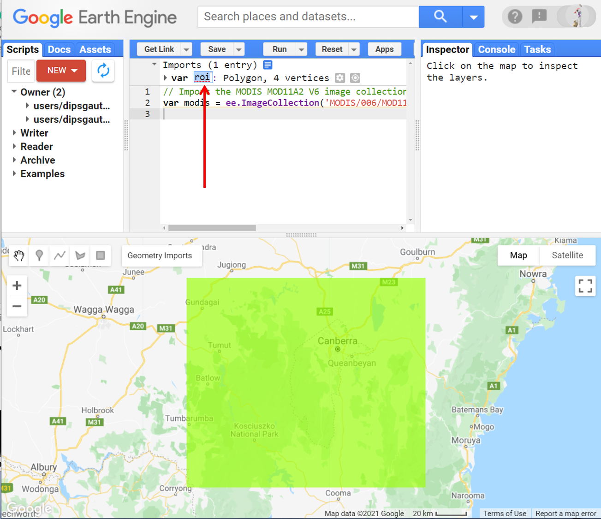
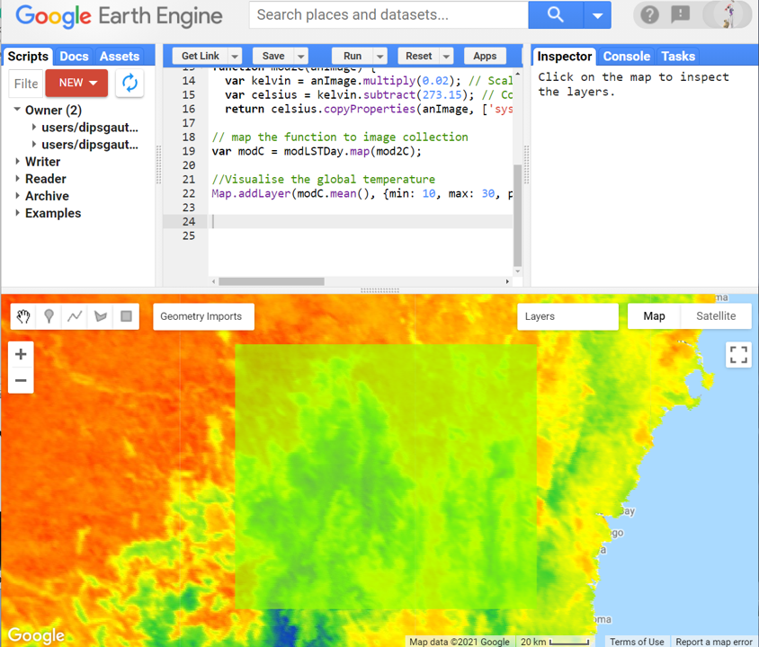
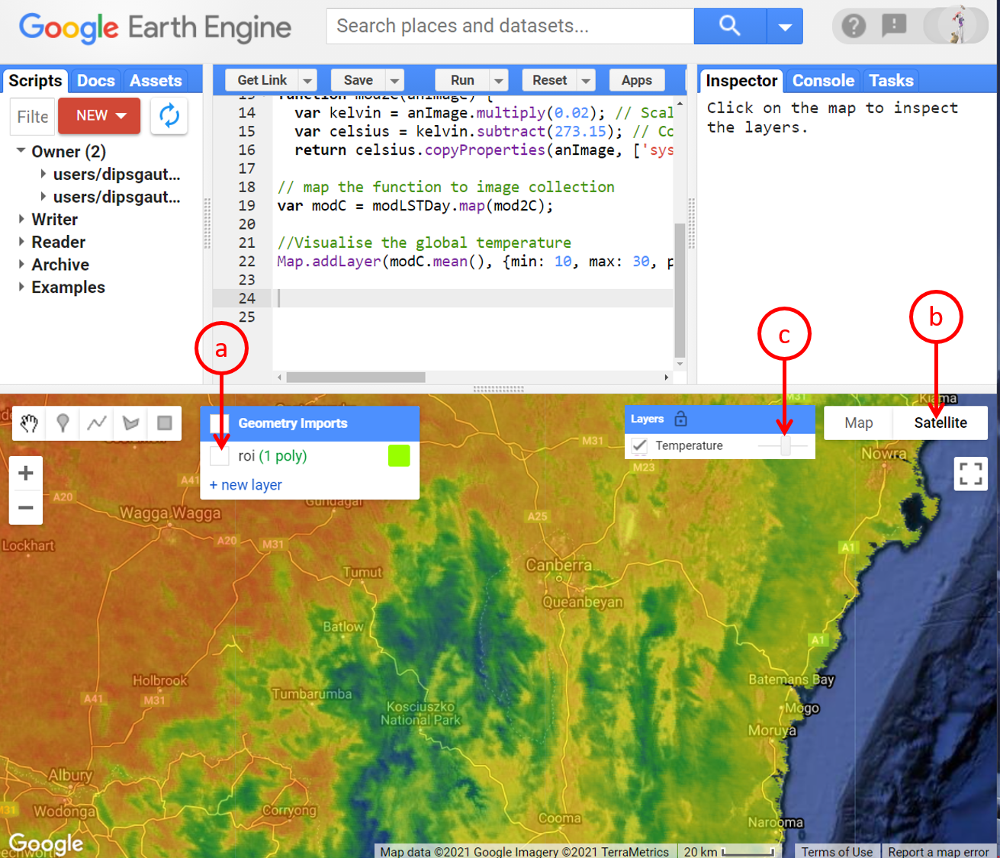
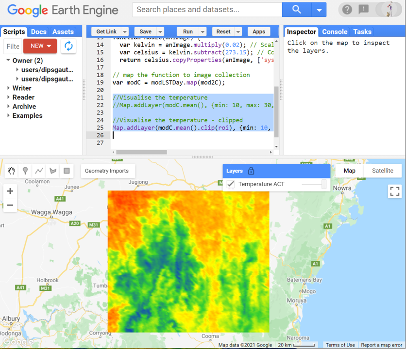
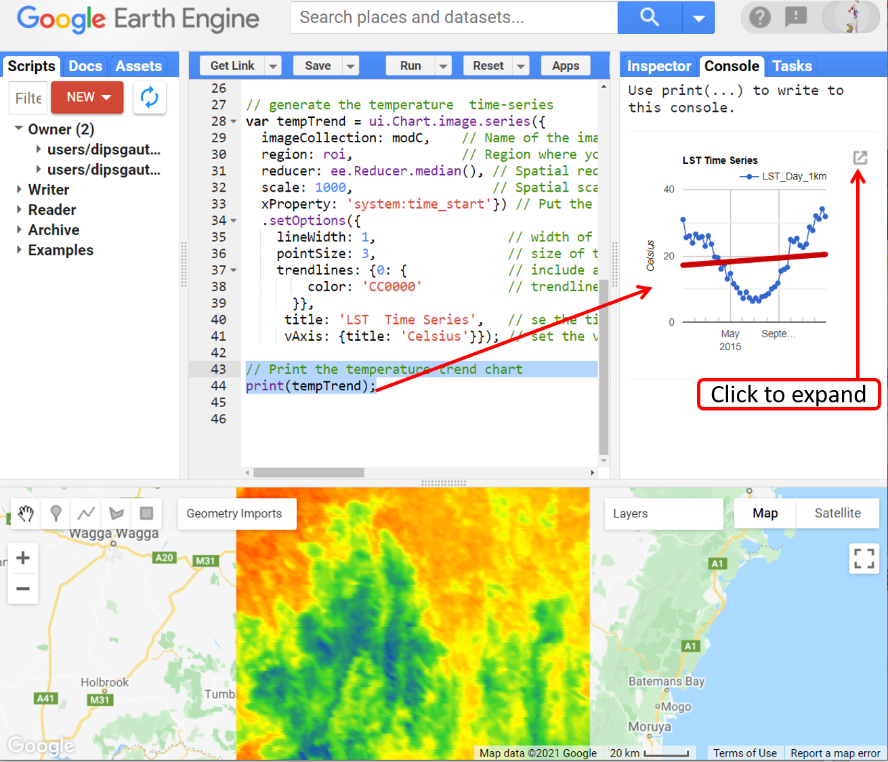
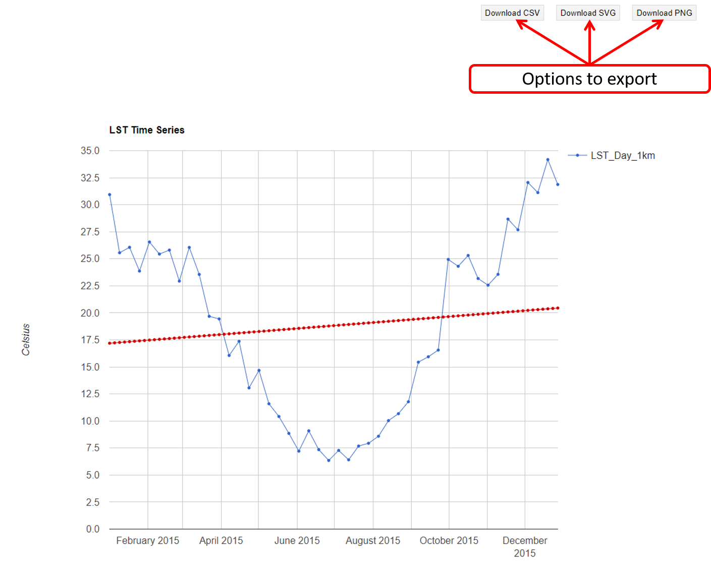
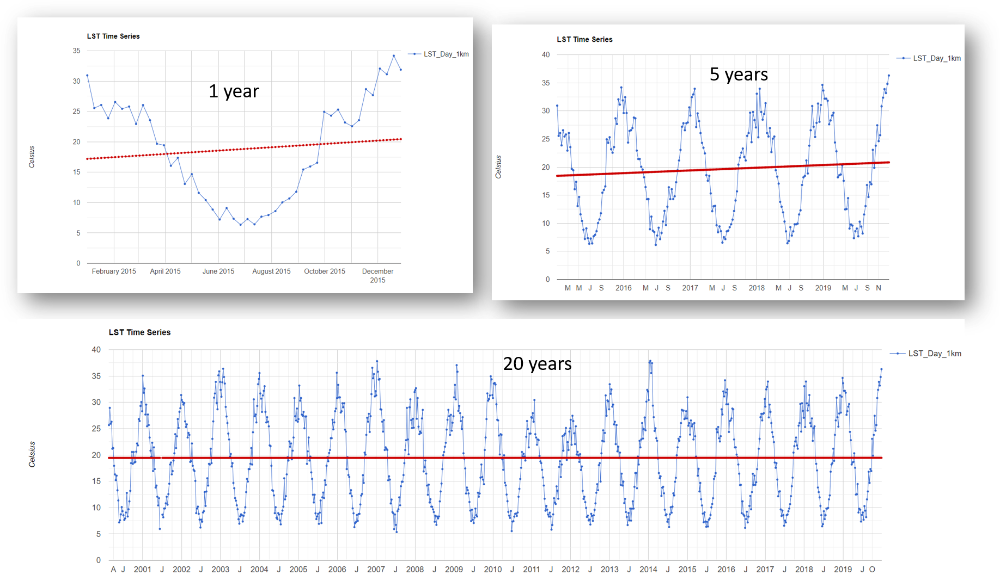

# Environmental Monitoring and Modelling (ENV306/506)

## Prac07 - Exploring land surface temperature trends over time

### Acknowledgments 

- Google Earth Engine Team
- [GEARS Lab](https://www.gears-lab.com/emm_lab_4/)

### Objective

The objective of this lab is to delve into climate variables with Google Earth Engine. By the end of this Prac, you will be able to explore long-term trends in temperature data for any region of interest. 

---------------------------------------------------
## 1. Accessing the MODIS LST dataset.
1. Open the Google Earth Engine environment by going to [https://code.earthengine.google.com] in the Chrome browser.

2. Search for and import MODIS data: MOD11A2 product. Alternatively, import the image collection using the below script. MOD11A2 V6 provides an average 8-day land surface temperature (LST) in a 1200 x 1200-kilometre grid. Each pixel value in MOD11A2 is a simple average of all the corresponding MOD11A1 LST pixels collected within those 8 days. In this product, along with both the day- and night-time surface temperature bands and their quality indicator (QC) layers, are also MODIS bands 31 and 32 and eight observation layers. The product is available from 05/03/2000 to the present.

```JavaScript
// Import the MODIS MOD11A2 V6 image collection
var modis = ee.ImageCollection('MODIS/006/MOD11A2');
```

3. For this lab we will work around the ACT region. I picked this region as ACT has quite a huge fluctuation in temperature in any given year/month/day. Use the geometry tool to draw a polygon and define your region of interest (roi). Remember to rename the 'geometry' to 'roi'.



4. Specify the dates of interest. We will use a different approach to the date range here - remember these are all different ways of doing things. You can follow any approach to filter the dates. This current approach makes changing the range of interest a lot easier.

```JavaScript
// A start date is defined and the end date is determined by advancing 1 year from the start date.
var startDate = ee.Date('2015-01-01');
var numberOfYears = 1;
var dateRange = ee.DateRange(startDate, startDate.advance(numberOfYears, 'year'));
```

5. We will filter the image collection by the above-specified date range and select the daytime temperature band out of all the bands.

```JavaScript
// Filter the LST collection to include only images from time frame and select day time temperature band
var modLSTDay = modis.filterDate(dateRange).select('LST_Day_1km');
```

*Self-assessment questions:* a) Is modLSTDay an image or image collection? b) If it is an image collection, how many images does it contain? c) How many bands does the modLSTDay have, and what are they?

6. Note that modLSTDay that we filtered out above, is still an image collection. It contains images from the entire 2015, but we have only retained a single band called 'LST_Day_1km'. We are ready to display the image collection. However, let's go a step forward. The images contain daytime temperature stored in degree Kelvin (not exactly – scaled Kelvin) - how do I know? - read the band description. Let's convert the temperature data to degree C before visualising. 

## 2. Function to convert MODIS LST data to temperature degree C

1. The band description tells us that the MODIS product temperature estimates are expressed in degrees Kelvin (scaled by a factor of 50). From an ecological/environmental perspective, we are typically more comfortable working in degree Celsius. Use the function below to convert MODIS data to degree Celsius.

```JavaScript
// Function to convert MODIS LST band from degree Kelvin to degree Celsius.
function mod2C(anImage) {
  var kelvin = anImage.multiply(0.02); // Scale back to degree Kelvin
  var celsius = kelvin.subtract(273.15); // Convert degree Kelvin to degree Celsius
  return celsius.copyProperties(anImage, ['system:time_start']);} // retain the image properties.
```

2. As usual, we need to apply the above function to the entire MODIS image collection. 

```JavaScript
// map the function to image collection
var modC = modLSTDay.map(mod2C);
```

3. Use temporal mean reducer to visualise the data. 

```JavaScript
//Visualise the temperature 
Map.addLayer(modC.mean(), {min: 10, max: 30, palette: ['blue', 'limegreen', 'yellow', 'darkorange', 'red']}, 'Temperature');
```



4. Let's do the following to improve the visualisation and our perception: a) untick the roi, b) enable the satellite view, c) adjust the opacity of the temperature layer.



5. You can also use the inspector tab to get a feel of the temperature in the region. Click on the inspector tab and click around different landscapes such as mountains, outback, city, coastal area. Also, check out the temperature of the region where you live in.

6. If you zoom out of the current view, you will notice that our current computation generates a temperature map for the entire globe. Feel free to explore a different part of the world. Make sure you adjust the min and max value for better colour contrast. 

7. Now, using the roi that we created earlier, we will clip the temperature image within the boundary or roi. You can even comment out the previous Map.addLayer command line by typing in “//” at the start of the line. 

```JavaScript
//Visualise the temperature - clipped
Map.addLayer(modC.mean().clip(roi), {min: 10, max: 30, palette: ['blue', 'limegreen', 'yellow', 'darkorange', 'red']}, 'Temperature ACT');
```
8. There you have it, the spatial temperature pattern around the ACT region for the year 2015.



## 3. Chart the temperature time series

1. Generate the daytime temperature time series from our region of interest using the script below.

```JavaScript
// generate the temperature  time-series
var tempTrend = ui.Chart.image.series({
  imageCollection: modC,    // Name of the image collection that you want to extract data from
  region: roi,              // Region where you want the data to come from
  reducer: ee.Reducer.median(), // Spatial reducer that you want to use
  scale: 1000,                  // Spatial scale of data extraction 
  xProperty: 'system:time_start'}) // Put the image acquisiton time as x-axis label
  .setOptions({
    lineWidth: 1,                 // width of the chart line
    pointSize: 3,                 // size of the point data
    trendlines: {0: {             // include a trend line
        color: 'CC0000'}},        // trendline is red in color
    title: 'LST  Time Series',   // se the title of the chart
    vAxis: {title: 'Celsius'}}); // set the vertical axis label
```

2. If you run the script, nothing new happens, you cant see the chart - why is that? Every time you generate a chart, you need to print it for visualisation in the console. Use the print command to print the chart to the console.

```JavaScript
// Print the temperature trend chart
print(tempTrend);
```



3. At this point you have expanded the chart view. You have a greater detailed view of the chart. You also have the option to export the chart in the desired format. 



4. Inspect the chart, does the trendline indicate global warming? Do you think the scale of observation here is enough to make that conclusion?

5. Try changing the number of years to 5 and inspect the trendline. To do that, go back to your variable named “numberOfYears” and set it to 5. Do you notice a similar pattern in the temperature change?

6. Now try changing the variable called “startDate” to 2000-03-05 and set the “numberOfYears” to 20. Does the trendline reveal a similar pattern? How does the long-term trend compare to the short-term trend?



7. Think of this trendline in the context of your reading task. Did the scale of observation alter the conclusions?  Or is this particular trendline region-specific? You can move the roi to any other location e.g. Darwin and see how temperature has changed there.

8. At this point, I want you to take a moment to appreciate the power of GEE and scripting. Once you establish a script, how convenient it is to investigate over a different region and/or at different time range. 

9. Don't forget to save the script before you exit. 

## 5. Ungraded exercise

1. In the example above, we used daytime temperature, but the MODIS product also contains night temperatures. Modify the code above to plot charts and maps of night temperature and compare with the day results.
2. Now try to modify the code further to plot NDVI as a time series and as a map for the same area of interest. Hint: have a look in the Earth Engine catalogue for the MOD13Q1.006 Terra Vegetation Indices 16-Day Global 250m collection.


## The complete script

```JavaScript
// Import the MODIS MOD11A2 V6 image collection
var modis = ee.ImageCollection('MODIS/006/MOD11A2');

// A start date is defined and the end date is determined by advancing 1 year from the start date.
var startDate = ee.Date('2015-01-01');
var numberOfYears = 1;
var dateRange = ee.DateRange(startDate, startDate.advance(numberOfYears, 'year'));

// Filter the LST collection to include only images from time frame and select day time temperature band
var modLSTDay = modis.filterDate(dateRange).select('LST_Day_1km');

// Function to convert MODIS LST band from degree Kelvin to degree Celsius.
function mod2C(anImage) {
  var kelvin = anImage.multiply(0.02); // Scale back to degree Kelvin
  var celsius = kelvin.subtract(273.15); // Convert degree Kelvin to degree Celsius
  return celsius.copyProperties(anImage, ['system:time_start']);} // retain the image properties.
  
// map the function to image collection
var modC = modLSTDay.map(mod2C);

//Visualise the temperature 
//Map.addLayer(modC.mean(), {min: 10, max: 30, palette: ['blue', 'limegreen', 'yellow', 'darkorange', 'red']}, 'Temperature');

//Visualise the temperature - clipped
Map.addLayer(modC.mean().clip(roi), {min: 10, max: 30, palette: ['blue', 'limegreen', 'yellow', 'darkorange', 'red']}, 'Temperature ACT');

// generate the temperature  time-series
var tempTrend = ui.Chart.image.series({
  imageCollection: modC,    // Name of the image collection that you want to extract data from
  region: roi,              // Region where you want the data to come from
  reducer: ee.Reducer.median(), // Spatial reducer that you want to use
  scale: 1000,                  // Spatial scale of data extraction 
  xProperty: 'system:time_start'}) // Put the image acquisiton time as x-axis label
  .setOptions({
    lineWidth: 1,                 // width of the chart line
    pointSize: 3,                 // size of the point data
    trendlines: {0: {             // include a trend line
        color: 'CC0000'}},        // trendline is red in color
    title: 'LST  Time Series',   // se the title of the chart
    vAxis: {title: 'Celsius'}}); // set the vertical axis label

// Print the temperature trend chart
print(tempTrend);
  
```

-------
### Thank you

I hope you found this prac useful. A recorded video of this prac can be found on your learnline.

#### Kind regards, Deepak Gautam
------
### The end
