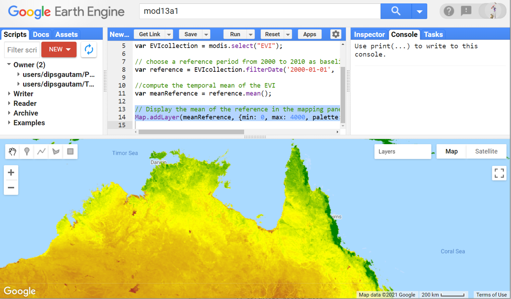
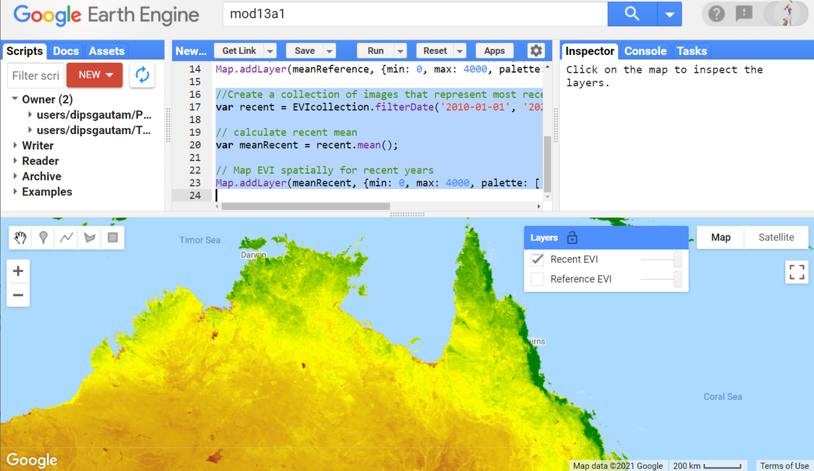
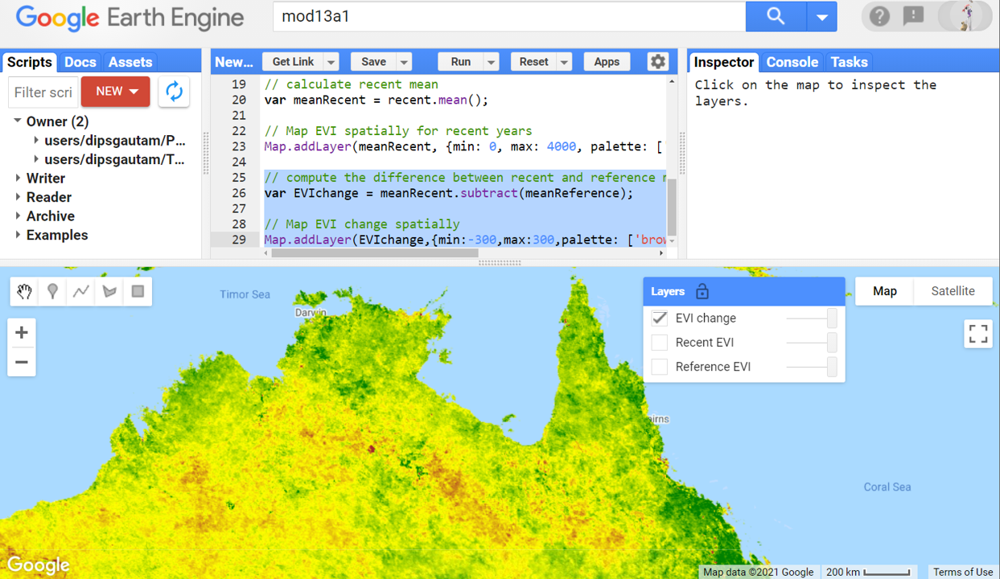
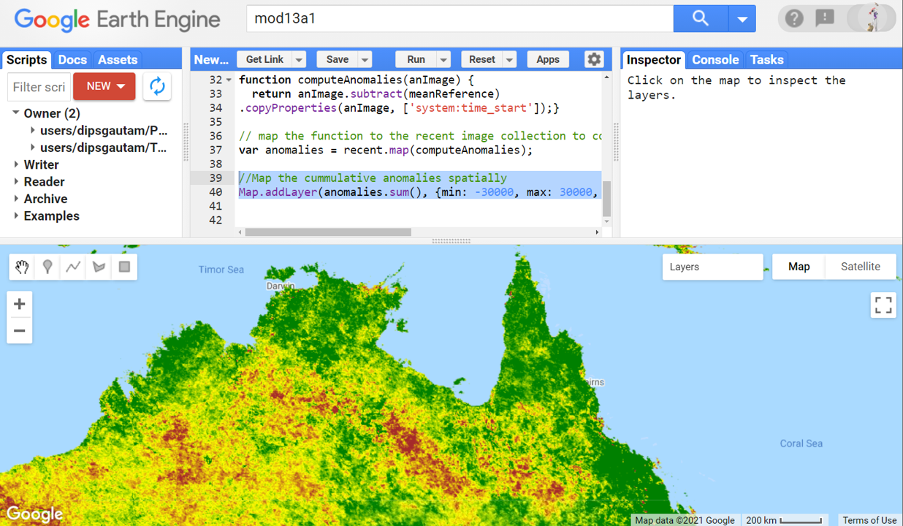
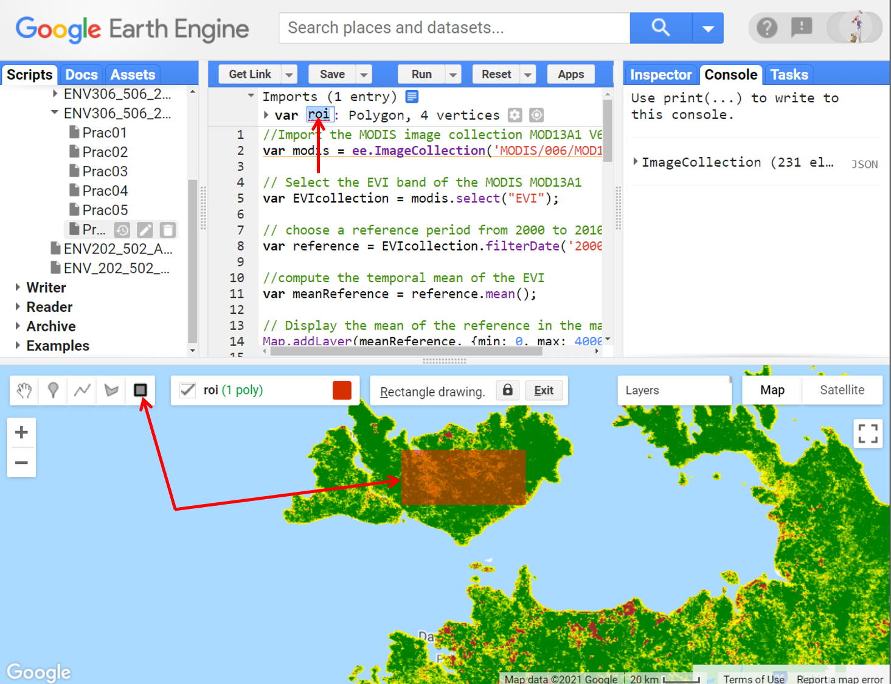
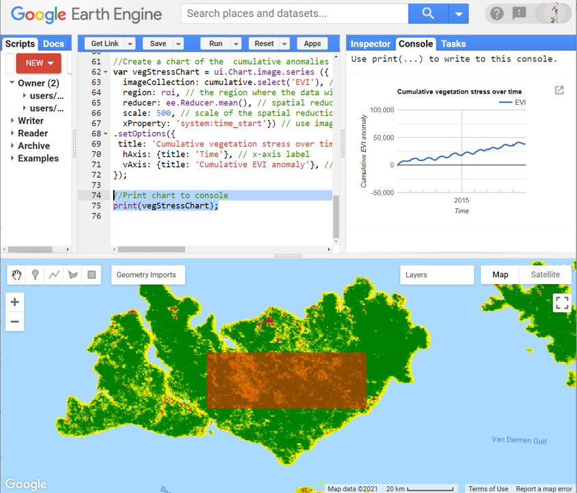
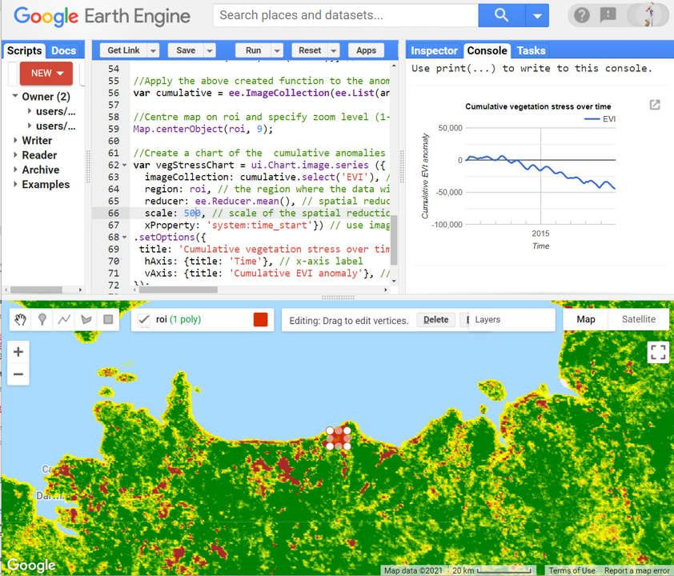

# Environmental Monitoring and Modelling (ENV306/506)

## Prac08 - Monitoring vegetation condition in Google Earth Engine

### Acknowledgments 

- Google Earth Engine Team
- [GEARS Lab](https://www.gears-lab.com/emm_lab_6/)

### Objective

The objective of this tutorial is to develop the skills for assessing change in vegetation conditions over time. How do we know if an ecosystem is stressed or has been disturbed? Quantifying changes and attributing causality can be challenging - particularly in ecosystems that have large degrees of intra-annual variability. 

One approach we have at our disposal is to compare attributes from recent years to those from a baseline period. In this Prac, we will explore anomalies in vegetation conditions (measured in terms of EVI) to determine if the vegetation stress is increasing or decreasing over time. Using this technique, you can explore anomalies in any other variables such as rainfall, temperature, vegetation health, etc. 

---------------------------------------------------
## 1. Getting to know MODIS and EVI.
1. Open the Google Earth Engine environment by going to [https://code.earthengine.google.com] in the Chrome browser.

2. Search for and import the MOD13A1.006 V6 or load the image collection using the script below. 
```JavaScript
//Import the MODIS image collection MOD13A1 V6
var modis = ee.ImageCollection('MODIS/006/MOD13A1');
```

3. Always when you load image collection, make sure you read the band information. In this Prac, we will be working with the EVI band. EVI is an acronym for "Enhanced Vegetation Index". The enhanced vegetation index (EVI) is an 'optimized' vegetation index designed to enhance the vegetation signal with improved sensitivity in high biomass regions and improved vegetation monitoring through a de-coupling of the canopy background signal and a reduction in atmosphere influences. EVI is very similar to NDVI (we worked with NDVI in Prac02 and Prac03) but EVI is more reliable in tropical ecosystems as it does not saturate as early as NDVI. Select the EVI band for further processing. For details about the MODIS vegetation index, refer to [this user guide](https://lpdaac.usgs.gov/documents/103/MOD13_User_Guide_V6.pdf). 

```JavaScript
// Select the EVI band of the MODIS MOD13A1
var EVIcollection = modis.select("EVI");
```

4. To detect the ecosystem stress/disturbance, we will use the comparison with the baseline approach. Create a reference baseline dataset by filtering for the dates from 2000 – 2010.

```JavaScript
// choose a reference period from 2000 to 2010 as baseline
var reference = EVIcollection.filterDate('2000-01-01', '2010-01-01');
```

5. Compute the mean of our reference baseline period

```JavaScript
//compute the temporal mean of the EVI 
var meanReference = reference.mean();
```

6. You can display the mean of the baseline in the mapping layer. Navigate to Northern Australia, and use the script below to display the baseline mean EVI. Adjust the min and max values for visualisation purposes.

```JavaScript
// Display the mean of the reference in the mapping panel
Map.addLayer(meanReference, {min: 0, max: 4000, palette: ['brown','yellow','green']}, 'Reference EVI');
```



*Question - do your research:* What does it mean to have low or high EVI value?

## 2. Exploring spatial change/anomalies pattern against the baseline

1. Create a new image collection from 2010 to 2020. This new collection will be used to compare with the baseline reference collection. 

```JavaScript
//Create a collection of images that represent most recent conditions
var recent = EVIcollection.filterDate('2010-01-01', '2020-01-01').sort('system:time_start');
```
2. Similar to the baseline, calculate the mean of the recent EVI time series and display it in the mapping layer.

```JavaScript
// calculate recent mean
var meanRecent = recent.mean();
// Map EVI spatially for recent years
Map.addLayer(meanRecent, {min: 0, max: 4000, palette: ['brown','yellow','green']}, 'Recent EVI');
```



3. Subtract the recent mean with the reference mean to see the spatial pattern of EVI change in the recent decade as compared to the baseline. The following map highlights the improved EVI in green, reduced EVI in red and yellow colour representing unchanged EVI. This technique highlights the areas where there has been EVI gain/loss highlight the vegetation condition and potential ecosystem stress.

```JavaScript
// compute the difference between recent and reference mean EVI (recent - reference)
var EVIchange = meanRecent.subtract(meanReference);

// Map EVI change spatially
Map.addLayer(EVIchange,{min:-300,max:300,palette: ['brown','yellow','green']},'EVI change');
```



4. The above figure is simply the difference between the recent and reference vegetation conditions. What we want is some measure of the anomaly through time. Let us create a function that calculates and define anomalies (departure from the long-term average) by subtracting the reference mean from *each of the more recent images*.

```JavaScript
// Function to subtract the meanReference each of the more recent images. 
function computeAnomalies(anImage) {
  return anImage.subtract(meanReference)
.copyProperties(anImage, ['system:time_start']);}
```

5. Map the computeAnomalies function to the entire recent (includes 2010-2020) EVI image collection
```JavaScript
// map the function to the recent image collection to compute anomalies 
var anomalies = recent.map(computeAnomalies);
```

6. Often in the context of an ecosystem, it is the cumulative anomaly, rather than the mean of 10 years that we are interested in. Display the cumulative anomalies spatially using the code below.

```JavaScript
//Map the cumulative anomalies spatially
Map.addLayer(anomalies.sum(), {min: -30000, max: 30000, palette: ['brown','yellow','green']}, 'Cumulative anomaly');
```


*Note* that the dark red areas where we had negative anomaly where EVI has been decreasing over time and dark green we have a positive anomaly.

7. Using the anomalies map above, explore the regions in northern Australia where there has been an accumulation of ecosystem stress.

## 3. Temporally explore anomalies trends against the baseline 
1. Next, we will chart the change of EVI through time, using the EVI anomalies. We will first create an image collection using the anomalies by using the iterate function. Then we will graph the cumulative anomaly (vertical axis) over time. *Caution: you may find the subsequent script not so intuitive - do not stress*: First we will get the timestamp from the earliest image in the recent collection.

```JavaScript
//Get timestamp of first image in the recent collection
var time0 = recent.first().get('system:time_start');
```

2. Create a list that contains a single image of zeros, with the time of time0 (i.e. the first image in recent). Effectively this is just a holder of empty images where we can map the values of EVI anomaly into. Rename the list to 'EVI' to match the band name of the recent EVI image collection.
```JavaScript
// initialise a list (containing an empty image) to provide a structure into which the EVI anomalies can be mapped
var first = ee.List([ ee.Image(0).set('system:time_start', time0).rename('EVI')]);
```

3. Paste the following code into the code editor. This code is a function that iterates through the subsequent images in the recent EVI collection and accumulates the anomalies temporally. Note we are adding anomalies from each subsequent image.

```JavaScript
// Write a function to iterate through time and accumulate the anomalies
function accumulate (anImage, aList) { // this function takes two inputs - image and list
  var previous = ee.List(aList).get(-1); // get the last anamolies in the list
  var cumSum = anImage.add(previous).set('system:time_start',anImage.get('system:time_start')); // add current anomalies with the previous one
  return ee.List(aList).add(cumSum);} // return the list with one extra item which is a cummulative sum
```

4. Paste the code below in the code editor to iterate through the above function.

```JavaScript
//Apply the above created function to the anomalies (the image collection)
var cumulative = ee.ImageCollection(ee.List(anomalies.iterate(accumulate, first)));
```

*Note* the above several steps is really heavy in JavaScript. Basically what we did is created a timestamp, created an empty list of images, and then mapped the cumulative anomalies to the images. 

## 4. Charting the anomaly
1. It is important to note that in the above image collection called "cumulative", we have images of a cumulative anomaly between 2010 and 2020. The anomalies were calculated by subtracting the recent EVI from the baseline EVI. Let's chart the temporal trend of cumulative anomaly. But first, let's create a roi using a rectangular geometry tool. I am going to draw a roi on Tiwi island. 




2. You can use the script below to make sure that whenever you run the script, the map view is zoomed into the roi.
```JavaScript
//Centre map on roi and specify zoom level (1-22)
Map.centerObject(roi, 9);
```
   
3. Make a chart of the mean cumulative anomaly within the roi using the code below. Note that if you want to accumulate multiple regions within one chart, you can just draw an additional polygon. i.e. roi can have more than one region.

```JavaScript
//Create a chart of the  cumulative anomalies
var vegStressChart = ui.Chart.image.series ({
  imageCollection: cumulative.select('EVI'), // we are using the image collection called cummulative
  region: roi, // the region where the data will be charted from
  reducer: ee.Reducer.mean(), // spatial reducer type mean
  scale: 500, // scale of the spatial reduction
  xProperty: 'system:time_start'}) // use image capture timestamp on the x-axis
.setOptions({
 title: 'Cumulative vegetation stress over time', // set the title of the chart
  hAxis: {title: 'Time'}, // x-axis label
  vAxis: {title: 'Cumulative EVI anomaly'}, //y-axis label
});
```
4. Print the chart to the console

```JavaScript
//Print chart to console
print(vegStressChart);
```


5. Inspect the chart. What kind of pattern do you notice in your chart? My chart is coming from the region which looked dark green in the cumulative anomaly map. So, I can see a trend of increasing anomaly. The increasing anomaly here means vegetation getting less stressed over time as compared to the baseline. I can see we have that seasonal cycle of EVI anomaly but the graph shows a clear accumulation of positive anomaly. This gives you a nice tool to investigate the temporal trends and accumulation of stress. The interesting thing is you can see a pattern of change through time. You can see where there is consistent increasing/decreasing change over time. Or sometimes you may see abrupt change at a time point and not much change for the next few years. 

6. You can move the roi to any location you want to investigate the anomalies there. For example, I moved the roi to a region of Point Stuart where I can see a different pattern of EVI anomaly. I can see the EVI anomaly was stable or increasing until late 2012. After that, the EVI anomaly steadily declined up to recent times. 



7. Don't forget to save the script before you exit. 

## 5. Ungraded exercise

1. Explore one of the category 5 cyclones in the Australian region [wikipedia link](https://en.wikipedia.org/wiki/List_of_Category_5_Australian_region_severe_tropical_cyclones). What effect would you expect the cyclone to have on the long term EVI trend? For example, I explored the Shoalwater Bay region which was affected by the cyclone Marcia. I saw a sharp drop in the EVI anomaly following the cyclone which also seems to have reversed the previous upward trend in the EVI anomaly. 
2. Think about how you can adapt this approach to other types of data, such as Land Surface Temperature or rainfall for example.


## The complete script

```JavaScript
//Import the MODIS image collection MOD13A1 V6
var modis = ee.ImageCollection('MODIS/006/MOD13A1');

// Select the EVI band of the MODIS MOD13A1
var EVIcollection = modis.select("EVI");

// choose a reference period from 2000 to 2010 as baseline
var reference = EVIcollection.filterDate('2000-01-01', '2010-01-01');

//compute the temporal mean of the EVI 
var meanReference = reference.mean();

// Display the mean of the reference in the mapping panel
Map.addLayer(meanReference, {min: 0, max: 4000, palette: ['brown','yellow','green']}, 'Reference EVI');

//Create a collection of images that represent most recent conditions
var recent = EVIcollection.filterDate('2010-01-01', '2020-01-01').sort('system:time_start');

// calculate recent mean
var meanRecent = recent.mean();

// Map EVI spatially for recent years
Map.addLayer(meanRecent, {min: 0, max: 4000, palette: ['brown','yellow','green']}, 'Recent EVI');

// compute the difference between recent and reference mean EVI (recent - reference)
var EVIchange = meanRecent.subtract(meanReference);

// Map EVI change spatially
Map.addLayer(EVIchange,{min:-300,max:300,palette: ['brown','yellow','green']},'EVI change');

// Function to subtract the meanReference each of the more recent images. 
function computeAnomalies(anImage) {
  return anImage.subtract(meanReference)
.copyProperties(anImage, ['system:time_start']);}

// map the function to the recent image collection to compute anomalies 
var anomalies = recent.map(computeAnomalies);

//Map the cumulative anomalies spatially
Map.addLayer(anomalies.sum(), {min: -30000, max: 30000, palette: ['brown','yellow','green']}, 'Cumulative anomaly');

//Get timestamp of first image in the recent collection
var time0 = recent.first().get('system:time_start');

// initialise a list (containing an empty image) to provide a structure into which the EVI anomalies can be mapped
var first = ee.List([ ee.Image(0).set('system:time_start', time0).rename('EVI')]);


// Write a function to iterate through time and accumulate the anomalies
function accumulate (anImage, aList) { // this function takes two inputs - image and list
  var previous = ee.List(aList).get(-1); // get the last anamolies in the list
  var cumSum = anImage.add(previous).set('system:time_start',anImage.get('system:time_start')); // add current anomalies with the previous one
  return ee.List(aList).add(cumSum);} // return the list with one extra item which is a cummulative sum

//Apply the above created function to the anomalies (the image collection)
var cumulative = ee.ImageCollection(ee.List(anomalies.iterate(accumulate, first)));

//Centre map on roi and specify zoom level (1-22)
Map.centerObject(roi, 9);

//Create a chart of the  cumulative anomalies
var vegStressChart = ui.Chart.image.series ({
  imageCollection: cumulative.select('EVI'), // we are using the image collection called cummulative
  region: roi, // the region where the data will be charted from
  reducer: ee.Reducer.mean(), // spatial reducer type mean
  scale: 500, // scale of the spatial reduction
  xProperty: 'system:time_start'}) // use image capture timestamp on the x-axis
.setOptions({
 title: 'Cumulative vegetation stress over time', // set the title of the chart
  hAxis: {title: 'Time'}, // x-axis label
  vAxis: {title: 'Cumulative EVI anomaly'}, //y-axis label
});

//Print chart to console
print(vegStressChart);
  
```

-------
### Thank you

I hope you found this prac useful. A recorded video of this prac can be found on your learnline.

#### Kind regards, Deepak Gautam
------
### The end
