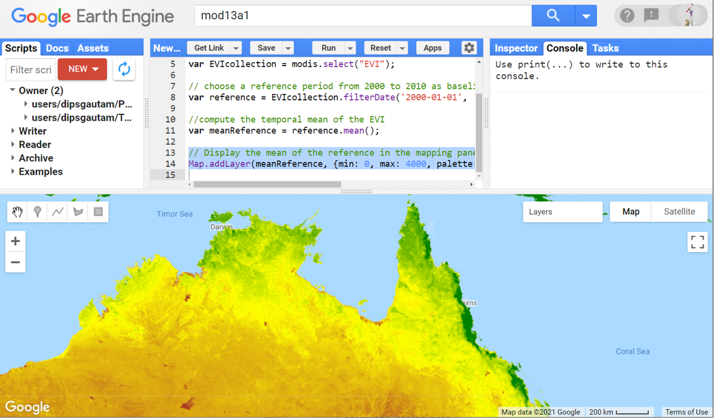

# Environmental Monitoring and Modelling (ENV306/506)

## Prac09 - Working with vector datasets

### Acknowledgments 

- Google Earth Engine Team
- [GEARS Lab](https://www.gears-lab.com/emm_lab_9/)

### Objective

The objective of this lab is to familiarise yourself with Features and FeatureCollections in Earth Engine. Vector/table datasets are useful for stratifying study sites, and for defining regions of interest (roi) for reducing and clipping images and image collections. Remember how we used roi (point, polygon, and complex) in previous pracs, all ot them are vector dataset.

---------------------------------------------------
## 1. Visualising features and feature collection.
1. Open the Google Earth Engine environment by going to [https://code.earthengine.google.com] in the Chrome browser.

2. Do you know the difference between vecotr and raster dataset? Do a google search and have a read about it. In a nutshell, raster dataset is made up of pixels lots of pixels such as our satellite images. Vector dataset is made up of geometries e.g. points, lines, polygons such as our roi. 

3. In GEE, we have used geometry (point, polygon etc.) to creat rois. These are the fundamental vector data type in GEE. A geometry object can also store some attribute properties forming a whats called "Feature". A set of features can be grouped together in a "FeatureCollection". In this exercise, we will load feature collections that are available to us, similar to the loading of satellite image collection.

4. Search for RESOLVE ecoregions dataset. The RESOLVE Ecoregions 2017 dataset, updated in 2017, offers a depiction of the 846 terrestrial ecoregions that represent our living planet. Ecoregions, in the simplest definition, are ecosystems of regional extent. Specifically, ecoregions represent distinct assemblages of biodiversity ― all taxa, not just vegetation ― whose boundaries include the space required to sustain ecological processes. Import the RESOLVE Ecoregions 2017 dataset and rename the default "table" to "ecoregions". Alternatively, use the script below. 

```JavaScript
// Load a FeatureCollection from a table dataset: 'RESOLVE' ecoregions.
var ecoregions = ee.FeatureCollection('RESOLVE/ECOREGIONS/2017');
```

5. the feature collection to the mapping layer. The default visualization will display the vectors with solid black lines and semi-opaque black fill. To render the vectors in colour, specify the colour parameter.


whats called Feature. A feature is an object with "geometry" property storing a geometry object and a "properties". 
2. Search for and import the MOD13A1.006 V6 or load the image collection using the script below. 
```JavaScript
//Import the MODIS image collection MOD13A1 V6
var modis = ee.ImageCollection('MODIS/006/MOD13A1');
```





7. Don't forget to save the script before you exit. 

## 5. Ungraded exercise

1. Explore one of the category 5 cyclones in the Australian region [wikipedia link](https://en.wikipedia.org/wiki/List_of_Category_5_Australian_region_severe_tropical_cyclones). What effect would you expect the cyclone to have on the long term EVI trend? For example, I explored the Shoalwater Bay region which was affected by the cyclone Marcia. I saw a sharp drop in the EVI anomaly following the cyclone which also seems to have reversed the previous upward trend in the EVI anomaly. 
2. Think about how you can adapt this approach to other types of data, such as Land Surface Temperature or rainfall for example.


## The complete script

```JavaScript

  
```

-------
### Thank you

I hope you found this prac useful. A recorded video of this prac can be found on your learnline.

#### Kind regards, Deepak Gautam
------
### The end
