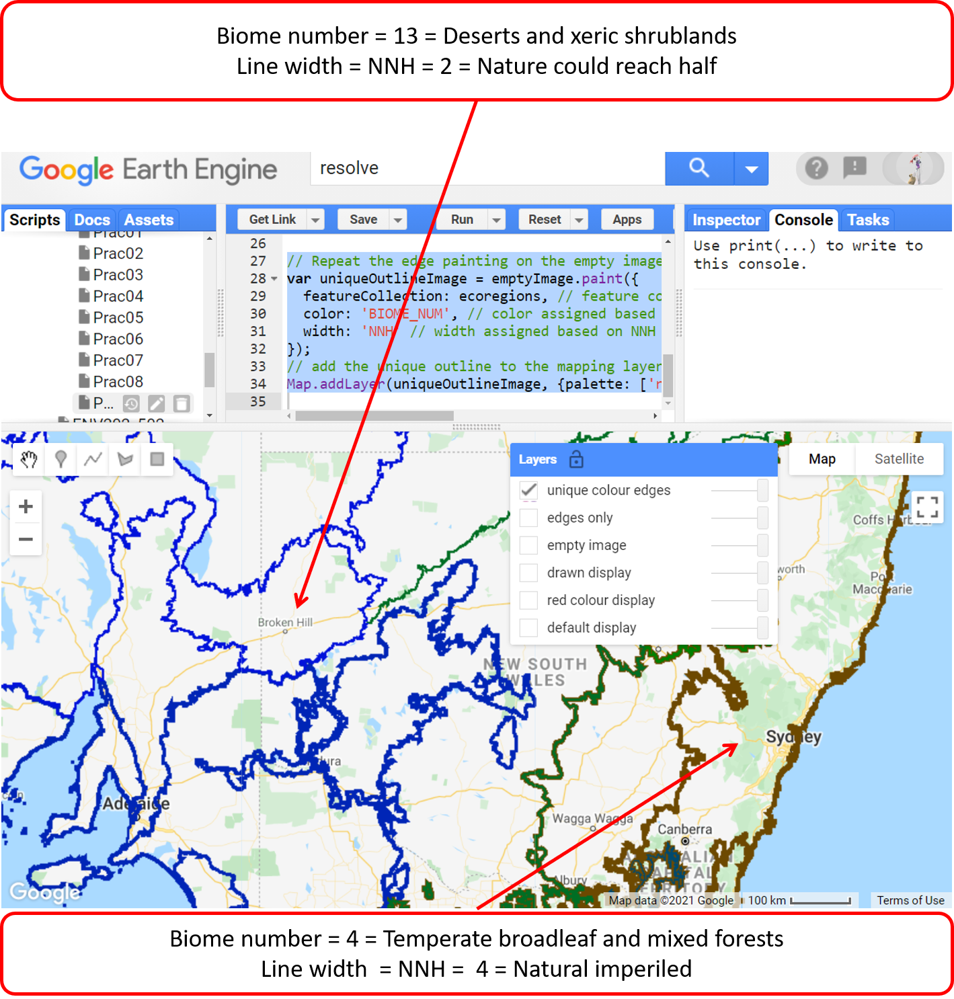

# Environmental Monitoring and Modelling (ENV306/506)

## Prac09 - Working with vector datasets

### Acknowledgments 

- Google Earth Engine Team
- [GEARS Lab](https://www.gears-lab.com/emm_lab_9/)

### Objective

The objective of this lab is to familiarise yourself with Features and FeatureCollections in Earth Engine. Vector/table datasets are useful for stratifying study sites, and for defining regions of interest (roi) for reducing and clipping images and image collections. Remember how we used roi (point, polygon, and complex) in previous pracs, all of them are vector dataset.

---------------------------------------------------
## 1. Visualising features and feature collection.
1. Open the Google Earth Engine environment by going to [https://code.earthengine.google.com] in the Chrome browser.

2. Do you know the difference between vector and raster dataset? Do a google search and have a read about it. In a nutshell, the raster dataset is made up of pixels lots of pixels such as our satellite images. Vector dataset is made up of geometries e.g. points, lines, polygons such as our roi. 

3. In GEE, we have used geometry (point, polygon etc.) to create ROIs. These are the fundamental vector data type in GEE. A geometry object can also store some attribute properties forming what is called "Feature". A set of features can be grouped in a "FeatureCollection". In this exercise, we will load feature collections that are available to us, similar to the loading of satellite image collection.

4. Search for RESOLVE ecoregions dataset. Import the RESOLVE Ecoregions 2017 dataset and rename the default "table" to "ecoregions". Alternatively, use the script below. 

```JavaScript
// Load a FeatureCollection from a table dataset: 'RESOLVE' ecoregions.
var ecoregions = ee.FeatureCollection('RESOLVE/ECOREGIONS/2017');
```

5. Please read through the description of this dataset. This dataset is not as intuitive to understand as you would a satellite image. The RESOLVE Ecoregions 2017 dataset provides a depiction of the 846 terrestrial ecoregions (each coded with unique ID "ECO_ID") that represent our living planet. Ecoregions, in the simplest definition, are ecosystems of regional extent. Specifically, ecoregions represent distinct assemblages of biodiversity ― all taxa, not just vegetation ― whose boundaries include the space required to sustain ecological processes. 

5. Visualisation of feature collection is done using Map.addLayer command - similar to how we visualise the raster image. You can do a quick and easy default display as below. The default visualization will display the vectors with solid black lines and semi-opaque black fill.

```JavaScript
// Try the default display
Map.addLayer(ecoregions, {}, 'default display');

```


6. What you see is global ecoregions displayed with solid black lines and semi-opaque black fill. Zoom in, have a look around and explore. You can use the inspector tab to click and explore different ecoregions.


7. You can control the colour by defining the colour. Note that in the raster display we used "palette"

```JavaScript
// add a custom color
Map.addLayer(ecoregions, {color: 'red'}, 'red colour display');
```


## 2. Controlling the boundary lines

1. For additional display options, use featureCollection.draw(). Specifically, parameter strokeWidth controls the size of the boundary lines in the rendered FeatureCollection. (similarly, pointRadius controls the size of points - not applicable here)

```JavaScript
// Use featureCollection.draw() to display in custom colours and linewidth 
Map.addLayer(ecoregions.draw({color: 'green', strokeWidth: 5}), {}, 'drawn display');
```


2. Note that although you have control of the boundary lines of the features, the features are also filled with the same colour.  For more control over how a FetureCollection is displayed, you will need to use ".paint()" command. The above ".draw()" output a three-band 8-bit display image, the ".paint()" output an image with a specif numeric value painted into it. To paint, you will first need to create an empty image - kind of like grabbing an empty sheet of paper to paint on it. 

```JavaScript
// create an empty image into which to paint the features, cast to a byte.
var emptyImage = ee.Image().byte();
// you can add the empty image to your mapping layer - its just empty
Map.addLayer(emptyImage,{},'empty image');
```


3. Now, on the empty image, you can paint all the polygon edges with ths same color and width.

```JavaScript
// Paint the polygon edges onto the empty image
var outlineImage = emptyImage.paint({
  featureCollection: ecoregions, // which feature collection you want to be painted
  strokeWidth: 3 // width of the polygon boundary line
});
```

4. The resulting painted "outlineImage" is an image and can be added to your mapping layer as you would a raster image. 

```JavaScript
// add the above outline image to the mapping layer
Map.addLayer(outlineImage, {palette: 'red'}, 'edges only');
```


8. There you have it - the outline of the ecoregions that you can control the colour and the width of the boundary line. However, the edges of the above image show all the ecoregions and biomes with the same colour. Now there are lots of ecoregions to assign a unique colour. But, what we can do is colour the different biome with unique colours. Under the "Table Schema" of the dataset tells you that each biome has a unique "BIOME_NUM". We can assign unique colours based on the stored "BIOME_NUM" - there are 14 biomes in total, so, 14 colours sounds okay. Similarly, you could also make the width of the boundary edge variable showing for example the "NNH" category. 

```JavaScript
// Repeat the edge painting on the empty image
var uniqueOutlineImage = emptyImage.paint({
  featureCollection: ecoregions, // feature collection to paint
  color: 'BIOME_NUM', // color assigned based on Biome Number
  width: 'NNH' // width assigned based on NNH value
});

// add the unique outline to the mapping layer
Map.addLayer(uniqueOutlineImage, {palette: ['red', 'green', 'blue'], max: 14}, 'unique colour edges');
```


*Question:* This dataset is quite heavy in information. For example, how did I know that BIOME_NUM 4 represents "Temperate broadleaf and mixed forests"? Do your research and can you find out what does BIOME_NUM 5 represent? -- hint hint dataset description window. 

## 3. Controlling the interior fill

1. Now we have complete control over the boundary lines, we also want to control the interior fill. Controlling interior fill is quite simple. Using the same script as above, if the "width" is not provided, the interior of the feature is painted instead of a boundary.

```JavaScript
// Paint the interior of the polygons with different colours.
var fillImage = emptyImage.paint({
  featureCollection: ecoregions, // feature collection to paint
  color: 'BIOME_NUM', // color assigned based on Biome Number
}); // no width means paint the interior

//Add the interior paint to the mapping layer
Map.addLayer(fillImage, {palette: ['red', 'green', 'blue'], max: 14}, 'fills only');
``` 


2. To render both the interior and edges of the features, you will need to paint the empty image twice: First paint the interior and on top of that, paint the edges. Note below I painted the interior using “BIOME_NUM” and edges using black colour. If you paint both the interior and edges using "BIOME_NUM", you cannot distinguish between two adjacent features with the same “BIOME_NUM”.

```JavaScript
// Paint both the interior and the edges. First paint the interior using biome number. Then paint the edges using
var doublePaintedImage = emptyImage.paint(ecoregions, 'BIOME_NUM').paint(ecoregions, 0, 1);

// add the interior/exterior painted image to mapping layer
Map.addLayer(doublePaintedImage, {palette: ['black','red', 'green', 'blue'], max: 14}, 'edges and fills');
```


## 4. Filtering a FeatureCollection
Filtering a feature collection is quite similar to filtering the image collection. Let us start filtering the feature collection but let us use a different feature collection for this purpose. We will use a feature collection called HUC06. This feature collection contains watershed boundaries of the United States. 

1. let us import the "HUC06: USGS Watershed Boundary Dataset of Basins" dataset. 

```JavaScript
// Load watersheds from a data table.
var sheds = ee.FeatureCollection('USGS/WBD/2017/HUC06');
```
2. Have a detailed read about the dataset at your own time. Use the geometry tool to define roughly covering the eastern part of the United States and call it roi. 


3. Similar to ImageCollection, there are the featureCollection.filterDate(),  featureCollection.filterBounds(), and the featureCollection.filter() method for use with any applicable ee.Filter including the featureCollection. Here, lets filter the "shed" featureCollection by the "roi".

```JavaScript
// Filter the table geographically: only watersheds within the defined roi.
var shedsFiltered = sheds.filterBounds(roi);
```
4. Now check the number of watersheds in the whole United States vs the eastern United States. Has the filtering worked?

```JavaScript
// Check the number of watersheds before and after filtering for location.
print('Watersheds in the entire US:', sheds.size());
print('Watersheds in the eastern US:', shedsFiltered.size());
```

5. Filter further to get only the larger watersheds. To do that you will need to filter the dataset by ‘areasqkm’ - have a read at the Table Schema under the dataset description. However, the area values are currently stored as strings, not numbers. So, first, we need to convert the strings to numbers and then we can filter. Write a function that converts the ‘areasqkm’ strings to numbers and apply that function to featureCollection. 

```JavaScript
// Function to convert 'areasqkm' property from string to number.
function str2Num(aFeature){
  // use feature.get grabs the string - ee.Number converts that string to number
  var num = ee.Number.parse(aFeature.get('areasqkm'));
  // the numerical value is returned under the same property
  return aFeature.set('areasqkm', num);}

// Map the str2Num function over the shedsFiltered featureCollection
var shedsFilteredNum = shedsFiltered.map(str2Num);
```

6. Now you are ready to filter the sheds using their size. Let us filter the sheds with an area larger than a numerical value e.g. 25000 square km.

```JavaScript
// Map the str2Num function over the shedsFiltered featureCollection
var shedsFilteredNum = shedsFiltered.map(str2Num);

// Filter to get only larger eastern US watersheds.
var largeSheds = shedsFilteredNum.filter(ee.Filter.gt('areasqkm', 25000));

// Check the number of watersheds after filtering for size and location.
print('Count after filtering by size:', largeSheds.size());
```


7. Has the filtering by size worked? Why not double-check by mapping the filtered large sheds. Below is a simple mapping script, you can play with the details following the techniques learnt just before. 

```JavaScript
// Map the large watershed filtered over the eastern US
Map.addLayer(largeSheds,{} , 'HUC06- eastern US - large sheds');
```


## 5. Ungraded exercise
Repeat the steps above, using the hydrosheds database for Australia. Clicking this link will take you to the dataset in the Earth Engine. 
Alternatively, you can import the data as below

```JavaScript
// Import the australian basin feature collection
var AUSbasin = ee.FeatureCollection('users/shaun/share/aus_basins_2019');
// Map the Australian basin
Map.addLayer(AUSbasin,{} , 'Australian basin');
```

## The complete script

```JavaScript
// Load a FeatureCollection from a table dataset: 'RESOLVE' ecoregions.
var ecoregions = ee.FeatureCollection('RESOLVE/ECOREGIONS/2017');

// Try the default display
Map.addLayer(ecoregions, {}, 'default display');

// add a custom color
Map.addLayer(ecoregions, {color: 'red'}, 'red colour display');

// Use featureCollection.draw() to display in custom colours and linewidth 
Map.addLayer(ecoregions.draw({color: 'green', strokeWidth: 5}), {}, 'drawn display');

// create an empty image into which to paint the features, cast to a byte.
var emptyImage = ee.Image().byte();
// you can add the empty image to your mapping layer - its just empty
Map.addLayer(emptyImage,{},'empty image');

// Paint the polygon edges onto the empty image
var outlineImage = emptyImage.paint({
  featureCollection: ecoregions, // which feature collection you want to be painted
  width: 3 // width of the polygon boundary line
});

// add the above outline image to the mapping layer
Map.addLayer(outlineImage, {palette: 'red'}, 'edges only');

// Repeat the edge painting on the empty image
var uniqueOutlineImage = emptyImage.paint({
  featureCollection: ecoregions, // feature collection to paint
  color: 'BIOME_NUM', // color assigned based on Biome Number
  width: 'NNH' // width assigned based on NNH value
});
// add the unique outline to the mapping layer
Map.addLayer(uniqueOutlineImage, {palette: ['red', 'green', 'blue'], max: 14}, 'unique colour edges');

// Paint the interior of the polygons with different colours.
var fillImage = emptyImage.paint({
  featureCollection: ecoregions, // feature collection to paint
  color: 'BIOME_NUM', // color assigned based on Biome Number
}); // no width means paint the interior

//Add the interior paint to mapping layer
Map.addLayer(fillImage, {palette: ['red', 'green', 'blue'], max: 14}, 'fills only');

// Paint both the interior and the edges. First paint the interior using biome number. Then paint the edges using
var doublePaintedImage = emptyImage.paint(ecoregions, 'BIOME_NUM').paint(ecoregions, 0, 1);

// add the interior/exterior painted image to mapping layer
Map.addLayer(doublePaintedImage, {palette: ['black','red', 'green', 'blue'], max: 14}, 'edges and fills');

//----------------------

// Load watersheds from a data table.
var sheds = ee.FeatureCollection('USGS/WBD/2017/HUC06');

// Filter the table geographically: only watersheds within the defined roi.
var shedsFiltered = sheds.filterBounds(roi);

// Check the number of watersheds before and after filtering for location.
print('Watersheds in the entire US:', sheds.size());
print('Watersheds in the eastern US:', shedsFiltered.size());

// Function to convert 'areasqkm' property from string to number.
function str2Num(aFeature){
  // use feature.get grabs the string - ee.Number converts that string to number
  var num = ee.Number.parse(aFeature.get('areasqkm'));
  // the numerical value is returned under the same property
  return aFeature.set('areasqkm', num);}

// Map the str2Num function over the shedsFiltered featureCollection
var shedsFilteredNum = shedsFiltered.map(str2Num);

// Filter to get only larger eastern US watersheds.
var largeSheds = shedsFilteredNum.filter(ee.Filter.gt('areasqkm',
25000));

// Check the number of watersheds after filtering for size and location.
print('Count after filtering by size:', largeSheds.size());

// Map the large watershed filtered over the eastern US
Map.addLayer(largeSheds,{} , 'HUC06- eastern US - large sheds');
  
```

-------
### Thank you

I hope you found this prac useful. A recorded video of this prac can be found on your learnline.

#### Kind regards, Deepak Gautam
------
### The end
