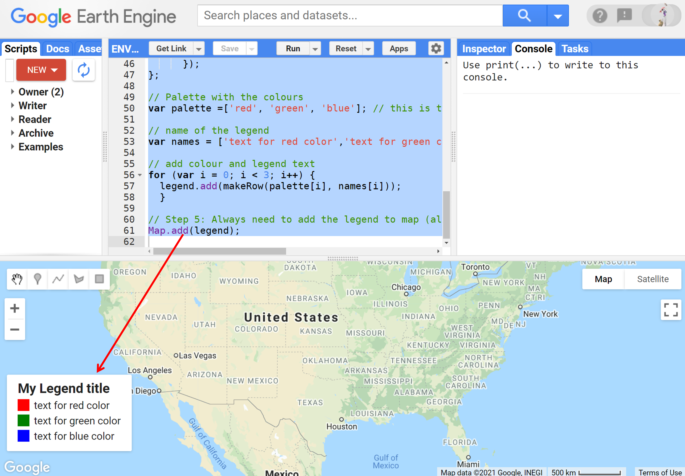
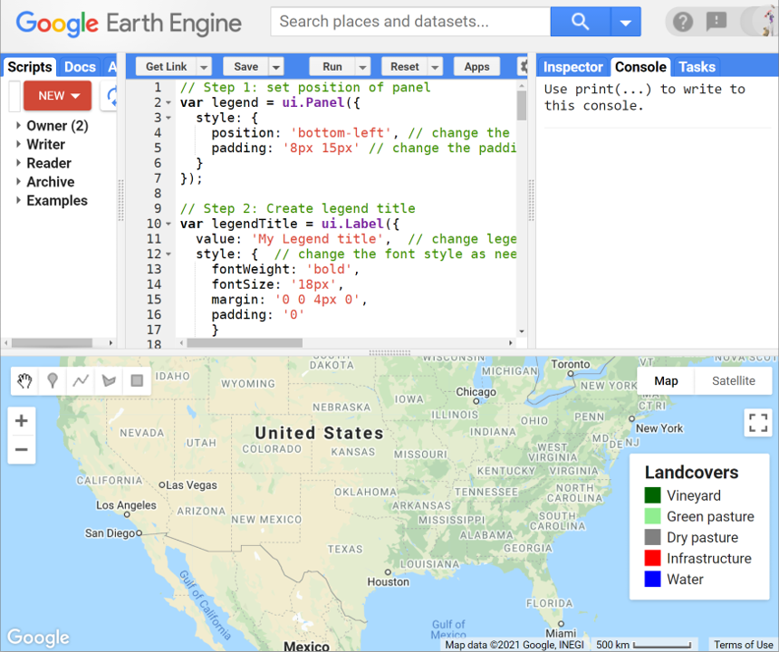
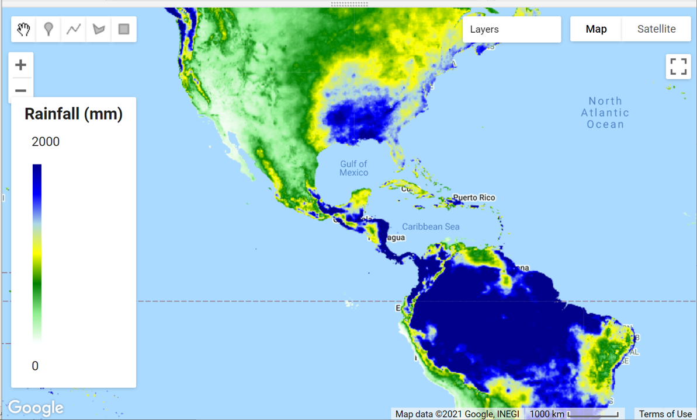
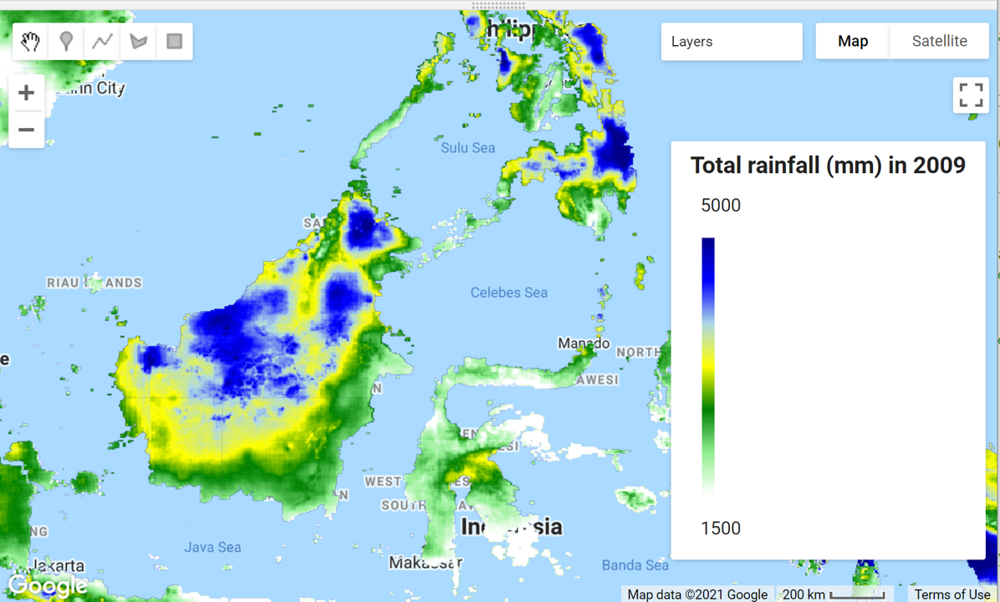

# Environmental Monitoring and Modelling (ENV306/506)

## Prac10 - Communicating earth engine discoveries

### Acknowledgments 

- Google Earth Engine Team
- [Open Geo Blog](https://mygeoblog.com/)
- [GEARS Lab](https://www.gears-lab.com/emm_lab_10/)

### Objective

The goal of this Prac is to gain an understanding of different ways of communicating discoveries you make in Google Earth Engine - including the publishing of maps, charts and animated time-lapse videos. .

---------------------------------------------------
## 1. Adding legend to maps.
We have used the mapping feature of Earth Engine in all of the previous labs (Map.addLayer). One aspect we have not covered so far is how to add a legend to a map. I have provided two examples below that you can modify for categorical or continuous data. You do not need to be able to replicate the script. However, general understanding of the script is expected such that you can modify the legends, etc. as required.

1. Run the below script to run the categorical legend. I will encourage you to change the parameters - most of them are super intuitive and create the legend you want. 


```JavaScript
/// Step 1: set position of panel
var legend = ui.Panel({
  style: {
    position: 'bottom-left', // change the position as needed
    padding: '8px 15px' // change the padding as needed
  }
});

// Step 2: Create legend title
var legendTitle = ui.Label({
  value: 'My Legend title',  // change legend title as required
  style: {  // change the font style as needed
    fontWeight: 'bold',
    fontSize: '18px',
    margin: '0 0 4px 0',
    padding: '0'
    }
});

// Step 3: Add the title to the panel
legend.add(legendTitle);

// Step 4: Function to creates the legend items.
var makeRow = function(color, name) {

      // Create the label that is actually the colored box.
      var colorBox = ui.Label({
        style: {
          backgroundColor: color,
          // Use padding to give the box height and width.
          padding: '8px',
          margin: '0 0 4px 0'
        }
      });

      // Create the label filled with the description text.
      var description = ui.Label({
        value: name,
        style: {margin: '0 0 4px 6px'}
      });

      // return the panel
      return ui.Panel({
        widgets: [colorBox, description],
        layout: ui.Panel.Layout.Flow('horizontal')
      });
};

// Palette with the colours
var palette =['red', 'green', 'blue']; // this is the actual color not text

// name of the legend
var names = ['text for red color','text for green color','text for blue color']; // thi sis the text next to the color

// add colour and legend text
for (var i = 0; i < 3; i++) {
  legend.add(makeRow(palette[i], names[i]));
  }  

// Step 5: Always need to add the legend to map (alternatively you can also print the legend to the console)
Map.add(legend);

```




*Practice Exercise*: Modify the above script to get the legend as shown in figure below. Below leged is of a Landcover classification over a grape-growing region. If you can get the below legend - you have mastered the necessary skills to modify the script.



2. Run the below script to generate the continuous legend. The script loads the CHIRPS rainfall dataset, maps the rainfall and then creates a continuous legend. Comment out the above "Map.add(legend);" line before you run the script.

```JavaScript
// First lets load a continuous data e.g. CHIRPS rainfall
var chirps = ee.ImageCollection("UCSB-CHG/CHIRPS/PENTAD");

// calculate the total rainfall 2009
var rainfall = chirps.select("precipitation").filterDate('2009-01-01', '2009-12-31').sum();

// create vizualization parameters - same visulisation aprameter will be used for mapping and legend
var vizPara = {min:0, max:2000, palette:['white','lightgreen','green','yellow','lightblue','blue','darkblue']};

// Map the rainfall
Map.addLayer(rainfall, vizPara);


// Step 1: Set position of panel
var legend = ui.Panel({
style: {
position: 'bottom-left', // modify the position as needed
padding: '8px 15px'
}
});

// Step 2: create legend title
var legendTitle = ui.Label({
value: 'Rainfall (mm)', // modify the title as needed
style: {
fontWeight: 'bold',
fontSize: '18px',
margin: '0 0 4px 0',
padding: '0'
}
});


// # 4 Create color bar
// create the legend image - I wouldn't change this
var lat = ee.Image.pixelLonLat().select('latitude');
var gradient = lat.multiply((vizPara.max-vizPara.min)/100.0).add(vizPara.min);
var legendImage = gradient.visualize(vizPara);

// Squeeze the above legend image to the legend thumbnail
var thumbnail = ui.Thumbnail({
image: legendImage,
params: {bbox:'0,0,10,100', dimensions:'10x200'},
style: {padding: '1px', position: 'bottom-center'}
});

// Step 5: Add the elements in order - Title first, followed by the max value, color thumbnail next and the min value last.  

// add the title to the panel
legend.add(legendTitle);

// Add the max value text above color bar
var maxValue = ui.Panel({widgets: [ui.Label(vizPara.max)]});
legend.add(maxValue);

// The color bar goes belwo the max value
legend.add(thumbnail);


// Add the min value text on below the colro bar
var minValue = ui.Panel({widgets: [ui.Label(vizPara.min)]});
legend.add(minValue);

//# Add the legend to the mapping layer
Map.add(legend);
```


*Exercise*: Pan over to Indonesia and run the script. Modify where necessary to get to below image. If you can do that, you have mastered the necessary skills to modify the script.



## 2. Charting
We have already explored a number of different charting options in previous lab, but once you become more familiar with JavaScript you will find that you have huge flexibility in the way you present data in graphs.

The Google Earth Engine Developer Guide provides a nice set of charting examples - please explore at your own time at the link below

- [Charts by reducing image](https://developers.google.com/earth-engine/guides/charts_image)
- [Charts by reducing imageCollection](https://developers.google.com/earth-engine/guides/charts_image_collection): also explored in Prac03, Prac05, Prac07 and Prac08
- [Chart from array and list](https://developers.google.com/earth-engine/guides/charts_array): also explored in Prac06
- [Data table chart](https://developers.google.com/earth-engine/guides/charts_datatable)
- [How to control the elements of chart](https://developers.google.com/earth-engine/guides/charts_style): explored in all the charting exercise

## 3. TIme-lapse animations
Google Earth Engine provides capability to create some time-lapse. These are very powerful tool to communicate changes in landscapes. You can develop you own time-lapses using and modifying the example below.

1. On above script, first comment out all the Map.addLayer and Map.add commands. 

2. Now run the the script below to see the location of the Landsat tile in your map view, and then draw in a geometry polygon (roi) within that area to clip your video area.

```JavaScript
// Load a Landsat 8 image collection using a defined WRS path and row.
var collection = ee.ImageCollection('LANDSAT/LC08/C01/T1_TOA')
  // Northern Territory.
  .filter(ee.Filter.eq('WRS_PATH', 105))
  .filter(ee.Filter.eq('WRS_ROW', 69))
  // Filter cloudy scenes.
  .filter(ee.Filter.lt('CLOUD_COVER', 5))

  // Need to have 3-band imagery for the video.
  .select(['B4', 'B3', 'B2']);
```

## 5. Ungraded exercise
Repeat the steps above, using the hydrosheds database for Australia. Clicking this link will take you to the dataset in the Earth Engine. 
Alternatively, you can import the data as below

```JavaScript
// Import the australian basin feature collection
var AUSbasin = ee.FeatureCollection('users/shaun/share/aus_basins_2019');
// Map the Australian basin
Map.addLayer(AUSbasin,{} , 'Australian basin');
```

## The complete script

```JavaScript
// Load a FeatureCollection from a table dataset: 'RESOLVE' ecoregions.
var ecoregions = ee.FeatureCollection('RESOLVE/ECOREGIONS/2017');

// Try the default display
Map.addLayer(ecoregions, {}, 'default display');

// add a custom color
Map.addLayer(ecoregions, {color: 'red'}, 'red colour display');

// Use featureCollection.draw() to display in custom colours and linewidth 
Map.addLayer(ecoregions.draw({color: 'green', strokeWidth: 5}), {}, 'drawn display');

// create an empty image into which to paint the features, cast to a byte.
var emptyImage = ee.Image().byte();
// you can add the empty image to your mapping layer - its just empty
Map.addLayer(emptyImage,{},'empty image');

// Paint the polygon edges onto the empty image
var outlineImage = emptyImage.paint({
  featureCollection: ecoregions, // which feature collection you want to be painted
  width: 3 // width of the polygon boundary line
});

// add the above outline image to the mapping layer
Map.addLayer(outlineImage, {palette: 'red'}, 'edges only');

// Repeat the edge painting on the empty image
var uniqueOutlineImage = emptyImage.paint({
  featureCollection: ecoregions, // feature collection to paint
  color: 'BIOME_NUM', // color assigned based on Biome Number
  width: 'NNH' // width assigned based on NNH value
});
// add the unique outline to the mapping layer
Map.addLayer(uniqueOutlineImage, {palette: ['red', 'green', 'blue'], max: 14}, 'unique colour edges');

// Paint the interior of the polygons with different colours.
var fillImage = emptyImage.paint({
  featureCollection: ecoregions, // feature collection to paint
  color: 'BIOME_NUM', // color assigned based on Biome Number
}); // no width means paint the interior

//Add the interior paint to mapping layer
Map.addLayer(fillImage, {palette: ['red', 'green', 'blue'], max: 14}, 'fills only');

// Paint both the interior and the edges. First paint the interior using biome number. Then paint the edges using
var doublePaintedImage = emptyImage.paint(ecoregions, 'BIOME_NUM').paint(ecoregions, 0, 1);

// add the interior/exterior painted image to mapping layer
Map.addLayer(doublePaintedImage, {palette: ['black','red', 'green', 'blue'], max: 14}, 'edges and fills');

//----------------------

// Load watersheds from a data table.
var sheds = ee.FeatureCollection('USGS/WBD/2017/HUC06');

// Filter the table geographically: only watersheds within the defined roi.
var shedsFiltered = sheds.filterBounds(roi);

// Check the number of watersheds before and after filtering for location.
print('Watersheds in the entire US:', sheds.size());
print('Watersheds in the eastern US:', shedsFiltered.size());

// Function to convert 'areasqkm' property from string to number.
function str2Num(aFeature){
  // use feature.get grabs the string - ee.Number converts that string to number
  var num = ee.Number.parse(aFeature.get('areasqkm'));
  // the numerical value is returned under the same property
  return aFeature.set('areasqkm', num);}

// Map the str2Num function over the shedsFiltered featureCollection
var shedsFilteredNum = shedsFiltered.map(str2Num);

// Filter to get only larger eastern US watersheds.
var largeSheds = shedsFilteredNum.filter(ee.Filter.gt('areasqkm',
25000));

// Check the number of watersheds after filtering for size and location.
print('Count after filtering by size:', largeSheds.size());

// Map the large watershed filtered over the eastern US
Map.addLayer(largeSheds,{} , 'HUC06- eastern US - large sheds');
  
```

-------
### Thank you

I hope you found this prac useful. A recorded video of this prac can be found on your learnline.

#### Kind regards, Deepak Gautam
------
### The end
