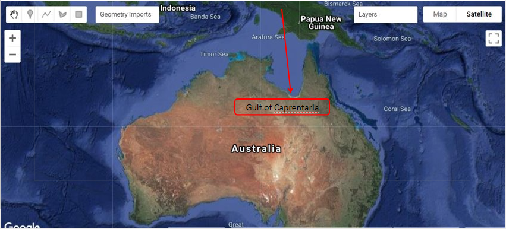

# Environmental Monitoring and Modelling (ENV306/506)

## Prac10 - Communicating earth engine discoveries

### Acknowledgments 

- Google Earth Engine Team
- [Open Geo Blog](https://mygeoblog.com/)
- [GEARS Lab](https://www.gears-lab.com/emm_lab_10/)

### Objective

The goal of this Prac is to gain an understanding of different ways of communicating discoveries you make in Google Earth Engine - including the publishing of maps, charts and animated time-lapse videos. .

---------------------------------------------------
## 1. Adding legend to maps.
We have used the mapping feature of Earth Engine in all of the previous labs (Map.addLayer). One aspect we have not covered so far is how to add a legend to a map. I have provided two examples below that you can modify for categorical or continuous data. You do not need to be able to replicate the script. However, general understanding of the script is expected such that you can modify the legends, etc. as required.

1. Run the below script to run the categorical legend. I will encourage you to change the parameters - most of them are super intuitive and create the legend you want. 


```JavaScript
/// Step 1: set position of panel
var legend = ui.Panel({
  style: {
    position: 'bottom-left', // change the position as needed
    padding: '8px 15px' // change the padding as needed
  }
});

// Step 2: Create legend title
var legendTitle = ui.Label({
  value: 'My Legend title',  // change legend title as required
  style: {  // change the font style as needed
    fontWeight: 'bold',
    fontSize: '18px',
    margin: '0 0 4px 0',
    padding: '0'
    }
});

// Step 3: Add the title to the panel
legend.add(legendTitle);

// Step 4: Function to creates the legend items.
var makeRow = function(color, name) {

      // Create the label that is actually the colored box.
      var colorBox = ui.Label({
        style: {
          backgroundColor: color,
          // Use padding to give the box height and width.
          padding: '8px',
          margin: '0 0 4px 0'
        }
      });

      // Create the label filled with the description text.
      var description = ui.Label({
        value: name,
        style: {margin: '0 0 4px 6px'}
      });

      // return the panel
      return ui.Panel({
        widgets: [colorBox, description],
        layout: ui.Panel.Layout.Flow('horizontal')
      });
};

// Palette with the colours
var palette =['red', 'green', 'blue']; // this is the actual color not text

// name of the legend
var names = ['text for red color','text for green color','text for blue color']; // thi sis the text next to the color

// add colour and legend text
for (var i = 0; i < 3; i++) {
  legend.add(makeRow(palette[i], names[i]));
  }  

// Step 5: Always need to add the legend to map (alternatively you can also print the legend to the console)
Map.add(legend);

```


*Practice Exercise*: Modify the above script to get the legend as shown in figure below. Below leged is of a Landcover classification over a grape-growing region. If you can get the below legend - you have mastered the necessary skills to modify the script.


2. Run the below script to generate the continuous legend. The script loads the CHIRPS rainfall dataset, maps the rainfall and then creates a continuous legend. Comment out the above "Map.add(legend);" line before you run the script.

```JavaScript
// First lets load a continuous data e.g. CHIRPS rainfall
var chirps = ee.ImageCollection("UCSB-CHG/CHIRPS/PENTAD");

// calculate the total rainfall 2009
var rainfall = chirps.select("precipitation").filterDate('2009-01-01', '2009-12-31').sum();

// create vizualization parameters - same visulisation aprameter will be used for mapping and legend
var vizPara = {min:0, max:2000, palette:['white','lightgreen','green','yellow','lightblue','blue','darkblue']};

// Map the rainfall
Map.addLayer(rainfall, vizPara);


// Step 1: Set position of panel
var legend = ui.Panel({
style: {
position: 'bottom-left', // modify the position as needed
padding: '8px 15px'
}
});

// Step 2: create legend title
var legendTitle = ui.Label({
value: 'Rainfall (mm)', // modify the title as needed
style: {
fontWeight: 'bold',
fontSize: '18px',
margin: '0 0 4px 0',
padding: '0'
}
});


// # 4 Create color bar
// create the legend image - I wouldn't change this
var lat = ee.Image.pixelLonLat().select('latitude');
var gradient = lat.multiply((vizPara.max-vizPara.min)/100.0).add(vizPara.min);
var legendImage = gradient.visualize(vizPara);

// Squeeze the above legend image to the legend thumbnail
var thumbnail = ui.Thumbnail({
image: legendImage,
params: {bbox:'0,0,10,100', dimensions:'10x200'},
style: {padding: '1px', position: 'bottom-center'}
});

// Step 5: Add the elements in order - Title first, followed by the max value, color thumbnail next and the min value last.  

// add the title to the panel
legend.add(legendTitle);

// Add the max value text above color bar
var maxValue = ui.Panel({widgets: [ui.Label(vizPara.max)]});
legend.add(maxValue);

// The color bar goes belwo the max value
legend.add(thumbnail);


// Add the min value text on below the colro bar
var minValue = ui.Panel({widgets: [ui.Label(vizPara.min)]});
legend.add(minValue);

//# Add the legend to the mapping layer
Map.add(legend);
```


*Exercise*: Pan over to Indonesia and run the script. Modify where necessary to get to below image. If you can do that, you have mastered the necessary skills to modify the script.


## 2. Charting
We have already explored a number of different charting options in previous lab, but once you become more familiar with JavaScript you will find that you have huge flexibility in the way you present data in graphs.

The Google Earth Engine Developer Guide provides a nice set of charting examples - please explore at your own time at the link below

- [Charts by reducing image](https://developers.google.com/earth-engine/guides/charts_image)
- [Charts by reducing imageCollection](https://developers.google.com/earth-engine/guides/charts_image_collection): also explored in Prac03, Prac05, Prac07 and Prac08
- [Chart from array and list](https://developers.google.com/earth-engine/guides/charts_array): also explored in Prac06
- [Data table chart](https://developers.google.com/earth-engine/guides/charts_datatable)
- [How to control the elements of chart](https://developers.google.com/earth-engine/guides/charts_style): explored in all the charting exercise

## 3. TIme-lapse animations
Google Earth Engine provides capability to create some time-lapse. These are very powerful tool to communicate changes in landscapes. You can develop you own time-lapses using and modifying the example below.

1. On above script, first comment out all the Map.addLayer and Map.add commands. 

2. Now run the the script below to see the location of the Landsat tile in your map view. 

```JavaScript
// Load a Landsat 8 image collection using a defined WRS path and row.
var collection = ee.ImageCollection('LANDSAT/LC08/C01/T1_TOA')
  // Northern Territory.
  .filter(ee.Filter.eq('WRS_PATH', 105))
  .filter(ee.Filter.eq('WRS_ROW', 69))
  // Filter cloudy scenes.
  .filter(ee.Filter.lt('CLOUD_COVER', 5))

  // Need to have 3-band imagery for the video.
  .select(['B4', 'B3', 'B2']);

// map the mean pixel value.
Map.addLayer(collection.median(), {min:0,max:0.3}, 'Median');  
```


3. You might be wondering what WRS_PATH and WRS_ROW are. Well, each Landsat scene has a path and row number determining where the scene was collected from. Each scan from north to south gets a path number and within a path there are multiple images numbered sequentially in rows. This filtering approach is just another way of filtering images. Our traditional approach of filtering is as good as this one so dont stress if you dont understand this approach. Attach image belwo to demonstrate the path row and go to this link to learn more. 


4. Use the geometry tool to draw a polygon within the displayed scene. Rename the geometry to roi. This is the area where we want to generate the timelaps video. 


4. We are almost ready to export the timelaps video. However, before exporting, we need to convert the Landsat 8 images to 8-bit. What does 8-bit mean? Well in current form the Landsat data contains pixel values ranged between 0 and 1. However, our display monitor (after we download data) expects a 8-bit data (values between 0 and 255) for appropriate visualisation. Use the script belwo to convert the collection to 8-bit. 

```JavaScript
// Need to make the data 8-bit integer because the montior you are using displays images in 8bit
var collection8bit=collection.map(
  function(anImage) {
    return anImage.multiply(512).uint8();
  });
``` 

5. You can also print information about the video to get an idea of how many images will be used to generate thsi video. 

```JavaScript
// print info about the video
print ('Generating video from ',collection8bit.size(),'images');
```

6. Now, run the script below to export the video. This will generate a new task under the task bar. 

```JavaScript
// Export (change dimensions or scale for higher quality).
Export.video.toDrive({
  collection: collection8bit, // the image collection you want to use
  description: 'L8VideoExample', // description of this video export task
  folder: 'EarthEngine', // name of folder in your google drive where you want to export the video
  fileNamePrefix: 'ENV306506_Lab10_TimeLapse', // filename for your video
  framesPerSecond: 5, // how many frames to use per second  
  region: roi, // region to capture the video from
  dimensions: 360 // dimension of the video screen in pixel
});
```


7. Hit run on the task within tasks bar. This will popup a window with the detais that we just defined. Hit run again to start the exporting process.


8. Now stay back, relax, and grab a coffee. GEE will take few mins to complete the export process. After completion, the video will appear to your folder in google drive. 


9. Dont forget to save your precious script.

## 5. Ungraded exercise
Export a Sentinel-2 false-color composite timeseries from the Gulf of Carpentaria. See image below for the location of Gulf of Carpentaria. 

## The complete script

```JavaScript
// Step 1: set position of panel
var legend = ui.Panel({
  style: {
    position: 'bottom-left', // change the position as needed
    padding: '8px 15px' // change the padding as needed
  }
});

// Step 2: Create legend title
var legendTitle = ui.Label({
  value: 'My Legend title',  // change legend title as required
  style: {  // change the font style as needed
    fontWeight: 'bold',
    fontSize: '18px',
    margin: '0 0 4px 0',
    padding: '0'
    }
});

// Step 3: Add the title to the panel
legend.add(legendTitle);

// Step 4: Function to creates the legend items.
var makeRow = function(color, name) {

      // Create the label that is actually the colored box.
      var colorBox = ui.Label({
        style: {
          backgroundColor: color,
          // Use padding to give the box height and width.
          padding: '8px',
          margin: '0 0 4px 0'
        }
      });

      // Create the label filled with the description text.
      var description = ui.Label({
        value: name,
        style: {margin: '0 0 4px 6px'}
      });

      // return the panel
      return ui.Panel({
        widgets: [colorBox, description],
        layout: ui.Panel.Layout.Flow('horizontal')
      });
};

// Palette with the colours
var palette =['red', 'green', 'blue']; // this is the actual color not text

// name of the legend
var names = ['text for red color','text for green color','text for blue color']; // thi sis the text next to the color

// add colour and legend text
for (var i = 0; i < 3; i++) {
  legend.add(makeRow(palette[i], names[i]));
  }  

// Step 5: Always need to add the legend to map (alternatively you can also print the legend to the console)
Map.add(legend);

//---------------------
// First lets load a continuous data e.g. CHIRPS rainfall
var chirps = ee.ImageCollection("UCSB-CHG/CHIRPS/PENTAD");

// calculate the total rainfall 2009
var rainfall = chirps.select("precipitation").filterDate('2009-01-01', '2009-12-31').sum();

// create vizualization parameters - same visulisation aprameter will be used for mapping and legend
var vizPara = {min:0, max:2000, palette:['white','lightgreen','green','yellow','lightblue','blue','darkblue']};

// Map the rainfall
Map.addLayer(rainfall, vizPara);


// Step 1: Set position of panel
var legend = ui.Panel({
style: {
position: 'bottom-left', // modify the position as needed
padding: '8px 15px'
}
});

// Step 2: create legend title
var legendTitle = ui.Label({
value: 'Rainfall (mm)', // modify the title as needed
style: {
fontWeight: 'bold',
fontSize: '18px',
margin: '0 0 4px 0',
padding: '0'
}
});


// # 4 Create color bar
// create the legend image - I wouldn't change this
var lat = ee.Image.pixelLonLat().select('latitude');
var gradient = lat.multiply((vizPara.max-vizPara.min)/100.0).add(vizPara.min);
var legendImage = gradient.visualize(vizPara);

// Squeeze the above legend image to the legend thumbnail
var thumbnail = ui.Thumbnail({
image: legendImage,
params: {bbox:'0,0,10,100', dimensions:'10x200'},
style: {padding: '1px', position: 'bottom-center'}
});

// Step 5: Add the elements in order - Title first, followed by the max value, color thumbnail next and the min value last.  

// add the title to the panel
legend.add(legendTitle);

// Add the max value text above color bar
var maxValue = ui.Panel({widgets: [ui.Label(vizPara.max)]});
legend.add(maxValue);

// The color bar goes belwo the max value
legend.add(thumbnail);


// Add the min value text on below the colro bar
var minValue = ui.Panel({widgets: [ui.Label(vizPara.min)]});
legend.add(minValue);

//# Add the legend to the mapping layer
Map.add(legend);

//--------------------------
// Load a Landsat 8 image collection and define path and row.
var collection = ee.ImageCollection('LANDSAT/LC08/C01/T1_TOA')
  // Northern Territory.
  .filter(ee.Filter.eq('WRS_PATH', 105))
  .filter(ee.Filter.eq('WRS_ROW', 69))
  // Filter cloudy scenes.
  .filter(ee.Filter.lt('CLOUD_COVER', 5))
  // Need to have 3-band imagery for the video.
  .select(['B4', 'B3', 'B2']);


// map the mean pixel value. Note the unusual range of min and max for Landsat, this is because we have converted to 8-bit data.
Map.addLayer(collection.median(), {min:0,max:0.3}, 'Median');

// Need to make the data 8-bit integer because the montior you are using displays images in 8bit i.e. stretched between 0 and 255
var collection8bit=collection.map(
  function(anImage) {
    return anImage.multiply(512).uint8();
  });


// print info about the video
print ('Generating video from ',collection8bit.size(),'images');

// Export (change dimensions or scale for higher quality).
Export.video.toDrive({
  collection: collection8bit, // the image collection you want to use
  description: 'L8VideoExample', // description of this video export task
  folder: 'EarthEngine', // name of folder in your google drive where you want to export the video
  fileNamePrefix: 'ENV306506_Lab10_TimeLapse', // filename for your video
  framesPerSecond: 5, // how many frames to use per second  
  region: roi, // region to capture the video from
  dimensions: 360 // dimension of the video screen in pixel
});
  
```

-------
### Thank you

I hope you found this prac useful. A recorded video of this prac can be found on your learnline.

#### Kind regards, Deepak Gautam
------
### The end
